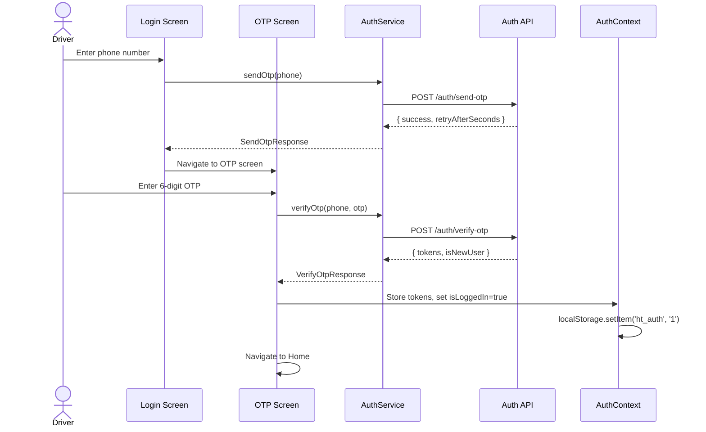
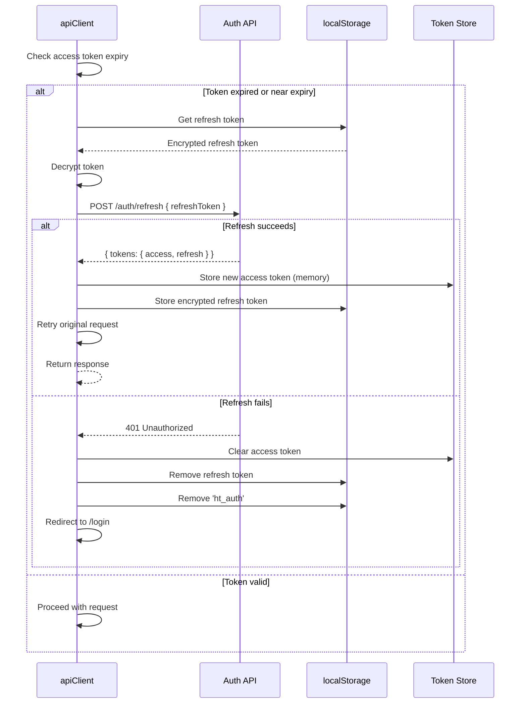
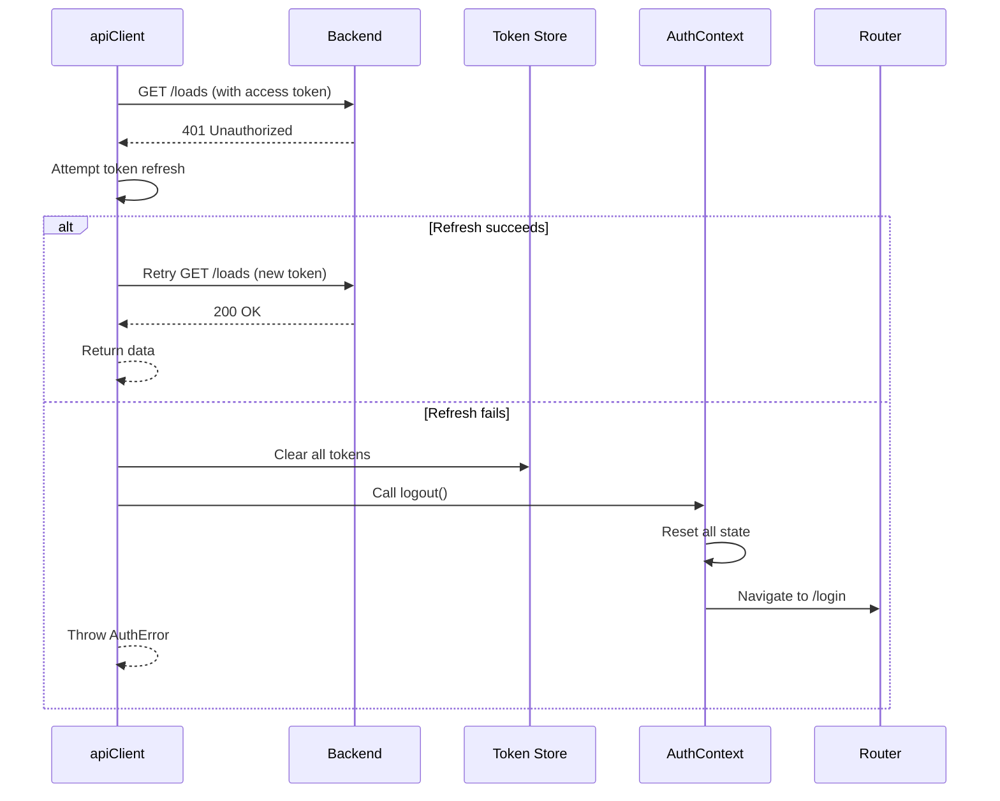
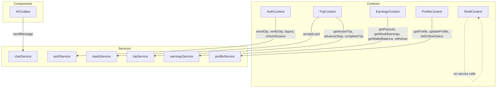
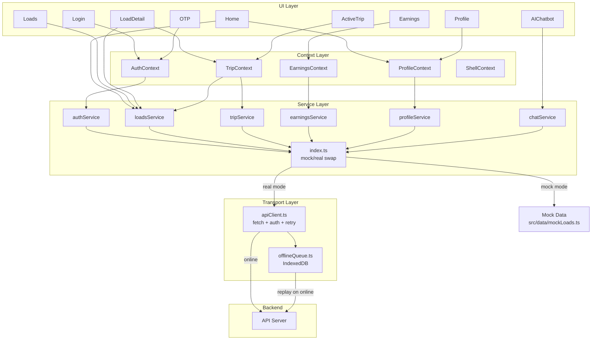

# API Service Layer Architecture

## 1. Overview

The API service layer is the data-access abstraction for the HindTrucks driver app. It provides a clean separation between UI components and data sources, enabling:

- **Mock-first development** — All screens work with mock data during development, no backend required
- **Seamless real-API switch** — A single environment variable flips all services from mock to real
- **State decentralization compatibility** — Designed to pair with the [state-decentralization.md](state-decentralization.md) plan, where each focused context calls its own service domain
- **Offline resilience** — Failed requests are queued and replayed when connectivity returns
- **Type safety** — Every service interface has full TypeScript contracts, ensuring mock and real implementations are interchangeable

### Relationship to State Decentralization

The [state-decentralization.md](state-decentralization.md) plan splits the monolithic [`AppContext`](../src/state/AppContext.tsx) into five focused contexts. This service layer aligns 1:1 with those contexts:

| Context | Service Domain | Primary Data |
|---|---|---|
| AuthContext | `auth/` | OTP, tokens, session |
| TripContext | `trip/` + `loads/` | Active trip, step progression, load acceptance |
| EarningsContext | `earnings/` | Wallet, payouts, weekly earnings |
| ProfileContext | `profile/` | Driver profile, online status |
| ShellContext | _(none)_ | Tour/notification are local-only state |

Additionally, [`AIChatbot`](../src/components/AIChatbot.tsx) calls `chat/` directly (not through a context).

---

## 2. File Structure

```
src/services/
  apiClient.ts              — Base fetch wrapper with auth, retry, timeout
  errors.ts                 — Error class hierarchy
  offlineQueue.ts           — IndexedDB-backed offline request queue
  index.ts                  — Barrel export with mock/real swap
  auth/
    types.ts                — Auth request/response types
    authService.ts          — Real auth implementation
    mockAuthService.ts      — Mock auth implementation
  loads/
    types.ts                — Load types
    loadsService.ts         — Real loads implementation
    mockLoadsService.ts     — Mock loads implementation
  trip/
    types.ts                — Trip types
    tripService.ts          — Real trip implementation
    mockTripService.ts      — Mock trip implementation
  earnings/
    types.ts                — Earnings types
    earningsService.ts      — Real earnings implementation
    mockEarningsService.ts  — Mock earnings implementation
  profile/
    types.ts                — Profile types
    profileService.ts       — Real profile implementation
    mockProfileService.ts   — Mock profile implementation
  chat/
    types.ts                — Chat types
    chatService.ts          — Real chat implementation
    mockChatService.ts      — Mock chat implementation
```

---

## 3. TypeScript Interface Definitions

### 3.1 Common Types (`src/services/errors.ts`)

```typescript
// ── Token Types ──

export interface AccessToken {
  token: string
  expiresAt: number // Unix timestamp (ms)
}

export interface RefreshToken {
  token: string
  expiresAt: number
}

export interface TokenPair {
  access: AccessToken
  refresh: RefreshToken
}

// ── Pagination ──

export interface PaginatedRequest {
  page?: number
  pageSize?: number
}

export interface PaginatedResponse<T> {
  data: T[]
  total: number
  page: number
  pageSize: number
  hasMore: boolean
}

// ── Error Hierarchy ──

export class ApiError extends Error {
  constructor(
    message: string,
    public readonly status: number,
    public readonly code: string,
    public readonly details?: unknown,
  ) {
    super(message)
    this.name = 'ApiError'
  }
}

export class NetworkError extends Error {
  constructor(message: string, public readonly originalError?: unknown) {
    super(message)
    this.name = 'NetworkError'
  }
}

export class AuthError extends ApiError {
  constructor(message = 'Authentication failed', status = 401) {
    super(message, status, 'AUTH_ERROR')
    this.name = 'AuthError'
  }
}

export class ValidationError extends ApiError {
  constructor(
    message: string,
    public readonly fieldErrors?: Record<string, string[]>,
  ) {
    super(message, 422, 'VALIDATION_ERROR')
    this.name = 'ValidationError'
  }
}

export class ServerError extends ApiError {
  constructor(message = 'Internal server error') {
    super(message, 500, 'SERVER_ERROR')
    this.name = 'ServerError'
  }
}

// ── Retry Configuration ──

export interface RetryConfig {
  maxRetries: number      // default: 3
  baseDelayMs: number     // default: 1000
  maxDelayMs: number      // default: 10000
  retryableStatuses: number[] // default: [408, 429, 500, 502, 503, 504]
}

// ── Offline Queue Entry ──

export interface OfflineQueueEntry {
  id: string
  url: string
  method: 'GET' | 'POST' | 'PUT' | 'PATCH' | 'DELETE'
  body?: unknown
  headers?: Record<string, string>
  createdAt: number
  retryCount: number
}
```

### 3.2 Auth Types (`src/services/auth/types.ts`)

```typescript
// ── Request Types ──

export interface SendOtpRequest {
  phone: string // E.164 format: "+91XXXXXXXXXX"
}

export interface VerifyOtpRequest {
  phone: string
  otp: string
}

export interface RefreshTokenRequest {
  refreshToken: string
}

export interface LogoutRequest {
  refreshToken: string
}

// ── Response Types ──

export interface SendOtpResponse {
  success: boolean
  retryAfterSeconds: number // Cooldown before next OTP can be sent
  expiresInSeconds: number  // OTP validity window
}

export interface VerifyOtpResponse {
  success: boolean
  tokens: TokenPair
  isNewUser: boolean
}

export interface RefreshTokenResponse {
  tokens: TokenPair
}

export interface SessionCheckResponse {
  valid: boolean
  phone?: string
}

// ── Service Interface ──

export interface IAuthService {
  sendOtp(request: SendOtpRequest): Promise<SendOtpResponse>
  verifyOtp(request: VerifyOtpRequest): Promise<VerifyOtpResponse>
  refreshToken(request: RefreshTokenRequest): Promise<RefreshTokenResponse>
  logout(request: LogoutRequest): Promise<void>
  checkSession(): Promise<SessionCheckResponse>
}
```

### 3.3 Loads Types (`src/services/loads/types.ts`)

```typescript
import type { GoodsKey, Load } from '../../data/mockLoads'
import type { PaginatedRequest, PaginatedResponse } from '../errors'

// Re-export domain types used by service layer
export type { GoodsKey, Load }

// ── Request Types ──

export interface GetLoadsRequest extends PaginatedRequest {
  goods?: GoodsKey
  minPrice?: number
  maxPrice?: number
  fromCity?: string
  toCity?: string
}

export interface GetLoadDetailRequest {
  loadId: string
}

export interface AcceptLoadRequest {
  loadId: string
}

// ── Response Types ──

export type GetLoadsResponse = PaginatedResponse<Load>

export interface GetLoadDetailResponse {
  load: Load
}

export interface AcceptLoadResponse {
  success: boolean
  activeLoad: Load
  tripStep: 1
}

// ── Service Interface ──

export interface ILoadsService {
  getLoads(request?: GetLoadsRequest): Promise<GetLoadsResponse>
  getLoadDetail(request: GetLoadDetailRequest): Promise<GetLoadDetailResponse>
  acceptLoad(request: AcceptLoadRequest): Promise<AcceptLoadResponse>
}
```

### 3.4 Trip Types (`src/services/trip/types.ts`)

```typescript
import type { TripStep } from '../../state/AppContext'
import type { Load } from '../../data/mockLoads'

export type { TripStep }

// ── Request Types ──

export interface AdvanceStepRequest {
  currentStep: TripStep
}

export interface CompleteTripRequest {
  loadId: string
}

export interface GetActiveTripRequest {} // No params; identified by auth token

// ── Response Types ──

export interface AdvanceStepResponse {
  newStep: TripStep
  message?: string // e.g., "Arrived at pickup point"
}

export interface CompleteTripResponse {
  success: boolean
  payoutAmount: number
  payoutId: string
}

export interface GetActiveTripResponse {
  activeLoad: Load | null
  tripStep: TripStep
}

// ── Service Interface ──

export interface ITripService {
  getActiveTrip(): Promise<GetActiveTripResponse>
  advanceStep(request: AdvanceStepRequest): Promise<AdvanceStepResponse>
  completeTrip(request: CompleteTripRequest): Promise<CompleteTripResponse>
}
```

### 3.5 Earnings Types (`src/services/earnings/types.ts`)

```typescript
import type { Payout } from '../../data/mockLoads'

export type { Payout }

// ── Request Types ──

export interface WithdrawRequest {
  amount: number
  upiId: string
}

// ── Response Types ──

export interface GetPayoutsResponse {
  payouts: Payout[]
}

export interface GetWeekEarningsResponse {
  earnings: number[] // 7 values, Mon-Sun
}

export interface GetWalletBalanceResponse {
  balance: number
}

export interface WithdrawResponse {
  success: boolean
  newBalance: number
  transaction: Payout
}

// ── Service Interface ──

export interface IEarningsService {
  getPayouts(): Promise<GetPayoutsResponse>
  getWeekEarnings(): Promise<GetWeekEarningsResponse>
  getWalletBalance(): Promise<GetWalletBalanceResponse>
  withdraw(request: WithdrawRequest): Promise<WithdrawResponse>
}
```

### 3.6 Profile Types (`src/services/profile/types.ts`)

```typescript
// ── Domain Types (mirrors state-decentralization DriverProfile) ──

export interface TruckInfo {
  regNumber: string
  type: string
  capacity: string
}

export interface DriverProfile {
  name: string
  phone: string
  rating: number
  tripsToday: number
  earningsToday: number
  truck: TruckInfo
}

// ── Request Types ──

export interface UpdateProfileRequest {
  name?: string
  truck?: Partial<TruckInfo>
}

export interface SetOnlineStatusRequest {
  isOnline: boolean
}

// ── Response Types ──

export interface GetProfileResponse {
  profile: DriverProfile
}

export interface UpdateProfileResponse {
  profile: DriverProfile
}

export interface SetOnlineStatusResponse {
  isOnline: boolean
}

// ── Service Interface ──

export interface IProfileService {
  getProfile(): Promise<GetProfileResponse>
  updateProfile(request: UpdateProfileRequest): Promise<UpdateProfileResponse>
  setOnlineStatus(request: SetOnlineStatusRequest): Promise<SetOnlineStatusResponse>
}
```

### 3.7 Chat Types (`src/services/chat/types.ts`)

```typescript
// ── Domain Types ──

export interface ChatMessage {
  id: string
  sender: 'user' | 'bot'
  text: string
  isTyping?: boolean
  redirectPath?: string
  redirectMsg?: string
}

// ── Request Types ──

export interface SendMessageRequest {
  message: string
  conversationId?: string // For multi-turn context
  locale?: string         // i18n locale for localized responses
}

// ── Response Types ──

export interface SendMessageResponse {
  reply: ChatMessage
  conversationId: string
  suggestedActions?: string[] // Quick-reply suggestions
}

// ── Service Interface ──

export interface IChatService {
  sendMessage(request: SendMessageRequest): Promise<SendMessageResponse>
}
```

---

## 4. apiClient.ts Design

### 4.1 Core Architecture

The [`apiClient.ts`](../src/services/apiClient.ts) is a thin wrapper around the native `fetch` API. No external HTTP library dependency.

```typescript
// ── Configuration ──

interface ApiClientConfig {
  baseUrl: string
  timeoutMs: number           // default: 10_000
  retryConfig: RetryConfig
  getAccessToken: () => string | null
  getRefreshToken: () => string | null
  onTokenRefreshed: (tokens: TokenPair) => void
  onAuthFailure: () => void   // Clear tokens + redirect to /login
  isOnline: () => boolean     // navigator.onLine wrapper
}

// ── Request Builder ──

interface RequestOptions<TBody = unknown> {
  method: 'GET' | 'POST' | 'PUT' | 'PATCH' | 'DELETE'
  path: string
  body?: TBody
  query?: Record<string, string | number | boolean | undefined>
  headers?: Record<string, string>
  timeoutMs?: number           // Per-request override
  skipAuth?: boolean           // For login/otp endpoints
  skipRetry?: boolean          // For non-idempotent mutations
}

// ── Response Wrapper ──

interface ApiResponse<T> {
  data: T
  status: number
  headers: Headers
}
```

### 4.2 Request Flow

```
apiClient.request<T>(options)
  │
  ├─ 1. Build full URL: baseUrl + path + query params
  ├─ 2. Build headers:
  │     Content-Type: application/json
  │     Authorization: Bearer <accessToken>  (if !skipAuth)
  │     Accept-Language: <i18n locale>
  ├─ 3. AbortController with timeout (default 10s)
  ├─ 4. fetch(url, { method, headers, body, signal })
  │
  ├─ 5. Response handling:
  │     ├─ 200-299 → parse JSON → return { data, status, headers }
  │     ├─ 401    → attempt token refresh → retry original request
  │     │            ├─ refresh success → retry → return data
  │     │            └─ refresh fail    → onAuthFailure() → throw AuthError
  │     ├─ 408/429/5xx → retry with exponential backoff (if !skipRetry)
  │     ├─ 422    → throw ValidationError with fieldErrors
  │     └─ other  → throw ApiError
  │
  └─ 6. On network/abort error → throw NetworkError
```

### 4.3 Token Refresh Logic

```typescript
// Token refresh is a singleton — only one refresh in-flight at a time
let refreshPromise: Promise<TokenPair> | null = null

async function refreshAccessToken(): Promise<TokenPair> {
  // If a refresh is already in progress, wait for it
  if (refreshPromise) return refreshPromise

  refreshPromise = (async () => {
    try {
      const refreshToken = config.getRefreshToken()
      if (!refreshToken) throw new AuthError('No refresh token available')

      const response = await fetch(`${config.baseUrl}/auth/refresh`, {
        method: 'POST',
        headers: { 'Content-Type': 'application/json' },
        body: JSON.stringify({ refreshToken }),
      })

      if (!response.ok) throw new AuthError('Refresh failed')

      const data: RefreshTokenResponse = await response.json()
      config.onTokenRefreshed(data.tokens)
      return data.tokens
    } finally {
      refreshPromise = null
    }
  })()

  return refreshPromise
}
```

### 4.4 Exponential Backoff Retry

```typescript
async function retryWithBackoff<T>(
  fn: () => Promise<T>,
  attempt: number,
  config: RetryConfig,
): Promise<T> {
  try {
    return await fn()
  } catch (error) {
    if (attempt >= config.maxRetries) throw error

    // Only retry on retryable errors
    if (error instanceof ApiError && !config.retryableStatuses.includes(error.status)) {
      throw error
    }
    if (error instanceof NetworkError) {
      // Network errors are always retryable
    } else if (!(error instanceof ApiError)) {
      throw error
    }

    const delay = Math.min(
      config.baseDelayMs * Math.pow(2, attempt),
      config.maxDelayMs,
    )
    // Add jitter: ±25%
    const jittered = delay * (0.75 + Math.random() * 0.5)

    await new Promise((resolve) => setTimeout(resolve, jittered))
    return retryWithBackoff(fn, attempt + 1, config)
  }
}
```

### 4.5 Decision Table: Retry Behavior

| Status | Idempotent (GET) | Non-Idempotent (POST/PUT/PATCH/DELETE) |
|---|---|---|
| 200-299 | Return immediately | Return immediately |
| 401 | Refresh → retry once | Refresh → retry once |
| 408 | Retry 3x | Do NOT retry (skipRetry) |
| 429 | Retry 3x | Retry 3x |
| 500, 502, 503, 504 | Retry 3x | Do NOT retry (skipRetry) |
| 422 | Throw ValidationError | Throw ValidationError |
| Other 4xx | Throw ApiError | Throw ApiError |

---

## 5. Mock → Real Transition Strategy

### 5.1 Pattern

Each service domain follows an interface-implementation pattern:

```
┌──────────────────────┐
│   I<Domain>Service   │  ← Interface contract (types.ts)
└──────────┬───────────┘
           │
   ┌───────┴───────┐
   │               │
┌──┴──────────┐  ┌─┴──────────────┐
│ MockService │  │ RealService    │  ← Both implement the interface
│ (mock*.ts)  │  │ (*Service.ts)  │
└─────────────┘  └────────────────┘
```

### 5.2 Mock Implementation Details

Each mock service:

- Imports data from [`src/data/mockLoads.ts`](../src/data/mockLoads.ts) (MOCK_LOADS, MOCK_PAYOUTS, WEEK_EARNINGS, DRIVER)
- Simulates network delay: `300-800ms` via `setTimeout` + `Math.random()`
- Stores mutable state in module-level variables (wallet balance, online status, active trip)
- Can simulate errors via `mockConfig.simulateErrors` flag
- Logs all calls to console for debugging

```typescript
// src/services/loads/mockLoadsService.ts — Skeleton

import type { ILoadsService, GetLoadsRequest, GetLoadsResponse } from './types'
import { MOCK_LOADS } from '../../data/mockLoads'

const delay = () => new Promise(r => setTimeout(r, 300 + Math.random() * 500))

export const mockLoadsService: ILoadsService = {
  async getLoads(request?: GetLoadsRequest): Promise<GetLoadsResponse> {
    await delay()
    let loads = [...MOCK_LOADS]
    // Apply filters from request...
    return { data: loads, total: loads.length, page: 1, pageSize: 20, hasMore: false }
  },
  async getLoadDetail({ loadId }) {
    await delay()
    const load = MOCK_LOADS.find(l => l.id === loadId)
    if (!load) throw new Error('Load not found')
    return { load }
  },
  async acceptLoad({ loadId }) {
    await delay()
    const load = MOCK_LOADS.find(l => l.id === loadId)
    if (!load) throw new Error('Load not found')
    return { success: true, activeLoad: load, tripStep: 1 }
  },
}
```

### 5.3 Barrel Export (`src/services/index.ts`)

```typescript
// src/services/index.ts
import type { IAuthService } from './auth/types'
import type { ILoadsService } from './loads/types'
import type { ITripService } from './trip/types'
import type { IEarningsService } from './earnings/types'
import type { IProfileService } from './profile/types'
import type { IChatService } from './chat/types'

import { mockAuthService } from './auth/mockAuthService'
import { mockLoadsService } from './loads/mockLoadsService'
import { mockTripService } from './trip/mockTripService'
import { mockEarningsService } from './earnings/mockEarningsService'
import { mockProfileService } from './profile/mockProfileService'
import { mockChatService } from './chat/mockChatService'

// Real services are lazy-loaded to avoid bundling in mock mode
const MODE: 'mock' | 'real' = (import.meta.env.VITE_API_MODE as 'mock' | 'real') || 'mock'

let _auth: IAuthService
let _loads: ILoadsService
let _trip: ITripService
let _earnings: IEarningsService
let _profile: IProfileService
let _chat: IChatService

function getServices() {
  if (MODE === 'mock') {
    return {
      auth: mockAuthService,
      loads: mockLoadsService,
      trip: mockTripService,
      earnings: mockEarningsService,
      profile: mockProfileService,
      chat: mockChatService,
    }
  }
  // Real services — lazy init to avoid initApiClient before env is ready
  if (!_auth) {
    const { authService } = require('./auth/authService')
    const { loadsService } = require('./loads/loadsService')
    const { tripService } = require('./trip/tripService')
    const { earningsService } = require('./earnings/earningsService')
    const { profileService } = require('./profile/profileService')
    const { chatService } = require('./chat/chatService')
    _auth = authService
    _loads = loadsService
    _trip = tripService
    _earnings = earningsService
    _profile = profileService
    _chat = chatService
  }
  return { auth: _auth, loads: _loads, trip: _trip, earnings: _earnings, profile: _profile, chat: _chat }
}

export const authService: IAuthService = {
  sendOtp: (...args) => getServices().auth.sendOtp(...args),
  verifyOtp: (...args) => getServices().auth.verifyOtp(...args),
  refreshToken: (...args) => getServices().auth.refreshToken(...args),
  logout: (...args) => getServices().auth.logout(...args),
  checkSession: (...args) => getServices().auth.checkSession(...args),
}

export const loadsService: ILoadsService = {
  getLoads: (...args) => getServices().loads.getLoads(...args),
  getLoadDetail: (...args) => getServices().loads.getLoadDetail(...args),
  acceptLoad: (...args) => getServices().loads.acceptLoad(...args),
}

export const tripService: ITripService = {
  getActiveTrip: (...args) => getServices().trip.getActiveTrip(...args),
  advanceStep: (...args) => getServices().trip.advanceStep(...args),
  completeTrip: (...args) => getServices().trip.completeTrip(...args),
}

export const earningsService: IEarningsService = {
  getPayouts: (...args) => getServices().earnings.getPayouts(...args),
  getWeekEarnings: (...args) => getServices().earnings.getWeekEarnings(...args),
  getWalletBalance: (...args) => getServices().earnings.getWalletBalance(...args),
  withdraw: (...args) => getServices().earnings.withdraw(...args),
}

export const profileService: IProfileService = {
  getProfile: (...args) => getServices().profile.getProfile(...args),
  updateProfile: (...args) => getServices().profile.updateProfile(...args),
  setOnlineStatus: (...args) => getServices().profile.setOnlineStatus(...args),
}

export const chatService: IChatService = {
  sendMessage: (...args) => getServices().chat.sendMessage(...args),
}
```

### 5.4 Environment Variables

| Variable | Values | Default | Purpose |
|---|---|---|---|
| `VITE_API_MODE` | `mock` \| `real` | `mock` | Switches all services between mock/real |
| `VITE_API_BASE_URL` | URL string | `http://localhost:3000/api` | Backend API base URL (real mode only) |
| `VITE_MOCK_DELAY_MS` | number | `500` | Mock delay midpoint (real delay is `delay ± 50%`) |
| `VITE_MOCK_ERROR_RATE` | `0.0`–`1.0` | `0` | Probability of mock services throwing errors |

---

## 6. Error Handling Pattern

### 6.1 Error Class Hierarchy

```
Error
 └─ ApiError            (status, code, details)
      ├─ AuthError      (status=401, code='AUTH_ERROR')
      ├─ ValidationError(status=422, code='VALIDATION_ERROR', fieldErrors)
      └─ ServerError    (status=500, code='SERVER_ERROR')
 └─ NetworkError        (originalError)
```

### 6.2 Error Boundary Integration

```typescript
// src/components/ApiErrorBoundary.tsx — Conceptual

interface ApiErrorBoundaryProps {
  children: ReactNode
  fallback?: ReactNode
  onError?: (error: Error) => void
}

// Wraps sections of the app that make API calls.
// Catches: NetworkError (offline), ServerError (500), ApiError (generic)
// Renders: appropriate fallback UI with retry button
// Does NOT catch: AuthError — those are handled by apiClient's onAuthFailure
```

### 6.3 Offline Detection

```typescript
// src/services/offlineQueue.ts

// Uses navigator.onLine + window 'online'/'offline' events
// When offline:
//   - All non-GET requests are stored in IndexedDB
//   - GET requests are served from in-memory cache (if available)
// When back online:
//   - Queue is drained in FIFO order
//   - Each request is replayed with original headers/body
//   - Failed replays are retried up to 3 times, then moved to dead-letter queue
//   - UI is notified via ShellContext.showNotification on completion

interface OfflineQueue {
  enqueue(entry: Omit<OfflineQueueEntry, 'id' | 'createdAt' | 'retryCount'>): Promise<void>
  drain(): Promise<{ succeeded: number; failed: number }>
  getQueueLength(): Promise<number>
}
```

### 6.4 Error Notification Flow

```
Service throws
  │
  ├─ AuthError ──────────────────→ apiClient.onAuthFailure() → clear tokens → redirect /login
  ├─ NetworkError ───────────────→ Check navigator.onLine
  │                                  ├─ offline → queue request → show "offline" toast
  │                                  └─ online  → show "network error" toast + retry button
  ├─ ValidationError ────────────→ Context sets fieldErrors → form shows inline errors
  ├─ ServerError (500) ──────────→ showNotification("Server error", "Please try again", "push")
  └─ Other ApiError ─────────────→ showNotification(code, message, "push")
```

### 6.5 Decision Table: Error Recovery

| Error Type | Auto-Retry | Offline Queue | User Notification | Recovery Action |
|---|---|---|---|---|
| NetworkError (offline) | Yes (when online) | Yes | Toast: "You're offline" | Wait for online event |
| NetworkError (online) | Yes (3x backoff) | No | Toast: "Connection issue" | Retry button |
| AuthError (401) | Refresh once | No | Silent (redirect) | Redirect to /login |
| ValidationError (422) | No | No | Inline field errors | User corrects input |
| ServerError (5xx) | Yes (3x backoff) | No | Toast: "Server error" | Retry button |
| ApiError (4xx, other) | No | No | Toast: error message | Context-specific |

---

## 7. Authentication Flow

### 7.1 Token Storage Strategy

| Token | Storage | Persistence | Rationale |
|---|---|---|---|
| Access token | In-memory (module-level variable) | Lost on page refresh | Prevents XSS extraction |
| Refresh token | `localStorage` (encrypted) | Survives refresh | Allows silent re-auth |
| Auth state | `localStorage` key `ht_auth` | Survives refresh | Quick isLoggedIn check |

The refresh token is encrypted with a simple XOR + base64 scheme (not cryptographic, but prevents casual token inspection in dev tools). For production, a proper Web Crypto-based encryption should be used.

### 7.2 Auto-Refresh Strategy

```typescript
// Proactive refresh: check expiry 5 minutes before expiration
const REFRESH_BUFFER_MS = 5 * 60 * 1000 // 5 minutes

function shouldRefreshToken(accessToken: AccessToken): boolean {
  const now = Date.now()
  return accessToken.expiresAt - now < REFRESH_BUFFER_MS
}
```

### 7.3 Auth Flow Diagrams

#### Login Flow



#### Token Refresh Flow



#### 401 Recovery Flow



### 7.4 Session Check on App Load

```typescript
// On app initialization (App.tsx or main.tsx):
async function initializeAuth(): Promise<void> {
  const storedRefresh = localStorage.getItem('ht_refresh')
  if (!storedRefresh) {
    // No stored session — user stays on login screen
    return
  }

  try {
    const { valid, phone } = await authService.checkSession()
    if (valid) {
      // Session is valid — user is auto-logged-in
    } else {
      // Stored token is invalid — clear and redirect
      localStorage.removeItem('ht_refresh')
      localStorage.removeItem('ht_auth')
    }
  } catch {
    // Network error — assume valid (offline-first)
    // User can still access cached data
  }
}
```

---

## 8. Integration Points with Focused Contexts

### 8.1 Context → Service Mapping



### 8.2 AuthContext Integration

```typescript
// AuthContext calls:
//   authService.sendOtp({ phone })          → on Login screen submit
//   authService.verifyOtp({ phone, otp })   → on OTP screen submit
//   authService.logout({ refreshToken })    → on logout action
//   authService.checkSession()              → on app initialization

// AuthContext owns:
//   - isLoggedIn state
//   - phone state
//   - Token management (calls apiClient config callbacks)
//   - login() action: calls verifyOtp → stores tokens → sets isLoggedIn=true
//   - logout() action: calls authService.logout → clears tokens → sets isLoggedIn=false
//                      → Effect-based cleanup triggers other contexts to reset
```

### 8.3 TripContext Integration

```typescript
// TripContext calls:
//   loadsService.acceptLoad({ loadId })       → on LoadDetail accept button
//   tripService.getActiveTrip()                → on mount (restore trip state)
//   tripService.advanceStep({ currentStep })   → on each stepper advance
//   tripService.completeTrip({ loadId })       → on final step

// TripContext owns:
//   - activeLoad state
//   - tripStep state
//   - acceptLoad(loadId) action
//   - advanceTrip() action
//   - resetTrip() action

// Consumer-level orchestration (LoadDetail):
//   const { acceptLoad } = useTripContext()
//   const { setOnline } = useProfileContext()
//   const handleAccept = async (loadId: string) => {
//     await acceptLoad(loadId)   // Sets activeLoad + tripStep=1
//     setOnline(true)            // Profile domain: mark driver as online
//   }
```

### 8.4 EarningsContext Integration

```typescript
// EarningsContext calls:
//   earningsService.getPayouts()         → on mount
//   earningsService.getWeekEarnings()    → on mount
//   earningsService.getWalletBalance()   → on mount / after withdrawal
//   earningsService.withdraw({ amount, upiId }) → on withdraw action

// EarningsContext owns:
//   - walletBalance state
//   - payouts state
//   - weekEarnings state
//   - withdraw(amount, upiId) action
```

### 8.5 ProfileContext Integration

```typescript
// ProfileContext calls:
//   profileService.getProfile()                            → on mount
//   profileService.updateProfile({ name, truck })          → on profile edit
//   profileService.setOnlineStatus({ isOnline })           → on toggle

// ProfileContext owns:
//   - profile: DriverProfile state (without walletBalance)
//   - isOnline state
//   - setOnline(v) action
//   - updateProfile(data) action
```

### 8.6 ShellContext (No Service Calls)

```typescript
// ShellContext is purely local state — no API calls.
// Owns:
//   - hasSeenTour, isTourActive, tourStep
//   - notification state
//   - startTour(), endTour() actions
//   - showNotification(), dismissNotification() actions
```

### 8.7 Chat (AIChatbot Component)

```typescript
// AIChatbot calls:
//   chatService.sendMessage({ message, conversationId, locale })

// AIChatbot manages its own local state:
//   - messages: ChatMessage[]
//   - conversationId
//   - input text
//   - TTS related state
```

---

## 9. Service Architecture Diagram



---

## 10. Migration Strategy

### Phase 0: Create Service Interfaces + Mock Implementations

**Goal:** All types and mock services exist, zero changes to existing code.

- Create all `types.ts` files with interface definitions
- Create all `mock*Service.ts` files using `src/data/mockLoads.ts` data
- Each mock is a standalone module — no dependency on apiClient or contexts
- Tests: Verify mock services return correct data shapes

### Phase 1: Create apiClient + Error Types

**Goal:** Transport layer is ready, still no changes to existing code.

- Implement [`apiClient.ts`](../src/services/apiClient.ts) with fetch wrapper, auth injection, retry, timeout
- Implement [`errors.ts`](../src/services/errors.ts) with error class hierarchy
- Implement [`offlineQueue.ts`](../src/services/offlineQueue.ts) with IndexedDB
- Add `VITE_API_BASE_URL`, `VITE_API_MODE` to `.env` / `.env.example`
- Tests: Verify apiClient retry, auth refresh, 401 handling, offline queue

### Phase 2: Wire Contexts to Services

**Goal:** Contexts call services instead of importing mock data directly.

- Replace `MOCK_LOADS` imports in contexts with `loadsService.getLoads()`
- Replace `DRIVER` imports with `profileService.getProfile()`
- Replace `MOCK_PAYOUTS` / `WEEK_EARNINGS` with `earningsService.*`
- Replace inline `login()` / `logout()` logic with `authService.*` calls
- Replace `acceptLoad()` inline logic with `loadsService.acceptLoad()` + `tripService.advanceStep()`
- Components continue to work unchanged — they call context actions, not services directly
- Tests: All existing screens render correctly with mock services

### Phase 3: Create Real Service Implementations

**Goal:** Real API implementations exist, but not yet active.

- Implement all `*Service.ts` files calling `apiClient`
- Map backend API contracts to frontend types
- Add request/response transformation where needed
- Tests: Integration tests against a running backend (or recorded fixtures)

### Phase 4: Enable Mock/Real Swap

**Goal:** Single env variable switches all services.

- Implement [`index.ts`](../src/services/index.ts) barrel with `VITE_API_MODE` switch
- Add `VITE_API_MODE=real` to production build config
- Verify: `VITE_API_MODE=mock` → all mock services; `VITE_API_MODE=real` → all real services
- Tests: Smoke test with both modes

### Phase 5: Add Offline Queue + Error Boundary

**Goal:** Production resilience features.

- Integrate offline queue into apiClient's request pipeline
- Add `ApiErrorBoundary` component
- Wire error notifications to `ShellContext.showNotification`
- Add service worker caching for GET requests
- Tests: Offline→online transition, error boundary rendering

### Phase Decision Table

| Phase | Touches Existing Code? | Risk | Rollback Strategy |
|---|---|---|---|
| 0 | No | None | Delete new files |
| 1 | No | None | Delete new files |
| 2 | Yes — contexts | Medium | Git revert; screens still work via mock data in contexts |
| 3 | No | Low | Delete new files |
| 4 | Yes — index.ts | Low | Set `VITE_API_MODE=mock` |
| 5 | Yes — apiClient | Medium | Feature flag for offline queue |

---

## 11. Screen → Service Migration Reference

| Screen | Current Data Source | → Service Call |
|---|---|---|
| [`Login.tsx`](../src/screens/Login.tsx) | `useApp().showNotification` | `authService.sendOtp({ phone })` |
| [`Otp.tsx`](../src/screens/Otp.tsx) | `useApp().login(phone)` | `authService.verifyOtp({ phone, otp })` → AuthContext.login |
| [`Home.tsx`](../src/screens/Home.tsx) | `useApp().isOnline, setOnline, driver` + `MOCK_LOADS.slice(0,2)` | `profileService.getProfile()` + `profileService.setOnlineStatus()` + `loadsService.getLoads({ pageSize: 2 })` |
| [`Loads.tsx`](../src/screens/Loads.tsx) | `MOCK_LOADS` directly (no useApp) | `loadsService.getLoads()` |
| [`LoadDetail.tsx`](../src/screens/LoadDetail.tsx) | `useApp().acceptLoad` + `MOCK_LOADS.find(id)` | `loadsService.getLoadDetail({ loadId })` + `loadsService.acceptLoad({ loadId })` |
| [`ActiveTrip.tsx`](../src/screens/ActiveTrip.tsx) | `useApp().activeLoad, tripStep, advanceTrip, resetTrip` | `tripService.getActiveTrip()` + `tripService.advanceStep()` + `tripService.completeTrip()` |
| [`Earnings.tsx`](../src/screens/Earnings.tsx) | `useApp().driver.walletBalance, payouts, withdrawWallet` + `WEEK_EARNINGS` | `earningsService.getWalletBalance()` + `earningsService.getPayouts()` + `earningsService.getWeekEarnings()` + `earningsService.withdraw()` |
| [`Profile.tsx`](../src/screens/Profile.tsx) | `useApp().logout, startTour` + `DRIVER` | `profileService.getProfile()` + `authService.logout()` |
| [`AIChatbot.tsx`](../src/components/AIChatbot.tsx) | Local keyword matching | `chatService.sendMessage({ message, conversationId, locale })` |

---

## 12. Key Design Decisions

| Decision | Rationale |
|---|---|
| `fetch` over axios | Zero dependency, native browser API, smaller bundle; PWA-friendly |
| Interfaces over abstract classes | Simpler, TypeScript-native, no runtime overhead |
| Module-level barrel swap | Single env variable controls all services; no DI container needed |
| Access token in memory only | Mitigates XSS token theft; refresh token handles persistence |
| Offline queue in IndexedDB | Survives browser restarts; larger storage than localStorage |
| Service interfaces per domain | Aligns 1:1 with state decentralization contexts; clear ownership |
| No service for ShellContext | Tour and notification states are purely local UI concerns |
| Mock services use `src/data/mockLoads.ts` | Single source of truth for mock data; existing screens can be migrated incrementally |
| 5-minute proactive refresh buffer | Prevents mid-request expiry; avoids latency spike from refresh |
| Singleton refresh promise | Prevents thundering herd of refresh requests from concurrent API calls |