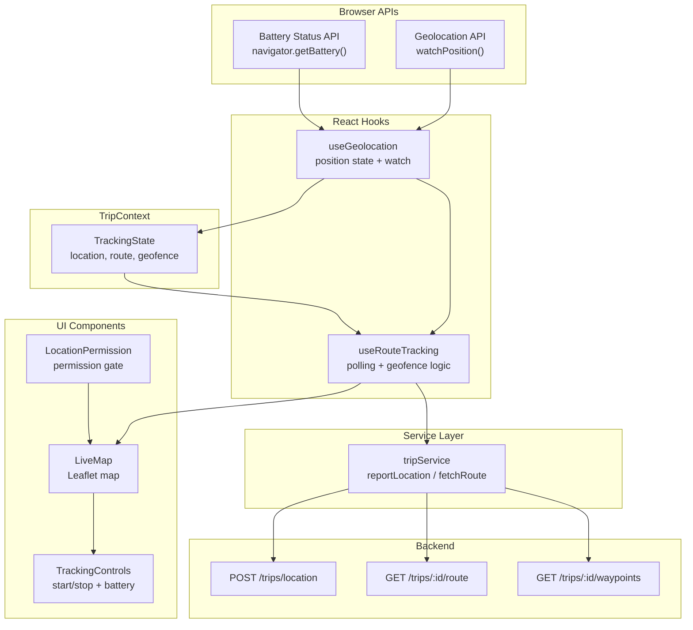
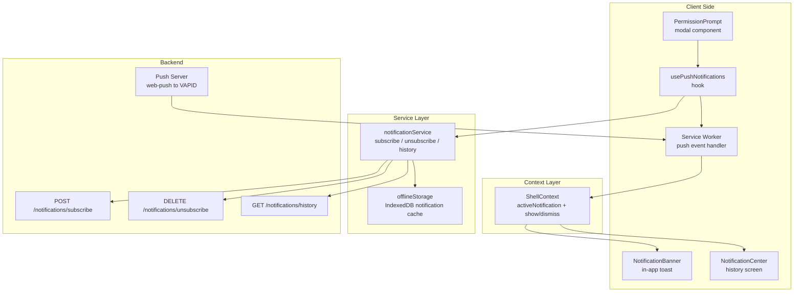
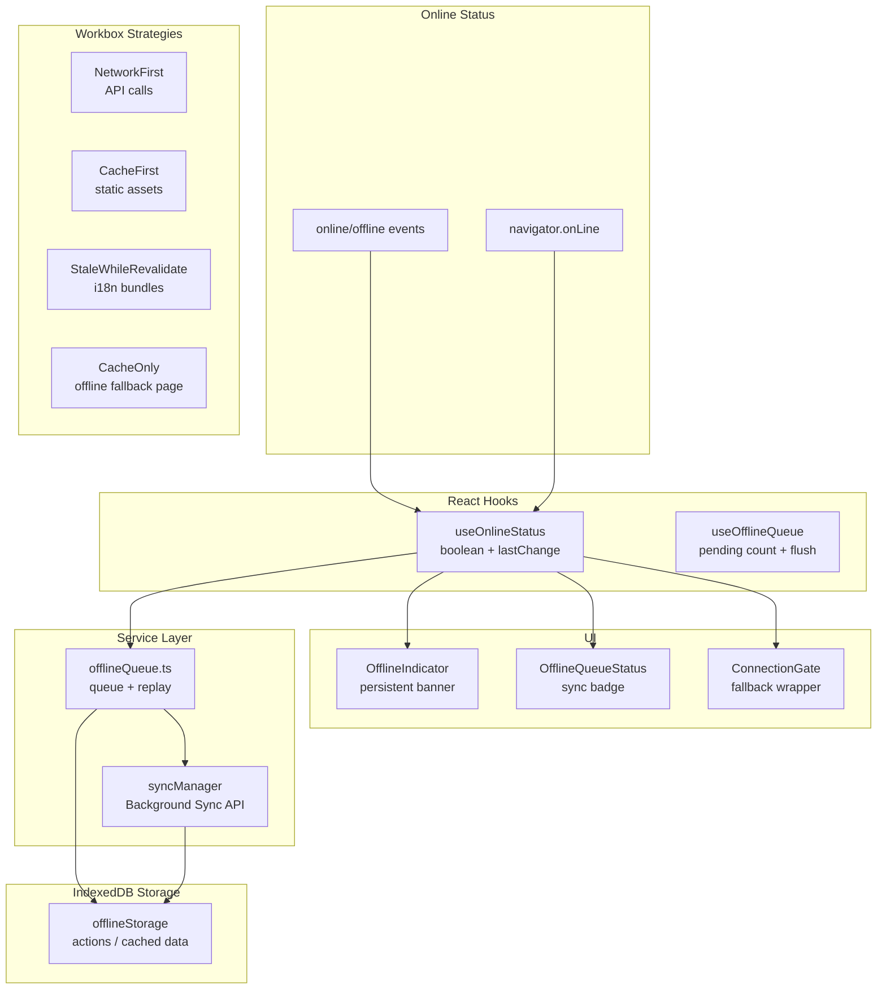
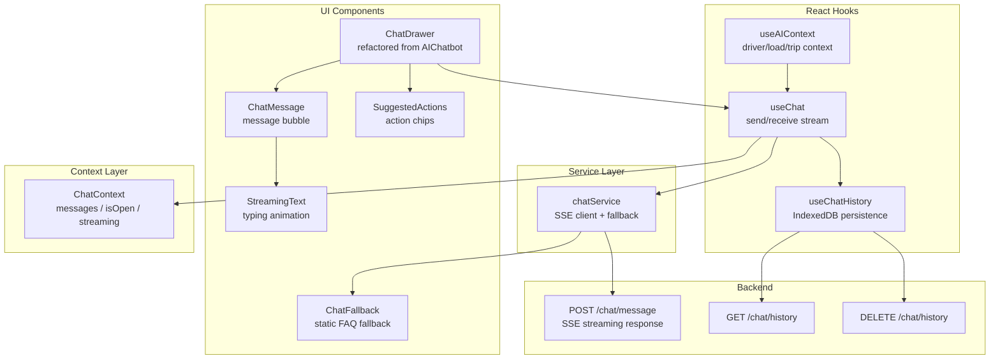
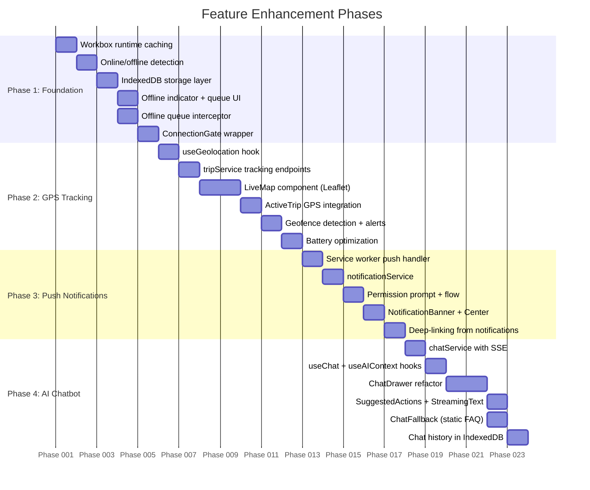

# HindTrucks — Feature Enhancement Architecture

> **Version:** 1.0  
> **Date:** 2026-06-04  
> **Context:** React 18 + TypeScript PWA, Vite 5, Tailwind CSS  
> **Related Docs:**
> - [`state-decentralization.md`](state-decentralization.md) — planned 5-context refactor
> - [`api-service-layer.md`](api-service-layer.md) — mock/real API service layer
> - [`tests-ci-performance.md`](tests-ci-performance.md) — testing, CI, performance strategy

---

## Table of Contents

1. [Overview](#overview)
2. [Feature 1: Real-Time GPS Trip Tracking](#feature-1-real-time-gps-trip-tracking)
3. [Feature 2: Push Notifications](#feature-2-push-notifications)
4. [Feature 3: Offline PWA Support](#feature-3-offline-pwa-support)
5. [Feature 4: AI Chatbot Enhancement](#feature-4-ai-chatbot-enhancement)
6. [Cross-Cutting Concerns](#cross-cutting-concerns)
7. [New Directory Structure](#new-directory-structure)
8. [Dependency Analysis](#dependency-analysis)
9. [Phased Implementation Strategy](#phased-implementation-strategy)
10. [Privacy & Security](#privacy--security)

---

## Overview

Four feature enhancements transform HindTrucks from a demo/prototype PWA into a production-grade driver companion application. Each feature builds on the planned state decentralization and API service layer. The architecture is designed for incremental delivery — each phase adds value independently.

**Current codebase baseline:**

| Component | Current State | Target State |
|---|---|---|
| [`RouteMap.tsx`](../../src/components/RouteMap.tsx) | Static SVG bezier curve, decorative only | Real Leaflet map with live GPS marker, route polyline, geofences |
| [`ActiveTrip.tsx`](../../src/screens/ActiveTrip.tsx) | Step-based simulation with `advanceTrip()` | GPS-driven progress with live location reporting |
| [`AIChatbot.tsx`](../../src/components/AIChatbot.tsx) | 511-line static keyword FAQ matching | AI-backed streaming chat with context-aware responses |
| [`AppContext.tsx`](../../src/state/AppContext.tsx) | 31-field monolithic context | 5 focused contexts (per state-decentralization plan) |
| [`vite.config.ts`](../../vite.config.ts) | Basic PWA manifest, no runtime caching | Workbox strategies, push handler, offline support |

**Integration context — 5 planned contexts (from state-decentralization.md):**

```
┌──────────────┐  ┌─────────────┐  ┌──────────────┐  ┌──────────────┐  ┌──────────────┐
│ AuthContext   │  │ TripContext  │  │EarningsContext│ │ ProfileContext│ │ ShellContext  │
│              │  │              │  │              │  │              │  │              │
│ session      │  │ activeLoad   │  │ walletBalance│  │ driver       │  │ isOnline     │
│ token        │  │ tripStep     │  │ earnings     │  │ trucks       │  │ notification │
│ login/logout │  │ GPS tracking │  │ payouts      │  │ documents    │  │ theme        │
│              │  │ geofences    │  │ history      │  │ settings     │  │ tour         │
└──────────────┘  └─────────────┘  └──────────────┘  └──────────────┘  └──────────────┘
     Feature 2          Feature 1                                            Feature 2
     (push sub)         (GPS tracking)                                       (notifications)
                                                                             Feature 3
                                                                             (offline status)
```

**Integration context — API service domains (from api-service-layer.md):**

```
┌──────────┐ ┌──────────┐ ┌──────────┐ ┌──────────┐ ┌──────────┐ ┌──────────┐
│   auth   │ │  loads   │ │   trip   │ │ earnings │ │ profile  │ │   chat   │
│ service  │ │ service  │ │ service  │ │ service  │ │ service  │ │ service  │
└──────────┘ └──────────┘ └──────────┘ └──────────┘ └──────────┘ └──────────┘
     ▲                                                               │
     │                          Feature 4 (AI chat) ─────────────────┘
     │
     ├── Feature 2 (push subscription ── profile service)
     │
 Feature 1 (GPS location ── trip service)
 Feature 3 (offline queue ── all services)
```

---

## Feature 1: Real-Time GPS Trip Tracking

### 1.1 Architecture Overview



### 1.2 Component Architecture

#### `LiveMap` — Leaflet Map Component

Replaces the static SVG in [`RouteMap.tsx`](../../src/components/RouteMap.tsx:13). Renders:

- **Tile layer:** OpenStreetMap tiles (free, no API key) — cached by Workbox for offline replay
- **Route polyline:** Multi-segment line from origin → waypoints → destination, color-coded by segment status (pending/grey, active/blue, completed/green)
- **Driver marker:** Custom truck icon with rotation based on `heading`; pulsing dot when stationary
- **Waypoint markers:** Pickup flag, delivery flag, checkpoints with popup labels
- **Geofence rings:** Semi-transparent circles at pickup/delivery with configurable radius
- **Auto-center:** Map follows driver position with smooth pan; user can manually pan (auto-center resumes after 10s idle)

Props interface:

```ts
interface LiveMapProps {
  route: Coordinates[];
  waypoints: RouteWaypoint[];
  driverPosition: Coordinates | null;
  geofenceStatus: GeofenceStatus;
  className?: string;
}
```

#### `LocationPermission` — Permission Gate

Shown before tracking starts. Three states:

| State | UI |
|---|---|
| `prompt` | "Allow location access to track your trip" — single CTA button that triggers `geolocation.getCurrentPosition()` |
| `granted` | Renders `LiveMap` children |
| `denied` | Instructional message with link to device settings; manual trip step advancement fallback |

#### `TrackingControls`

Minimal overlay on the map:

- **Start/Stop tracking:** Toggle button (visible only when permission is granted and trip is active)
- **Battery indicator:** Color-coded (green >50%, yellow 20-50%, red <20%) with warning when below 15% — prompts driver to plug in
- **Last reported:** "Updated 5s ago" timestamp

### 1.3 Hook Architecture

#### `useGeolocation`

```ts
function useGeolocation(options?: {
  enableHighAccuracy?: boolean;    // default: true
  maximumAge?: number;             // default: 5000 (5s)
  timeout?: number;                // default: 10000 (10s)
}): {
  position: Coordinates | null;
  error: GeolocationPositionError | null;
  permissionState: PermissionState;
  isWatching: boolean;
  startWatch: () => void;
  stopWatch: () => void;
  requestPermission: () => void;
}
```

Wraps `navigator.geolocation.watchPosition()`. Manages permission state via `navigator.permissions.query({ name: 'geolocation' })`. Exposes start/stop for lifecycle control — tracking starts on trip begin and stops on trip complete/cancel.

Battery-aware: when battery < 15% and discharging, switches `enableHighAccuracy` to `false` and increases `maximumAge` to 30s.

#### `useRouteTracking`

```ts
function useRouteTracking(tripId: string): {
  trackingState: TrackingState;
  startTracking: () => void;
  stopTracking: () => void;
  reportLocation: () => Promise<void>;
}
```

Core logic hook:

1. Calls `fetchRoute(tripId)` on mount to get route polyline + waypoints
2. Subscribes to `useGeolocation` position updates
3. Every 5-10s (adaptive based on speed): calls `reportLocation(tripId, coordinates)`
4. Computes geofence proximity: distance to next waypoint, ETA, approaching flag
5. Updates `TripContext` with latest tracking state
6. On stop: sends final location, cleans up watch

**Polling strategy:** Adaptive interval. 5s when speed > 10 km/h, 10s when speed < 10 km/h, 30s when stationary (speed near 0). This balances accuracy with battery/data usage.

### 1.4 TypeScript Interfaces

```ts
// ─── src/features/tracking/types.ts ───

interface Coordinates {
  lat: number;
  lng: number;
  heading: number | null;   // degrees from north, null if stationary
  speed: number | null;     // m/s
  accuracy: number;         // meters
  timestamp: number;        // Date.now()
}

interface RouteWaypoint {
  id: string;
  coordinates: Coordinates;
  type: 'pickup' | 'delivery' | 'rest_stop' | 'weigh_bridge' | 'checkpoint';
  label: string;
  radius: number;           // geofence radius in meters (default: 500)
  estimatedArrival: number; // Unix timestamp
  status: 'pending' | 'approaching' | 'arrived' | 'departed';
}

interface GeofenceStatus {
  nearestWaypoint: RouteWaypoint | null;
  distanceToNext: number | null;   // meters
  etaSeconds: number | null;
  isApproaching: boolean;          // within 2x radius
  hasArrived: boolean;             // within radius
}

interface TrackingState {
  isTracking: boolean;
  currentLocation: Coordinates | null;
  routePolyline: Coordinates[];
  waypoints: RouteWaypoint[];
  geofenceStatus: GeofenceStatus;
  lastReportedAt: number;
  batteryLevel: number | null;     // 0..1
  isCharging: boolean;
  permissionState: PermissionState;
}
```

### 1.5 Integration Points

| Integration | How |
|---|---|
| **TripContext** | New fields: `trackingState: TrackingState`, `startTracking()`, `stopTracking()` |
| **tripService** | New methods: `reportLocation(tripId, coords)`, `fetchRoute(tripId)`, `fetchWaypoints(tripId)` |
| **ActiveTrip screen** | Renders `LiveMap` instead of `RouteMap`; passes tracking state; advanceTrip triggered by geofence arrival, not manual button |
| **ShellContext** | Reads `isOnline` to switch between live reporting and offline queuing |
| **offlineStorage** | Queues location reports when offline (see Feature 3) |

### 1.6 Map Library Decision

| Criteria | Leaflet + react-leaflet | MapLibre GL + react-map-gl |
|---|---|---|
| Bundle size | ~45KB gzip | ~200KB gzip |
| Tile source | OpenStreetMap raster (free) | Vector tiles (free options) |
| Offline support | Tile caching via Workbox | Custom tile packaging |
| Rotation support | Plugin (`leaflet-rotatedmarker`) | Native bearing support |
| PWA friendliness | Excellent (small, mature) | Good (heavier) |
| Learning curve | Low | Medium |

**Decision: Leaflet** — smaller bundle, sufficient for single-route display, better PWA compatibility. The `leaflet-rotatedmarker` plugin handles truck heading rotation (1KB addition).

---

## Feature 2: Push Notifications

### 2.1 Architecture Overview



### 2.2 Component Architecture

#### `PermissionPrompt` — Push Opt-In Modal

Shown once after successful login (not during onboarding). Stored in localStorage to avoid re-prompting.

```
┌─────────────────────────────────────┐
│           🔔 Stay Updated            │
│                                      │
│  Get notified when:                  │
│  • New loads are available           │
│  • Your load is accepted             │
│  • Trip status changes               │
│  • Earnings are credited             │
│                                      │
│  [ Maybe Later ]   [ Enable ]        │
└─────────────────────────────────────┘
```

- "Enable" → calls `notificationService.subscribe()`, triggers browser native prompt
- "Maybe Later" → dismisses, sets `promptedBefore: true` in localStorage, shows again after 7 days or 3 app opens
- If browser prompt was previously denied: shows instructions to enable via browser settings

#### `NotificationBanner` — In-App Toast

```ts
interface NotificationBannerProps {
  notification: PushNotification;
  onDismiss: () => void;
  onAction: (deepLink?: string) => void;
}
```

- Non-intrusive toast at top of screen (below `TopBar`)
- Type-specific icon + color: new_load=blue, accepted=green, status_update=amber, earnings=green/coin, announcement=grey
- Swipe-to-dismiss + auto-dismiss after 8s
- "Tap to view" — navigates via deepLink data
- Always shown (serves as fallback when push is denied or browser doesn't support it)

#### `NotificationCenter` — History Screen

Accessible from Profile screen and bottom tab notification badge.

- Grouped by date (Today, Yesterday, This Week, Older)
- Unread indicator dot
- Swipe-to-delete (removes from IndexedDB)
- "Mark all read" button
- Empty state: "No notifications yet"

### 2.3 Hook Architecture

#### `usePushNotifications`

```ts
function usePushNotifications(): {
  permissionState: NotificationPermissionState;
  isSubscribed: boolean;
  subscribe: () => Promise<void>;
  unsubscribe: () => Promise<void>;
  notifications: PushNotification[];
  unreadCount: number;
  markRead: (id: string) => void;
  markAllRead: () => void;
  deleteNotification: (id: string) => void;
  showBanner: (notification: PushNotification) => void;
}
```

**Subscribe flow:**

1. Check `Notification.permission`
2. If `default`: show `PermissionPrompt` modal
3. If `granted`: register service worker → `pushManager.subscribe()` with VAPID public key
4. Send subscription object to `POST /notifications/subscribe` with device info
5. Store subscription status in IndexedDB + ShellContext

**Unsubscribe flow (logout or profile toggle):**

1. Get current subscription from `pushManager.getSubscription()`
2. Call `subscription.unsubscribe()`
3. Call `DELETE /notifications/unsubscribe` with endpoint
4. Clear notification history from IndexedDB

#### Service Worker Push Handler

```ts
// src/features/notifications/sw/pushHandler.ts
// Registered via vite-plugin-pwa workbox config

self.addEventListener('push', (event: PushEvent) => {
  const data = event.data?.json() as PushPayload;
  
  const options: NotificationOptions = {
    body: data.body,
    icon: '/pwa-192.png',
    badge: '/pwa-192.png',
    data: {
      deepLink: data.deepLink,
      notificationId: data.id,
      type: data.type,
      timestamp: Date.now(),
    },
    tag: data.type,           // replace same-type notifications
    renotify: true,
    vibrate: [200, 100, 200],
    actions: data.actions,    // optional action buttons
  };

  event.waitUntil(
    Promise.all([
      self.registration.showNotification(data.title, options),
      // Store in IndexedDB for in-app history
      storeNotification(data),
    ])
  );
});

self.addEventListener('notificationclick', (event) => {
  event.notification.close();
  const deepLink = event.notification.data?.deepLink || '/';
  
  event.waitUntil(
    clients.openWindow(deepLink)
  );
});
```

### 2.4 TypeScript Interfaces

```ts
// ─── src/features/notifications/types.ts ───

type NotificationType = 
  | 'new_load' 
  | 'accepted' 
  | 'status_update' 
  | 'earnings' 
  | 'announcement';

interface PushPayload {
  id: string;
  type: NotificationType;
  title: string;
  body: string;
  deepLink?: string;          // e.g., '/loads/123', '/trip', '/earnings'
  actions?: NotificationAction[];
  expiresAt?: number;          // Unix timestamp, auto-dismiss after
}

interface NotificationAction {
  action: string;
  title: string;
  icon?: string;
}

interface PushNotification {
  id: string;
  type: NotificationType;
  title: string;
  body: string;
  deepLink?: string;
  read: boolean;
  receivedAt: number;
  expiresAt?: number;
}

interface NotificationPermissionState {
  push: PermissionState;        // 'granted' | 'denied' | 'prompt'
  needsPrompt: boolean;
  promptedBefore: boolean;
}

interface PushSubscriptionData {
  endpoint: string;
  keys: {
    p256dh: string;
    auth: string;
  };
  userAgent: string;
  platform: string;
  language: string;
}
```

### 2.5 Integration Points

| Integration | How |
|---|---|
| **ShellContext** | New fields: `activeNotification: PushNotification | null`, `unreadCount: number`, `showNotification()`, `dismissNotification()` |
| **AuthContext** | On `login`: check if prompted before → cooldown logic. On `logout`: unsubscribe push, clear stored notifications |
| **notificationService** | New service domain: `subscribe(deviceInfo)`, `unsubscribe()`, `getHistory(page, limit)` |
| **offlineStorage** | Notification history persisted in IndexedDB for offline access + in-app fallback |
| **Profile screen** | "Notification Center" entry point, push toggle switch |
| **BottomTabBar** | Badge on Profile tab when `unreadCount > 0` |
| **vite.config.ts** | Workbox config: `importScripts` for custom SW push handler |

### 2.6 vite.config.ts Changes

```ts
// Add to existing VitePWA plugin options:
VitePWA({
  registerType: 'autoUpdate',
  workbox: {
    // ... runtime caching from Feature 3 ...
    importScripts: ['/sw-push-handler.js'],
  },
  manifest: {
    // ... existing manifest ...
    display: 'standalone',
  },
})
```

The custom push handler script (`public/sw-push-handler.js`) is served as a static asset and imported by the generated service worker.

---

## Feature 3: Offline PWA Support

### 3.1 Architecture Overview



### 3.2 Component Architecture

#### `OfflineIndicator`

```tsx
// Persistent banner at top of app (below TopBar, above content)
// Only visible when isOnline === false
function OfflineIndicator() {
  const { isOnline } = useShell();
  if (isOnline) return null;
  
  return (
    <div className="bg-amber-500 text-white text-center py-1.5 text-sm font-medium">
      <WifiOff className="inline w-4 h-4 mr-1" />
      {t('offline.banner')} {/* "You're offline. Changes will sync when connected." */}
    </div>
  );
}
```

#### `OfflineQueueStatus`

Shown in the TopBar when pending actions exist:

```tsx
function OfflineQueueStatus() {
  const { pendingCount } = useOfflineQueue();
  if (pendingCount === 0) return null;
  
  return (
    <span className="relative">
      <CloudOff className="w-5 h-5" />
      <span className="absolute -top-1 -right-1 bg-red-500 text-white text-[10px] 
                       rounded-full w-4 h-4 flex items-center justify-center">
        {pendingCount}
      </span>
    </span>
  );
}
```

Tap opens a bottom sheet showing pending actions with retry/delete options.

#### `ConnectionGate`

Wrapper component for screens that require connectivity:

```tsx
function ConnectionGate({ 
  children, 
  fallback,     // Optional custom offline UI
  requireOnline = true 
}: ConnectionGateProps) {
  const { isOnline } = useShell();
  
  if (requireOnline && !isOnline) {
    return fallback ?? <OfflineFallback />;
  }
  return <>{children}</>;
}
```

### 3.3 Hook Architecture

#### `useOnlineStatus`

```ts
function useOnlineStatus(): {
  isOnline: boolean;
  wasOffline: boolean;       // true if just came back online
  lastOnlineAt: number;      // timestamp
  lastOfflineAt: number;
}
```

- Listens to `window` `online`/`offline` events
- On transition offline→online: triggers offline queue flush
- Populates `ShellContext.isOnline`

#### `useOfflineQueue`

```ts
function useOfflineQueue(): {
  pendingActions: OfflineAction[];
  pendingCount: number;
  addToQueue: (action: Omit<OfflineAction, 'id' | 'createdAt' | 'attempts' | 'status'>) => Promise<void>;
  flushQueue: () => Promise<SyncResult>;
  removeAction: (id: string) => Promise<void>;
  retryAction: (id: string) => Promise<void>;
  syncStatus: 'idle' | 'syncing' | 'error';
}
```

**Queue flow:**

1. **Action queued:** App tries API call → fails (offline) → serializes action to IndexedDB
2. **Online detected:** `online` event fires → `flushQueue()` called
3. **Replay:** Actions replayed in FIFO order with original auth token (refreshed if needed)
4. **Conflict resolution:** Server timestamp > client timestamp → server wins, notify user of conflict

This extends the planned [`offlineQueue.ts`](api-service-layer.md) from the API service layer architecture.

### 3.4 IndexedDB Schema (via `idb`)

```ts
// src/features/offline/services/offlineStorage.ts

const DB_NAME = 'hindtrucks_offline';
const DB_VERSION = 1;

// Object stores:
interface HindTrucksDB {
  offline_actions: {
    key: string;            // action.id
    value: OfflineAction;
    indexes: { 'by-status': string; 'by-created': number };
  };
  cached_responses: {
    key: string;            // endpoint hash (e.g., 'GET:/loads?status=active')
    value: CachedResponse;
    indexes: { 'by-ttl': number };
  };
  chat_history: {
    key: string;
    value: ChatMessage;
    indexes: { 'by-timestamp': number };
  };
  notification_history: {
    key: string;            // notification.id
    value: PushNotification;
    indexes: { 'by-received': number; 'by-read': number };
  };
  user_preferences: {
    key: string;
    value: unknown;
  };
}
```

### 3.5 Workbox Runtime Caching Strategies

```ts
// vite.config.ts — VitePWA workbox config
workbox: {
  runtimeCaching: [
    // API calls: NetworkFirst with 3s timeout
    {
      urlPattern: /^https?:\/\/api\..*\/v1\/.*/,
      handler: 'NetworkFirst',
      options: {
        cacheName: 'api-cache',
        networkTimeoutSeconds: 3,
        expiration: { maxEntries: 50, maxAgeSeconds: 300 },  // 5 min
        cacheableResponse: { statuses: [0, 200] },
      },
    },
    // Static assets: CacheFirst (fingerprinted by Vite)
    {
      urlPattern: /\.(js|css|woff2?|png|svg|ico)$/,
      handler: 'CacheFirst',
      options: {
        cacheName: 'static-assets',
        expiration: { maxEntries: 100, maxAgeSeconds: 604800 },  // 7 days
      },
    },
    // i18n locale bundles: StaleWhileRevalidate
    {
      urlPattern: /\/locales\/.*\.json$/,
      handler: 'StaleWhileRevalidate',
      options: {
        cacheName: 'i18n-cache',
        expiration: { maxEntries: 10, maxAgeSeconds: 86400 },  // 1 day
      },
    },
    // Map tiles (OpenStreetMap): StaleWhileRevalidate
    {
      urlPattern: /^https:\/\/.*\.tile\.openstreetmap\.org\/.*/,
      handler: 'StaleWhileRevalidate',
      options: {
        cacheName: 'map-tiles',
        expiration: { maxEntries: 200, maxAgeSeconds: 604800 },  // 7 days
      },
    },
  ],
  // Custom SW script for push handling
  importScripts: ['/sw-push-handler.js'],
},
```

### 3.6 Background Sync

For actions queued while offline that need guaranteed delivery:

```ts
// src/features/offline/services/syncManager.ts

async function registerSync(tag: string) {
  if ('serviceWorker' in navigator && 'SyncManager' in window) {
    const reg = await navigator.serviceWorker.ready;
    await (reg as any).sync.register(tag);
  }
}

// Service worker sync event handler:
self.addEventListener('sync', (event) => {
  if (event.tag === 'flush-offline-queue') {
    event.waitUntil(flushQueuedActions());
  }
});
```

Background Sync is Chrome-only. For other browsers, fallback to `online` event-driven flush.

### 3.7 TypeScript Interfaces

```ts
// ─── src/features/offline/types.ts ───

interface OfflineAction {
  id: string;
  type: 'accept_load' | 'advance_trip' | 'report_location' | 'withdraw_earnings' | 'update_profile' | 'update_truck';
  payload: unknown;
  endpoint: string;
  method: 'POST' | 'PUT' | 'PATCH' | 'DELETE';
  createdAt: number;
  attempts: number;
  maxAttempts: number;          // default: 3
  lastAttemptAt: number | null;
  status: 'pending' | 'syncing' | 'failed' | 'conflict';
  error?: string;
  conflictData?: unknown;       // server's version on conflict
}

interface CachedResponse {
  key: string;
  endpoint: string;
  data: unknown;
  cachedAt: number;
  ttl: number;                  // milliseconds
  headers: Record<string, string>;
}

interface SyncResult {
  succeeded: number;
  failed: OfflineAction[];
  conflicts: OfflineAction[];
}

interface OfflineState {
  isOnline: boolean;
  pendingActions: number;
  lastSyncAt: number | null;
  syncStatus: 'idle' | 'syncing' | 'error';
  wasOffline: boolean;
}
```

### 3.8 Integration Points

| Integration | How |
|---|---|
| **ShellContext** | Owns `isOnline`, `offlineState`, `wasOffline` |
| **TripContext** | Actions queued: `advance_trip`, `report_location` |
| **EarningsContext** | Action queued: `withdraw_earnings` |
| **ProfileContext** | Actions queued: `update_profile`, `update_truck` |
| **all services** | Transparent offline queuing via the `offlineQueue` interceptor in `apiClient.ts` |
| **LoadCard / Home** | Data displayed from `cached_responses` when offline |
| **BottomTabBar** | Offline queue badge (pending count) |

---

## Feature 4: AI Chatbot Enhancement

### 4.1 Architecture Overview



### 4.2 Component Architecture

#### `ChatDrawer` — Refactored from `AIChatbot.tsx`

Current [`AIChatbot.tsx`](../../src/components/AIChatbot.tsx) (511 lines) is refactored into:

| Original | Refactored Into |
|---|---|
| `Message` interface | `ChatMessage` type in `types.ts` |
| `speakText()` function | `useTTS()` hook (reusable) |
| `RedirectBubble` component | `SuggestedActions` component (enhanced) |
| FAQ arrays (withdraw/accept/bfc/refer/docs) | `ChatFallback` component |
| `handleSend()` logic | `useChat` hook |
| `toggleListening()` / STT logic | `useSTT()` hook (reusable) |
| FAB + drawer UI | `ChatDrawer` shell component |
| `activeFaqs` / quick questions | Dynamic suggestions from AI context |

New component responsibilities:

- **`ChatDrawer`:** FAB trigger, slide-up drawer, header with "AI Assistant" title + close button + online status indicator
- **`ChatMessage`:** Renders user/assistant bubbles; assistant messages support streaming text, suggested actions, and TTS play button
- **`StreamingText`:** Animated typewriter effect driven by SSE `onmessage` events; shows blinking cursor while streaming
- **`SuggestedActions`:** Row of tappable chips that trigger navigation or actions; replaces `RedirectBubble` with more flexible design
- **`ChatFallback`:** Preserves current static FAQ keyword matching; shown when API is unreachable or `VITE_API_MODE=mock`

### 4.3 Hook Architecture

#### `useChat`

```ts
function useChat(): {
  messages: ChatMessage[];
  isStreaming: boolean;
  sendMessage: (text: string) => void;
  clearChat: () => void;
  retryLast: () => void;
  suggestedActions: SuggestedAction[];
}
```

**sendMessage flow:**

1. Create user `ChatMessage`, add to state + IndexedDB
2. Collect context via `useAIContext()` (driver name, language, active load, trip step, etc.)
3. Open SSE connection to `POST /chat/message`
4. On `onmessage`: append token to current assistant message in state
5. On `onerror`: switch to `ChatFallback` static FAQ matching
6. On stream end (special `[DONE]` event or stream close): finalize message, extract suggested actions, save to IndexedDB

#### `useChatHistory`

```ts
function useChatHistory(): {
  messages: ChatMessage[];
  loadHistory: () => Promise<void>;
  addMessage: (msg: ChatMessage) => Promise<void>;
  clearHistory: () => Promise<void>;
  isLoaded: boolean;
}
```

- On mount: loads last 50 messages from IndexedDB
- On new message: persists to IndexedDB immediately (optimistic)
- On clear: removes from IndexedDB + calls `DELETE /chat/history`
- Messages older than 30 days auto-purged

#### `useAIContext`

```ts
function useAIContext(): ChatContext {
  // Aggregates context from multiple focused contexts:
  const { driver } = useProfile();
  const { activeLoad, tripStep } = useTrip();
  const { walletBalance } = useEarnings();
  const { unreadCount } = useShell();
  const { i18n } = useTranslation();
  
  return useMemo(() => ({
    driverName: driver?.name ?? '',
    driverLanguage: i18n.language,
    activeLoadId: activeLoad?.id ?? null,
    tripStep,
    walletBalance,
    recentEarnings: /* from EarningsContext */,
    unreadNotifications: unreadCount,
  }), [driver, activeLoad, tripStep, walletBalance, unreadCount, i18n.language]);
}
```

This context object is sent as part of the initial SSE request, allowing the AI to personalize responses.

### 4.4 SSE Chat Service

```ts
// src/features/chatbot/services/chatService.ts

function streamChatMessage(
  text: string,
  context: ChatContext,
  history: ChatMessage[],
  signal: AbortSignal
): AsyncIterable<ChatStreamEvent> {
  // Uses fetch() with streaming reader (not EventSource, because POST body needed)
  const response = await fetch('/api/v1/chat/message', {
    method: 'POST',
    headers: { 'Content-Type': 'application/json', 'Authorization': `Bearer ${token}` },
    body: JSON.stringify({ text, context, history: history.slice(-10) }),
    signal,
  });

  const reader = response.body!.getReader();
  const decoder = new TextDecoder();

  return {
    [Symbol.asyncIterator]() {
      return {
        async next() {
          const { done, value } = await reader.read();
          if (done) return { done: true, value: undefined };
          
          const chunk = decoder.decode(value, { stream: true });
          const lines = chunk.split('\n').filter(l => l.startsWith('data: '));
          
          for (const line of lines) {
            const data = JSON.parse(line.slice(6));
            if (data.type === 'done') return { done: true, value: undefined };
            return { done: false, value: data };
          }
          
          return this.next(); // skip empty
        },
      };
    },
  };
}
```

**Fallback strategy:**

```ts
async function sendMessage(text: string, context: ChatContext): Promise<ChatResponse> {
  if (VITE_API_MODE === 'mock' || !navigator.onLine) {
    return staticFaqMatch(text, context.driverLanguage);
  }
  
  try {
    return await streamChatMessage(text, context, history, abortController.signal);
  } catch (error) {
    // AI service unavailable — fall back to static FAQ
    console.warn('AI chat unavailable, using static fallback');
    return staticFaqMatch(text, context.driverLanguage);
  }
}
```

### 4.5 TypeScript Interfaces

```ts
// ─── src/features/chatbot/types.ts ───

interface ChatMessage {
  id: string;
  role: 'user' | 'assistant' | 'system';
  content: string;
  language: string;
  timestamp: number;
  suggestedActions?: SuggestedAction[];
  isStreaming?: boolean;
  isError?: boolean;
}

interface SuggestedAction {
  id: string;
  label: string;                // Display text (localized)
  icon?: string;                // Lucide icon name
  action: 'accept_load' | 'view_load' | 'start_trip' | 'view_earnings' | 'update_profile' | 'navigate' | 'call_support';
  payload?: {
    loadId?: string;
    route?: string;             // React Router path
    phoneNumber?: string;
  };
}

interface ChatContext {
  driverName: string;
  driverLanguage: string;       // 'en' | 'hi' | 'ta' | 'te' | 'pa'
  activeLoadId: string | null;
  tripStep: number;
  walletBalance: number;
  recentEarnings: number;
  unreadNotifications: number;
  isOnline: boolean;
}

type ChatStreamEvent =
  | { type: 'token'; content: string }
  | { type: 'action'; action: SuggestedAction }
  | { type: 'error'; message: string }
  | { type: 'done' };

interface ChatState {
  messages: ChatMessage[];
  isOpen: boolean;
  isStreaming: boolean;
  fallbackMode: boolean;
  context: ChatContext;
}
```

### 4.6 Multilingual Support

The AI backend receives `driverLanguage` in the context. The backend should:

1. Respond in the driver's language
2. If the AI model doesn't support the language natively, return English + a `translationHints` field
3. Client-side: mark messages with `language` field for TTS voice selection

The current static FAQ (5 languages, 5 categories) is preserved as `ChatFallback` for offline/mock mode. The static FAQ arrays are moved from `AIChatbot.tsx` to a separate data file: `src/data/staticFaqs.ts`.

### 4.7 Integration Points

| Integration | How |
|---|---|
| **New ChatContext** | Owns `messages`, `isOpen`, `isStreaming`, `fallbackMode`; provides `sendMessage`, `clearChat` |
| **chatService** | New service domain (already planned in api-service-layer.md): `streamMessage()`, `getHistory()`, `clearHistory()` |
| **offlineStorage** | Chat history persisted in IndexedDB `chat_history` store |
| **TripContext** | Context injection: `activeLoad`, `tripStep` |
| **EarningsContext** | Context injection: `walletBalance`, `recentEarnings` |
| **ProfileContext** | Context injection: `driverName`, `language` |
| **ShellContext** | Context injection: `isOnline`, `unreadCount` |
| **React Router** | Navigation from `SuggestedActions` |
| **i18n** | Language detection for AI response language + static FAQ fallback |

---

## Cross-Cutting Concerns

### State Ownership Map

| State | Owner Context | Consumer Contexts |
|---|---|---|
| `isOnline` | ShellContext | TripContext, ChatContext, EarningsContext |
| `activeNotification` | ShellContext | BottomTabBar, NotificationBanner |
| `trackingState` | TripContext | ActiveTrip screen, LiveMap |
| `messages` (chat) | ChatContext | ChatDrawer, useChatHistory |
| `pushSubscription` | ProfileContext (settings) | usePushNotifications |
| `offlineActions` | offlineStorage (not context) | useOfflineQueue, OfflineQueueStatus |

### Context Communication

Following the state-decentralization pattern: **effect-based self-cleanup**. Each context sets up effects that listen for cross-context changes and clean up on unmount.

Example — Offline→Online triggers queue flush:

```ts
// In ShellContext provider:
useEffect(() => {
  if (isOnline && wasOffline) {
    // Dispatch event that OfflineQueueContext listens for
    window.dispatchEvent(new CustomEvent('ht:online-restored'));
  }
}, [isOnline, wasOffline]);
```

---

## New Directory Structure

All new feature code lives under `src/features/`. Existing components/screens are refactored in place.

```
src/
├── features/
│   ├── tracking/                     # Feature 1: GPS Tracking
│   │   ├── components/
│   │   │   ├── LiveMap.tsx
│   │   │   ├── LocationPermission.tsx
│   │   │   ├── TrackingControls.tsx
│   │   │   ├── DriverMarker.tsx
│   │   │   └── GeofenceAlert.tsx
│   │   ├── hooks/
│   │   │   ├── useGeolocation.ts
│   │   │   └── useRouteTracking.ts
│   │   ├── services/
│   │   │   └── trackingService.ts
│   │   └── types.ts
│   │
│   ├── notifications/                # Feature 2: Push Notifications
│   │   ├── components/
│   │   │   ├── NotificationBanner.tsx
│   │   │   ├── NotificationCenter.tsx
│   │   │   ├── PermissionPrompt.tsx
│   │   │   └── NotificationItem.tsx
│   │   ├── hooks/
│   │   │   ├── usePushNotifications.ts
│   │   │   └── useNotificationPermission.ts
│   │   ├── services/
│   │   │   └── notificationService.ts
│   │   ├── sw/
│   │   │   └── pushHandler.ts        # Compiled to public/sw-push-handler.js
│   │   └── types.ts
│   │
│   ├── offline/                      # Feature 3: Offline PWA
│   │   ├── components/
│   │   │   ├── OfflineIndicator.tsx
│   │   │   ├── OfflineQueueStatus.tsx
│   │   │   ├── ConnectionGate.tsx
│   │   │   └── OfflineFallback.tsx
│   │   ├── hooks/
│   │   │   ├── useOnlineStatus.ts
│   │   │   └── useOfflineQueue.ts
│   │   ├── services/
│   │   │   ├── offlineStorage.ts     # IndexedDB operations
│   │   │   └── syncManager.ts        # Background Sync API
│   │   └── types.ts
│   │
│   └── chatbot/                      # Feature 4: AI Chatbot
│       ├── components/
│       │   ├── ChatDrawer.tsx
│       │   ├── ChatMessage.tsx
│       │   ├── StreamingText.tsx
│       │   ├── SuggestedActions.tsx
│       │   ├── ChatFallback.tsx
│       │   └── ChatFAB.tsx
│       ├── hooks/
│       │   ├── useChat.ts
│       │   ├── useChatHistory.ts
│       │   ├── useAIContext.ts
│       │   ├── useTTS.ts             # Extracted from AIChatbot
│       │   └── useSTT.ts             # Extracted from AIChatbot
│       ├── services/
│       │   └── chatService.ts
│       ├── data/
│       │   └── staticFaqs.ts         # Moved from AIChatbot.tsx
│       └── types.ts
│
├── state/                            # Refactored contexts
│   ├── AuthContext.tsx
│   ├── TripContext.tsx               # Updated: +TrackingState
│   ├── EarningsContext.tsx
│   ├── ProfileContext.tsx            # Updated: +push settings
│   ├── ShellContext.tsx              # Updated: +isOnline, +notifications
│   └── ChatContext.tsx               # New
│
├── services/                          # API service layer
│   ├── apiClient.ts                  # Updated: +offline interceptor
│   ├── authService.ts
│   ├── loadsService.ts
│   ├── tripService.ts                # Updated: +tracking endpoints
│   ├── earningsService.ts
│   ├── profileService.ts
│   ├── chatService.ts                # New
│   ├── notificationService.ts        # New
│   └── offlineQueue.ts               # New (from api-service-layer plan)
│
├── components/                        # Shared components (existing, some refactored)
│   ├── RouteMap.tsx                   # → Replaced by features/tracking/LiveMap
│   ├── AIChatbot.tsx                  # → Replaced by features/chatbot/ChatDrawer
│   └── ... (others unchanged)
│
└── screens/                           # Screen components (existing, updated)
│   ├── ActiveTrip.tsx                 # Updated: GPS tracking integration
│   └── ... (others unchanged)
│
public/
├── sw-push-handler.js                 # Compiled SW push event handler
└── offline.html                       # Offline fallback page
```

---

## Dependency Analysis

### New npm Packages

| Package | Version | Bundle Impact | Used By | Purpose |
|---|---|---|---|---|
| `leaflet` | ^1.9 | ~40KB gzip | Feature 1 | Map rendering, tile display |
| `react-leaflet` | ^4.2 | ~5KB gzip | Feature 1 | React bindings for Leaflet |
| `leaflet-rotatedmarker` | ^0.2 | ~1KB gzip | Feature 1 | Truck heading rotation on marker |
| `idb` | ^8.0 | ~2KB gzip | Features 2,3,4 | Clean IndexedDB API wrapper |

**Total new bundle impact: ~48KB gzip** (before tree-shaking). All packages are tree-shakeable.

### Packages NOT Needed (Native APIs Used)

| Requirement | Solution | Reason |
|---|---|---|
| Push Notifications | Web Push API | Native browser API — no library needed |
| SSE streaming | `fetch()` with `ReadableStream` | Native — no EventSource limitation (POST support) |
| Geolocation | `navigator.geolocation` | Native browser API |
| Background Sync | `SyncManager` API | Native (Chrome), fallback to `online` event |
| IndexedDB | `idb` library | Thin wrapper (~2KB) — avoids raw IndexedDB complexity |
| Service Worker | `vite-plugin-pwa` (already installed) | Already in project, extended config only |

### Dev Dependencies (Testing)

| Package | Purpose |
|---|---|
| `@testing-library/react-hooks` | Test custom hooks (useGeolocation, useChat, etc.) |
| `msw` | Mock service worker for API mocking in tests |
| `fake-indexeddb` | In-memory IndexedDB for unit tests |

These are already planned in [`tests-ci-performance.md`](tests-ci-performance.md).

---

## Phased Implementation Strategy



**Phase ordering rationale:**

1. **Phase 1 first** — Offline foundation is a dependency for GPS (offline location queuing), notifications (offline notification storage), and chatbot (chat history storage). Every other feature benefits from the connectivity detection and IndexedDB infrastructure.

2. **Phase 2 second** — GPS tracking is the most visually transformative feature (replaces decorative map with real map). It validates the offline queue (location reports queued when connectivity drops). It's independent of notifications and chatbot.

3. **Phase 3 third** — Notifications depend on the service worker infrastructure (set up in Phase 1) and the profile service. They're independent of GPS and chatbot.

4. **Phase 4 last** — AI chatbot is the most complex feature with the most integration points (reads from all 5 contexts). It benefits from the stable infrastructure built in Phases 1-3. The static FAQ fallback ensures no regression if the AI backend isn't ready.

### Phase 1: Detailed Breakdown

| Step | Files Changed/Created | Key Deliverable |
|---|---|---|
| 1.1 Workbox config | `vite.config.ts` | Runtime caching for API, static, i18n, map tiles |
| 1.2 Online detection | `useOnlineStatus.ts`, `ShellContext.tsx` | `isOnline` state with event listeners |
| 1.3 IndexedDB setup | `offlineStorage.ts` | `HindTrucksDB` with all object stores |
| 1.4 Offline queue | `offlineQueue.ts`, `useOfflineQueue.ts` | Queue + replay logic |
| 1.5 API client interceptor | `apiClient.ts` | Transparent offline→queue fallback |
| 1.6 UI components | `OfflineIndicator.tsx`, `OfflineQueueStatus.tsx`, `ConnectionGate.tsx` | Visual offline feedback |
| 1.7 Offline fallback | `OfflineFallback.tsx`, `public/offline.html` | Cached offline page |

### Phase 2: Detailed Breakdown

| Step | Files Changed/Created | Key Deliverable |
|---|---|---|
| 2.1 Geolocation hook | `useGeolocation.ts` | Wraps `watchPosition` with permission management |
| 2.2 Tracking types | `tracking/types.ts` | All GPS-related interfaces |
| 2.3 Tracking service | `trackingService.ts`, `tripService.ts` | API endpoints for location + route |
| 2.4 LiveMap | `LiveMap.tsx`, `DriverMarker.tsx` | Leaflet map with route + real-time marker |
| 2.5 Permission UI | `LocationPermission.tsx` | Three-state permission gate |
| 2.6 Tracking hook | `useRouteTracking.ts` | Polling, geofence, battery logic |
| 2.7 TripContext update | `TripContext.tsx` | Add TrackingState + actions |
| 2.8 ActiveTrip update | `ActiveTrip.tsx` | Wire LiveMap + GPS-driven progress |
| 2.9 Geofence alerts | `GeofenceAlert.tsx` | Visual/audible waypoint proximity alerts |

### Phase 3: Detailed Breakdown

| Step | Files Changed/Created | Key Deliverable |
|---|---|---|
| 3.1 SW push handler | `public/sw-push-handler.js` | Push event + notificationclick handling |
| 3.2 Notification types | `notifications/types.ts` | All push notification interfaces |
| 3.3 Notification service | `notificationService.ts` | Subscribe/unsubscribe/history endpoints |
| 3.4 Permission flow | `PermissionPrompt.tsx`, `useNotificationPermission.ts` | Post-login opt-in flow |
| 3.5 Push hook | `usePushNotifications.ts` | Full subscription lifecycle |
| 3.6 Banner + Center | `NotificationBanner.tsx`, `NotificationCenter.tsx` | In-app notification UI |
| 3.7 ShellContext update | `ShellContext.tsx` | Add notification state + badge count |
| 3.8 Deep-linking | Router config | Notification click → specific screen |

### Phase 4: Detailed Breakdown

| Step | Files Changed/Created | Key Deliverable |
|---|---|---|
| 4.1 Chat types | `chatbot/types.ts` | All chat-related interfaces |
| 4.2 Chat service | `chatService.ts` | SSE streaming + fallback logic |
| 4.3 AI context hook | `useAIContext.ts` | Aggregate context from 5 sources |
| 4.4 Chat hook | `useChat.ts` | Send/receive streaming messages |
| 4.5 Chat history hook | `useChatHistory.ts` | IndexedDB persistence |
| 4.6 ChatContext | `ChatContext.tsx` | New focused context for chat state |
| 4.7 Refactor components | `ChatDrawer.tsx`, `ChatMessage.tsx`, `StreamingText.tsx`, `SuggestedActions.tsx`, `ChatFAB.tsx` | Replace AIChatbot.tsx |
| 4.8 Static FAQ fallback | `ChatFallback.tsx`, `data/staticFaqs.ts` | Preserve current FAQ matching |
| 4.9 Extract TTS/STT | `useTTS.ts`, `useSTT.ts` | Reusable speech hooks |

---

## Privacy & Security

### GPS Location Data

| Concern | Mitigation |
|---|---|
| **Data in transit** | HTTPS-only transmission; location data encrypted over TLS |
| **Data at rest (server)** | Server stores: last-known location only + completed trip route polyline. Raw location history not retained beyond trip duration |
| **Data at rest (client)** | Location not persisted in IndexedDB or localStorage. In-memory only during active trip |
| **Tracking scope** | GPS watch ONLY active during in-progress trip (tripStep 1-3). Stops on trip complete/cancel |
| **User awareness** | Persistent map pin icon in status bar while tracking. "Location Active" indicator in TrackingControls |
| **Permission** | Browser Geolocation API forces user grant. Permission state checked on each tracking start |
| **Battery correlation** | No battery data sent to server. Battery level used locally only for polling interval adjustment |
| **Background tracking** | No background geolocation. Tracking stops when app is backgrounded (PWA limitation — acceptable for this use case) |

### Push Notifications

| Concern | Mitigation |
|---|---|
| **Subscription storage** | Push subscription stored server-side with user ID. Invalidated on logout or token revocation |
| **VAPID keys** | Private VAPID key stored in server environment variables ONLY. Public key fetched from server at subscription time (not hardcoded) |
| **Notification payload** | `body` text kept generic (e.g., "New load available near Delhi"). No PII, amounts, or sensitive data in notification text |
| **Deep-link data** | `deepLink` paths validated against allowlist. No open redirect |
| **Opt-out** | Clear unsubscribe in Profile settings. Browser-level disable also works |
| **Service worker scope** | SW registered at root scope; push events handled only by validated handler |
| **Notification history** | Stored locally in IndexedDB. Not synced to server (privacy-preserving) |

### Offline Data

| Concern | Mitigation |
|---|---|
| **IndexedDB sensitivity** | No auth tokens, passwords, or full PII in IndexedDB. Only cached API responses and queued actions |
| **Stale data** | All cached responses have TTL. Earnings: 5min. Profile: 30min. Loads: 2min. Trip data: 1min |
| **Queue replay** | Queued actions replayed with fresh auth token. Server-authoritative conflict resolution |
| **Data clearing** | "Clear app data" option in Profile → wipes all IndexedDB stores, caches, and localStorage |
| **Auth on resume** | Token refresh attempted before queue replay. If refresh fails, queue paused, user prompted to re-login |

### AI Chatbot

| Concern | Mitigation |
|---|---|
| **Context injection** | Context scrubbed of PII before sending. `driverName` → first name only. No phone, email, or document numbers in context |
| **Chat history** | Stored locally in IndexedDB. Optional server sync for multi-device (future, opt-in) |
| **Message content** | AI responses logged server-side for quality monitoring (anonymized, no user PII attached) |
| **Financial actions** | Chatbot CANNOT trigger financial transactions. SuggestedActions limited to navigation + view operations. `accept_load` action requires explicit confirmation on LoadDetail screen, not via chat |
| **Rate limiting** | Server-side rate limiting: 30 messages/minute per user |
| **Content filtering** | Server-side input/output filtering for abuse/injection prevention |
| **Clear history** | "Clear chat" button in ChatDrawer header. Also cleared on logout |

### General

| Concern | Mitigation |
|---|---|
| **Environment variables** | `VITE_VAPID_PUBLIC_KEY`, `VITE_API_MODE`, `VITE_API_BASE_URL` in `.env`. No secrets in client code |
| **CSP headers** | Content-Security-Policy configured for: map tile domains, API domain, SSE domain |
| **PWA install** | HTTPS required for PWA install + service worker registration (enforced by browser) |
| **Data minimization** | Only data needed for each feature is collected and transmitted |

---

## Appendix: RouteMap → LiveMap Migration Notes

The existing [`RouteMap.tsx`](../../src/components/RouteMap.tsx) is a decorative SVG component. Migration path:

1. **Create** `LiveMap.tsx` in `features/tracking/components/` — all-new component
2. **Update** [`ActiveTrip.tsx`](../../src/screens/ActiveTrip.tsx) to import `LiveMap` instead of `RouteMap`
3. **Keep** `RouteMap.tsx` as a static fallback for when Leaflet fails to load or user denies location permission
4. **Remove** `RouteMap.tsx` in Phase 2 cleanup after LiveMap is stable

The `progress` prop on `RouteMap` maps to GPS-based progress in `LiveMap` (position along route polyline).

---

## Appendix: AIChatbot → ChatDrawer Migration Notes

The existing [`AIChatbot.tsx`](../../src/components/AIChatbot.tsx) (511 lines) is refactored into 6+ smaller files:

| Original Code | Migration Target |
|---|---|
| `Message` interface (lines 7-14) | `chatbot/types.ts` — `ChatMessage` |
| `speakText()` function (lines 17-54) | `chatbot/hooks/useTTS.ts` |
| `RedirectBubble` component (lines 57-99) | `chatbot/components/SuggestedActions.tsx` |
| FAQ keyword arrays (5 categories × 5 languages) | `chatbot/data/staticFaqs.ts` |
| SpeechRecognition logic (lines 189-221) | `chatbot/hooks/useSTT.ts` |
| `handleSend()` (lines 279-331) | `chatbot/hooks/useChat.ts` |
| `toggleListening()` + UI (lines 337-510) | `chatbot/components/ChatDrawer.tsx` |

The static FAQ matching logic is preserved intact in `ChatFallback.tsx` to ensure zero regression for current users.