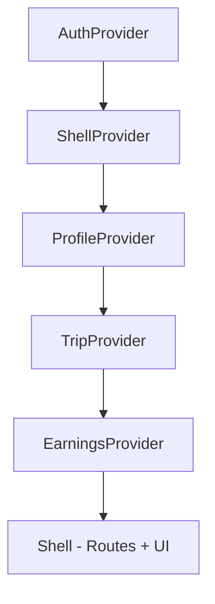
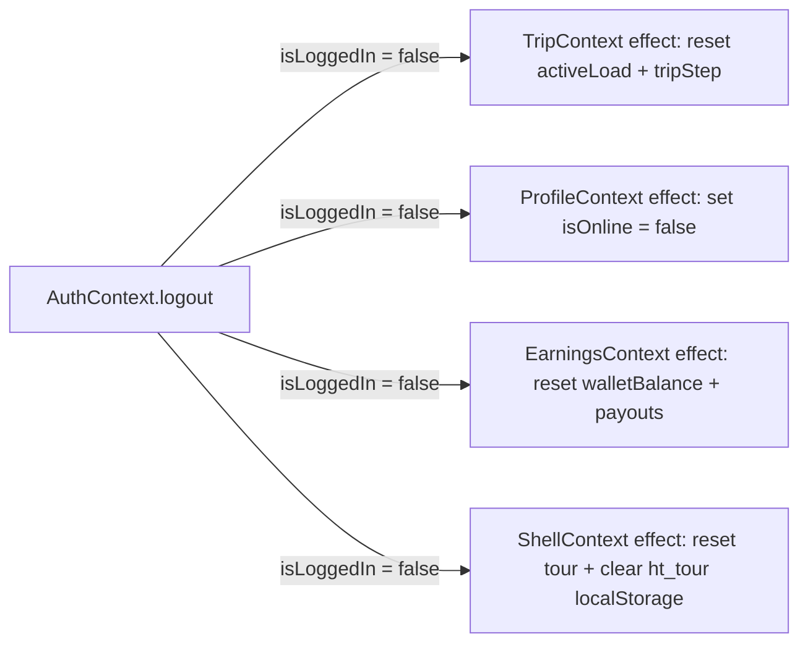
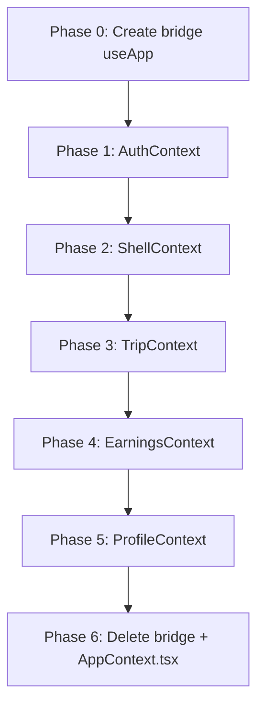

# State Decentralization Architecture

## 1. Current State Analysis

### 1.1 Monolithic AppContext Shape

The entire application state lives in a single [`AppContext.tsx`](src/state/AppContext.tsx:1) god-node with 31 fields on the `AppState` interface:

| Domain | Fields | Actions |
|---|---|---|
| Auth | `isLoggedIn`, `phone` | `login()`, `logout()` |
| Trip | `activeLoad`, `tripStep` | `acceptLoad()`, `advanceTrip()`, `resetTrip()` |
| Earnings | `walletBalance` (internal), `payouts` | `withdrawWallet()` |
| Profile | `driver` (merged with walletBalance), `isOnline` | `setOnline()` |
| Shell | `hasSeenTour`, `isTourActive`, `tourStep`, `notification` | `startTour()`, `endTour()`, `setTourStep()`, `showNotification()`, `dismissNotification()` |

### 1.2 Consumer Dependency Map

Each screen/component destructures specific fields from [`useApp()`](src/state/AppContext.tsx:169):

```
Splash           → isLoggedIn
LanguagePicker   → (none — uses i18n directly)
Login            → showNotification
Otp              → login
Home             → isOnline, setOnline, driver
Loads            → (none — uses MOCK_LOADS directly)
LoadDetail       → acceptLoad
ActiveTrip       → activeLoad, tripStep, advanceTrip, resetTrip
Earnings         → driver.walletBalance, payouts, withdrawWallet
Profile          → logout, startTour
RequireAuth      → isLoggedIn
Shell (App.tsx)  → isLoggedIn, notification, dismissNotification
OnboardingTour   → isTourActive, endTour, tourStep, setTourStep
AIChatbot        → isTourActive
```

### 1.3 Cross-Domain Coupling in Actions

Two actions violate single-domain ownership:

- **`logout()`** — resets state across ALL domains: sets `isLoggedIn=false`, `isOnline=false`, `activeLoad=null`, `tripStep=0`, tour state, wallet/payouts to defaults, removes `ht_tour` from localStorage
- **`acceptLoad()`** — sets `activeLoad` + `tripStep=1` (Trip domain) AND `isOnline=true` (Profile domain) AND triggers tour activation on first login

This coupling is the primary design challenge for decentralization.

---

## 2. Proposed Context Split

### 2.1 AuthContext

**File:** `src/state/AuthContext.tsx`

```typescript
interface AuthState {
  isLoggedIn: boolean
  phone: string
  login: (phone: string) => void
  logout: () => void
}
```

**Consumers:** Splash, Otp, RequireAuth, Shell, Profile

**Persistence:** `localStorage.ht_auth` — already implemented

**Notes:** `login()` only handles auth concerns (set phone + isLoggedIn). Tour activation on first login moves to ShellContext via effect. `logout()` only sets `isLoggedIn=false` — other contexts self-clean via effects watching `isLoggedIn`.

---

### 2.2 TripContext

**File:** `src/state/TripContext.tsx`

```typescript
interface TripState {
  activeLoad: Load | null
  tripStep: TripStep
  acceptLoad: (load: Load) => void
  advanceTrip: () => void
  resetTrip: () => void
}
```

**Consumers:** ActiveTrip, LoadDetail

**Notes:** `acceptLoad()` only sets `activeLoad` + `tripStep=1`. The `setOnline(true)` side-effect moves to the consumer (LoadDetail screen calls both `acceptLoad` from TripContext and `setOnline(true)` from ProfileContext). Self-cleans on logout via effect watching `isLoggedIn` from AuthContext.

---

### 2.3 EarningsContext

**File:** `src/state/EarningsContext.tsx`

```typescript
interface EarningsState {
  walletBalance: number
  payouts: Payout[]
  withdrawWallet: (amount: number, upiId: string) => void
}
```

**Consumers:** Earnings

**Notes:** `walletBalance` is extracted from the merged `driver` object. The `driver.walletBalance` field consumed by Earnings screen comes from here, not ProfileContext. Self-cleans on logout via effect watching `isLoggedIn`.

---

### 2.4 ProfileContext

**File:** `src/state/ProfileContext.tsx`

```typescript
interface ProfileState {
  driver: DriverProfile  // static data only — no walletBalance
  isOnline: boolean
  setOnline: (v: boolean) => void
}
```

Where `DriverProfile` is:

```typescript
interface DriverProfile {
  name: string
  phone: string
  rating: number
  tripsToday: number
  earningsToday: number
  truck: {
    regNumber: string
    type: string
    capacity: string
  }
}
```

**Consumers:** Home

**Notes:** `walletBalance` is NOT in `DriverProfile` — it lives in EarningsContext. Home screen does not display wallet balance, so this split is clean. Self-cleans `isOnline` on logout via effect.

---

### 2.5 ShellContext

**File:** `src/state/ShellContext.tsx`

```typescript
interface ShellState {
  // Tour
  hasSeenTour: boolean
  isTourActive: boolean
  tourStep: number
  startTour: () => void
  endTour: () => void
  setTourStep: React.Dispatch<React.SetStateAction<number>>

  // Notifications
  notification: NotificationPayload | null
  showNotification: (title: string, message: string, type?: 'sms' | 'push') => void
  dismissNotification: () => void
}

interface NotificationPayload {
  title: string
  message: string
  type: 'sms' | 'push'
}
```

**Consumers:** Shell (App.tsx), OnboardingTour, AIChatbot, Login, Profile

**Notes:** Tour activation on first login is handled by ShellContext via an effect that watches `isLoggedIn` from AuthContext and checks `localStorage.ht_tour`. Self-cleans on logout via effect.

---

## 3. Context Composition Pattern

### 3.1 Provider Nesting in App.tsx

Providers nest in dependency order — AuthContext is outermost since other contexts watch its `isLoggedIn`:



```typescript
// src/App.tsx
export default function App() {
  return (
    <AuthProvider>
      <ShellProvider>
        <ProfileProvider>
          <TripProvider>
            <EarningsProvider>
              <Shell />
            </EarningsProvider>
          </TripProvider>
        </ProfileProvider>
      </ShellProvider>
    </AuthProvider>
  )
}
```

### 3.2 Provider Wrapper Alternative

For cleaner App.tsx, a `src/state/AppProviders.tsx` wrapper can encapsulate the nesting:

```typescript
// src/state/AppProviders.tsx
export function AppProviders({ children }: { children: ReactNode }) {
  return (
    <AuthProvider>
      <ShellProvider>
        <ProfileProvider>
          <TripProvider>
            <EarningsProvider>
              {children}
            </EarningsProvider>
          </TripProvider>
        </ProfileProvider>
      </ShellProvider>
    </AuthProvider>
  )
}

// src/App.tsx
export default function App() {
  return (
    <AppProviders>
      <Shell />
    </AppProviders>
  )
}
```

---

## 4. Cross-Context Communication

### 4.1 Strategy: Effect-Based Self-Cleanup

Each context that needs to reset on logout owns its own cleanup effect watching `isLoggedIn` from AuthContext. This is the React-idiomatic approach — no event bus, no callback registration, no central orchestrator.



**Implementation pattern inside each provider:**

```typescript
// Inside TripProvider
const { isLoggedIn } = useAuth()

useEffect(() => {
  if (!isLoggedIn) {
    setActiveLoad(null)
    setTripStep(0)
  }
}, [isLoggedIn])
```

### 4.2 Strategy: Consumer-Level Orchestration

For actions that span multiple domains (like `acceptLoad` also setting `isOnline`), the screen component orchestrates the calls:

```typescript
// LoadDetail screen
const { acceptLoad } = useTrip()
const { setOnline } = useProfile()

function accept() {
  acceptLoad(load)
  setOnline(true)
  nav('/trip', { replace: true })
}
```

This makes cross-domain dependencies explicit at the call site rather than hidden inside a monolithic action.

### 4.3 Strategy: Tour Activation on First Login

ShellContext watches `isLoggedIn` and activates the tour when the user logs in for the first time:

```typescript
// Inside ShellProvider
const { isLoggedIn } = useAuth()

useEffect(() => {
  if (isLoggedIn && localStorage.getItem('ht_tour') !== '1') {
    setTourActive(true)
    setTourStep(0)
  }
}, [isLoggedIn])
```

### 4.4 Communication Summary Table

| Trigger | Source Context | Affected Contexts | Mechanism |
|---|---|---|---|
| Logout | AuthContext | Trip, Profile, Earnings, Shell | Effect watching `isLoggedIn` |
| First login tour | AuthContext | Shell | Effect watching `isLoggedIn` + localStorage check |
| Accept load → go online | TripContext + ProfileContext | None | Consumer orchestrates both calls |
| Notification auto-dismiss | ShellContext | None | Internal timeout effect (already exists) |

---

## 5. Migration Strategy

### 5.1 Phase 0 — Backward Compatibility Bridge

Create a compatibility [`useApp()`](src/state/AppContext.tsx:169) hook that delegates to the new contexts. This allows incremental migration — old screens continue working while new screens adopt focused hooks.

```typescript
// src/state/AppContext.tsx (bridge version)
export function useApp() {
  const auth = useAuth()
  const trip = useTrip()
  const earnings = useEarnings()
  const profile = useProfile()
  const shell = useShell()

  return {
    // Auth
    isLoggedIn: auth.isLoggedIn,
    phone: auth.phone,
    login: auth.login,
    logout: auth.logout,
    // Trip
    activeLoad: trip.activeLoad,
    tripStep: trip.tripStep,
    acceptLoad: trip.acceptLoad,
    advanceTrip: trip.advanceTrip,
    resetTrip: trip.resetTrip,
    // Earnings
    payouts: earnings.payouts,
    withdrawWallet: earnings.withdrawWallet,
    // Profile — merge walletBalance back into driver for compat
    driver: { ...profile.driver, walletBalance: earnings.walletBalance },
    isOnline: profile.isOnline,
    setOnline: profile.setOnline,
    // Shell
    hasSeenTour: shell.hasSeenTour,
    isTourActive: shell.isTourActive,
    startTour: shell.startTour,
    endTour: shell.endTour,
    tourStep: shell.tourStep,
    setTourStep: shell.setTourStep,
    notification: shell.notification,
    showNotification: shell.showNotification,
    dismissNotification: shell.dismissNotification,
  }
}
```

This bridge is deleted once all consumers migrate to focused hooks.

### 5.2 Phase 1 — Extract AuthContext

- Create `src/state/AuthContext.tsx` with `AuthProvider`, `useAuth()`
- Simplest context — no incoming effects, only outgoing (other contexts watch `isLoggedIn`)
- Migrate: Splash, Otp, RequireAuth
- Keep `useApp()` bridge working

### 5.3 Phase 2 — Extract ShellContext

- Create `src/state/ShellContext.tsx` with tour + notification state
- Add effect: watch `isLoggedIn` from AuthContext for tour activation
- Migrate: OnboardingTour, AIChatbot, Login (showNotification), Shell (notification)
- Keep `useApp()` bridge working

### 5.4 Phase 3 — Extract TripContext

- Create `src/state/TripContext.tsx` with trip state + actions
- Add effect: watch `isLoggedIn` for self-cleanup on logout
- Migrate: ActiveTrip, LoadDetail
- LoadDetail also needs `useProfile().setOnline` — consumer-level orchestration
- Keep `useApp()` bridge working

### 5.5 Phase 4 — Extract EarningsContext

- Create `src/state/EarningsContext.tsx` with walletBalance, payouts, withdrawWallet
- Add effect: watch `isLoggedIn` for self-cleanup on logout
- Migrate: Earnings screen
- Keep `useApp()` bridge working

### 5.6 Phase 5 — Extract ProfileContext

- Create `src/state/ProfileContext.tsx` with driver (static) + isOnline
- Add effect: watch `isLoggedIn` for isOnline cleanup on logout
- Migrate: Home screen
- Keep `useApp()` bridge working

### 5.7 Phase 6 — Final Cleanup

- Delete `useApp()` bridge from `AppContext.tsx`
- Delete `AppContext.tsx` entirely
- Create `src/state/AppProviders.tsx` with provider nesting
- Update `App.tsx` to use `<AppProviders>`
- All consumers now use focused hooks: `useAuth()`, `useTrip()`, `useEarnings()`, `useProfile()`, `useShell()`

### 5.8 Migration Order Diagram



---

## 6. File Structure

### 6.1 New Layout Under `src/state/`

```
src/state/
  AuthContext.tsx        — AuthProvider + useAuth()
  TripContext.tsx        — TripProvider + useTrip()
  EarningsContext.tsx    — EarningsProvider + useEarnings()
  ProfileContext.tsx     — ProfileProvider + useProfile()
  ShellContext.tsx       — ShellProvider + useShell()
  AppProviders.tsx       — Composes all providers in correct order
  types.ts               — Shared type exports (TripStep, NotificationPayload, DriverProfile)
  AppContext.tsx         — DELETED in Phase 6 (bridge during migration)
```

### 6.2 Shared Types File

`src/state/types.ts` extracts types currently defined inline in AppContext or mockLoads:

```typescript
export type TripStep = 0 | 1 | 2 | 3 | 4

export interface NotificationPayload {
  title: string
  message: string
  type: 'sms' | 'push'
}

export interface DriverProfile {
  name: string
  phone: string
  rating: number
  tripsToday: number
  earningsToday: number
  truck: {
    regNumber: string
    type: string
    capacity: string
  }
}
```

`Load` and `Payout` types remain in [`mockLoads.ts`](src/data/mockLoads.ts:5) since they are data-layer types.

---

## 7. Type Definitions

### 7.1 AuthContext

```typescript
// src/state/AuthContext.tsx
interface AuthState {
  isLoggedIn: boolean
  phone: string
  login: (phone: string) => void
  logout: () => void
}

// Hook signature
function useAuth(): AuthState
```

### 7.2 TripContext

```typescript
// src/state/TripContext.tsx
import { type Load } from '../data/mockLoads'
import { type TripStep } from './types'

interface TripState {
  activeLoad: Load | null
  tripStep: TripStep
  acceptLoad: (load: Load) => void
  advanceTrip: () => void
  resetTrip: () => void
}

// Hook signature
function useTrip(): TripState
```

### 7.3 EarningsContext

```typescript
// src/state/EarningsContext.tsx
import { type Payout } from '../data/mockLoads'

interface EarningsState {
  walletBalance: number
  payouts: Payout[]
  withdrawWallet: (amount: number, upiId: string) => void
}

// Hook signature
function useEarnings(): EarningsState
```

### 7.4 ProfileContext

```typescript
// src/state/ProfileContext.tsx
import { type DriverProfile } from './types'

interface ProfileState {
  driver: DriverProfile
  isOnline: boolean
  setOnline: (v: boolean) => void
}

// Hook signature
function useProfile(): ProfileState
```

### 7.5 ShellContext

```typescript
// src/state/ShellContext.tsx
import { type NotificationPayload } from './types'

interface ShellState {
  hasSeenTour: boolean
  isTourActive: boolean
  tourStep: number
  startTour: () => void
  endTour: () => void
  setTourStep: React.Dispatch<React.SetStateAction<number>>
  notification: NotificationPayload | null
  showNotification: (title: string, message: string, type?: 'sms' | 'push') => void
  dismissNotification: () => void
}

// Hook signature
function useShell(): ShellState
```

---

## 8. Testing Strategy

### 8.1 Independent Context Testing

Each context can be tested in isolation with a minimal provider wrapper:

```typescript
// Example: TripContext test
function renderWithTrip(ui: ReactElement) {
  return render(<TripProvider>{ui}</TripProvider>)
}

test('acceptLoad sets activeLoad and tripStep=1', () => {
  const { result } = renderHook(() => useTrip(), { wrapper: TripProvider })
  act(() => result.current.acceptLoad(MOCK_LOADS[0]))
  expect(result.current.activeLoad).toEqual(MOCK_LOADS[0])
  expect(result.current.tripStep).toBe(1)
})
```

### 8.2 Cross-Context Integration Testing

For logout cascade and acceptLoad orchestration, test with `AppProviders`:

```typescript
function renderWithAllProviders(ui: ReactElement) {
  return render(<AppProviders>{ui}</AppProviders>)
}

test('logout resets all contexts', () => {
  // Setup: login, accept load, go online
  // Act: logout
  // Assert: all contexts reset
})
```

---

## 9. Risk Assessment

| Risk | Mitigation |
|---|---|
| `useApp()` bridge re-renders all consumers on any state change | Bridge is temporary — phased migration removes it per screen |
| Effect-based cleanup has slight async delay vs synchronous `logout()` | Negligible in practice — React batches state updates in effects |
| Provider nesting depth (5 levels) | Acceptable for this app size. Can flatten if performance issues arise |
| `driver.walletBalance` split across Profile + Earnings contexts | Earnings screen uses `useEarnings().walletBalance` directly. Bridge merges for compat. Home screen never needed walletBalance |
| `acceptLoad` + `setOnline` consumer orchestration | Explicit at call site — easier to understand than hidden coupling |

---

## 10. Decision Log

| Decision | Rationale |
|---|---|
| Effect-based self-cleanup over event bus | React-idiomatic, no extra infrastructure, works with React batching |
| Consumer-level orchestration over cross-context actions | Makes dependencies explicit, avoids hidden coupling, simpler to test |
| ShellContext includes both tour + notifications | Both are UI-shell concerns with no domain logic, low state count, same consumers |
| walletBalance in EarningsContext not ProfileContext | walletBalance is financial data mutated only by earnings actions. Home screen does not need it |
| AuthProvider outermost in nesting | Other contexts watch `isLoggedIn` via `useAuth()` — Auth must be available first |
| Bridge `useApp()` during migration | Zero-breaking-change migration — old screens work until explicitly updated |