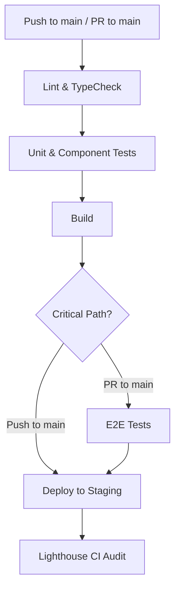
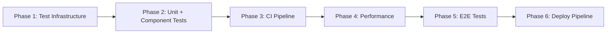

# Testing, CI/CD & Performance Architecture

## Table of Contents

1. [Context & Current State](#1-context--current-state)
2. [Testing Architecture](#2-testing-architecture)
3. [CI/CD Pipeline](#3-cicd-pipeline)
4. [Performance Optimizations](#4-performance-optimizations)
5. [Migration Strategy](#5-migration-strategy)
6. [New File Structure](#6-new-file-structure)

---

## 1. Context & Current State

### 1.1 Baseline

The project currently has:

| Concern | Current State |
|---|---|
| Tests | **Zero** test files |
| CI/CD | **None** configured |
| Test deps | No testing libraries in [`package.json`](../package.json) |
| Lint scripts | No lint, format, or type-check standalone scripts |
| Bundle analysis | No visualizer plugin |
| Code splitting | All 10 screens imported eagerly in [`App.tsx`](../src/App.tsx) |
| i18n loading | All 5 locale JSONs bundled eagerly in [`i18n/index.ts`](../src/i18n/index.ts) |
| PWA caching | Basic `autoUpdate` in [`vite.config.ts`](../vite.config.ts) — no Workbox runtime strategies |
| Performance monitoring | None |

### 1.2 Relevant Architecture Decisions

Two prior architecture documents set the foundation:

- **[State Decentralization](state-decentralization.md)** — Splits monolithic [`AppContext`](../src/state/AppContext.tsx) into AuthContext, TripContext, EarningsContext, ProfileContext, ShellContext. Tests must wrap components with the specific contexts they consume, not the full AppProvider.
- **[API Service Layer](api-service-layer.md)** — Mock/real swap pattern via `VITE_API_MODE` environment variable. Service interfaces allow mocking at the transport layer, simplifying test setup.

### 1.3 Key Source Files

| File | Lines | Role | Test Priority |
|---|---|---|---|
| [`src/state/AppContext.tsx`](../src/state/AppContext.tsx) | 279 | Monolithic state (31 fields, ~18 actions) | HIGH — context hook tests |
| [`src/lib/format.ts`](../src/lib/format.ts) | 10 | `inr()` / `inrShort()` pure functions | HIGH — trivial unit tests |
| [`src/App.tsx`](../src/App.tsx) | 104 | Route definitions + Shell layout | MEDIUM — integration tests |
| [`src/data/mockLoads.ts`](../src/data/mockLoads.ts) | 137 | Load/payout/driver mock data | LOW — data shape validation |
| [`src/i18n/index.ts`](../src/i18n/index.ts) | 32 | i18next init with 5 bundled locales | MEDIUM — i18n mock setup |
| [`src/assets.ts`](../src/assets.ts) | 29 | Unsplash image URL builder | LOW — pure function tests |
| 10 screen files | ~150-400 each | Full-page components | HIGH — integration/screen tests |
| 12 component files | ~30-200 each | Reusable UI components | HIGH — component tests |

---

## 2. Testing Architecture

### 2.1 Technology Stack

| Tool | Version | Purpose |
|---|---|---|
| [Vitest](https://vitest.dev) | `^2.x` | Test runner (Vite-native, fast, TypeScript/JSX out of the box) |
| [@testing-library/react](https://testing-library.com/react) | `^16.x` | Component rendering + interaction testing |
| [@testing-library/jest-dom](https://github.com/testing-library/jest-dom) | `^6.x` | DOM matchers (`toBeInTheDocument`, `toHaveTextContent`) |
| [@testing-library/user-event](https://testing-library.com/user-event) | `^14.x` | Realistic user interaction simulation |
| [jsdom](https://github.com/jsdom/jsdom) | `^25.x` | Browser-like DOM environment in Node |
| [Playwright](https://playwright.dev) | `^1.x` | E2E browser testing |
| [msw](https://mswjs.io) | `^2.x` | API mocking at the network level (for service-layer tests) |

#### Why Vitest over Jest

- **Zero config with Vite** — uses the same `vite.config.ts` transform pipeline, no duplicate configuration
- **ESM-native** — matches the project's `"type": "module"` in [`package.json`](../package.json)
- **Watch mode is instant** — Vitest leverages Vite's HMR-style module graph
- **TypeScript/JSX** — works without `ts-jest` or `babel-jest` transforms
- **Compatible with RTL** — drop-in replacement for Jest in React Testing Library setups

#### Why Playwright over Cypress

- **Multi-browser** — Chromium, Firefox, WebKit from one API
- **Mobile emulation** — built-in device profiles match the PWA's mobile-first design
- **No test runner dependency** — standalone, doesn't need a separate dev server plugin
- **Trace viewer** — timeline, screenshots, and DOM snapshots for debugging

### 2.2 Test File Structure — Co-Located Pattern

**Recommendation: Co-located `*.test.tsx` files** alongside source files.

Rationale:
- Tests are discoverable — open `Button.tsx` and `Button.test.tsx` is right next to it
- Import paths stay short (relative `./Button` not `../../src/components/Button`)
- Easy to see which files lack tests at a glance
- Vitest's default `include` pattern (`**/*.test.*`) matches this naturally

```
src/
  lib/
    format.ts
    format.test.ts              ← co-located unit test
  components/
    Button.tsx
    Button.test.tsx             ← co-located component test
    Card.tsx
    Card.test.tsx
    ...
  screens/
    Home.tsx
    Home.test.tsx               ← co-located screen test
    ...
  state/
    AppContext.tsx
    AppContext.test.tsx         ← context hook test
  i18n/
    index.ts
    index.test.ts              ← i18n setup test
  __tests__/                    ← shared test infrastructure only
    setup.ts                    ← global test setup (jsdom, mocks)
    test-utils.tsx              ← custom render with providers
    mocks/
      i18n.ts                   ← i18next mock
      contexts.ts               ← context provider mocks
```

**Exception:** E2E tests live outside `src/`:

```
e2e/
  playwright.config.ts
  fixtures/
    auth.fixture.ts
  specs/
    login.spec.ts
    trip-flow.spec.ts
    earnings.spec.ts
```

### 2.3 Test Categories

#### 2.3.1 Unit Tests

**Target:** Pure functions, utility modules, simple hooks.

| Module | What to Test | File |
|---|---|---|
| `inr()` / `inrShort()` | Input/output for integers, decimals, zero, negative, large numbers | [`src/lib/format.test.ts`](../src/lib/format.test.ts) |
| `assets.ts` helpers | URL construction for valid/invalid photo IDs | [`src/assets.test.ts`](../src/assets.test.ts) |
| `i18n/index.ts` | Language detection, fallback chain, namespace loading | [`src/i18n/index.test.ts`](../src/i18n/index.test.ts) |
| Context hooks | State transitions for login, logout, acceptLoad, withdrawWallet, etc. | [`src/state/AppContext.test.tsx`](../src/state/AppContext.test.tsx) |

**Context hook test example pattern:**

```typescript
// src/state/AppContext.test.tsx
import { renderHook, act } from '@testing-library/react'
import { AppProvider, useApp } from './AppContext'

describe('AppContext - login', () => {
  it('sets isLoggedIn and phone on login', () => {
    const { result } = renderHook(() => useApp(), { wrapper: AppProvider })
    
    act(() => result.current.login('+919876543210'))
    
    expect(result.current.isLoggedIn).toBe(true)
    expect(result.current.phone).toBe('+919876543210')
  })
})
```

#### 2.3.2 Component Tests

**Target:** All 12 components in [`src/components/`](../src/components/).

Priority matrix:

| Component | Priority | Tests |
|---|---|---|
| Button | HIGH | All variants (primary, secondary, outline, ghost, danger), sizes, disabled, loading state, onClick |
| Card | HIGH | Renders children, padded vs unpadded, className merge |
| LoadCard | HIGH | Renders load data (price, route, shipper), onClick fires, verified badge |
| Toggle | HIGH | On/off states, onChange fires, keyboard accessible |
| BottomTabBar | HIGH | All 4 tabs render, active tab highlighted, navigation fires |
| StatusStepper | HIGH | All steps render, current step highlighted, completed steps checked |
| TopBar | MEDIUM | Title renders, back button navigates, right slot renders |
| LanguageChip | MEDIUM | Selected/unselected states, flag renders, onClick fires |
| RouteMap | MEDIUM | SVG renders, progress bar position |
| PhoneFrame | LOW | Children render, frame wrapper present |
| OnboardingTour | MEDIUM | Tooltip renders, step progression, dismiss works |
| AIChatbot | LOW | Toggle open/close, message input, response display |

**Component test example:**

```typescript
// src/components/Button.test.tsx
import { render, screen } from '@testing-library/react'
import userEvent from '@testing-library/user-event'
import Button from './Button'

describe('Button', () => {
  it('renders children text', () => {
    render(<Button>Accept Load</Button>)
    expect(screen.getByRole('button', { name: 'Accept Load' })).toBeInTheDocument()
  })

  it('calls onClick when clicked', async () => {
    const onClick = vi.fn()
    render(<Button onClick={onClick}>Click</Button>)
    await userEvent.click(screen.getByRole('button'))
    expect(onClick).toHaveBeenCalledTimes(1)
  })

  it('disables button and prevents click when disabled', async () => {
    const onClick = vi.fn()
    render(<Button disabled onClick={onClick}>Disabled</Button>)
    expect(screen.getByRole('button')).toBeDisabled()
    await userEvent.click(screen.getByRole('button'))
    expect(onClick).not.toHaveBeenCalled()
  })
})
```

#### 2.3.3 Screen / Integration Tests

**Target:** All 10 screens in [`src/screens/`](../src/screens/).

Each screen test renders the component wrapped with the providers it needs (Router + Contexts). The custom `renderWithProviders` utility (see §2.5) handles this.

| Screen | Route | Key Integration Tests |
|---|---|---|
| Splash | `/` | Auto-redirects to `/language` after timeout, logo renders |
| LanguagePicker | `/language` | All 5 languages render, selection changes i18n, navigates to `/login` |
| Login | `/login` | Phone input validation, notification banner shows, navigates to `/otp` |
| Otp | `/otp` | OTP input (4 digits), auto-submit, calls login on success |
| Home | `/home` | Driver info renders, online toggle works, loads preview, navigation to Loads/Earnings |
| Loads | `/loads` | Load list renders, search/filter, LoadCard click → `/loads/:id` |
| LoadDetail | `/loads/:id` | Full load info, accept button, navigates to `/trip` on accept |
| ActiveTrip | `/trip` | Stepper shows correct step, advance/reset buttons, trip completion flow |
| Earnings | `/earnings` | Wallet balance, payout history, withdraw flow, weekly chart |
| Profile | `/profile` | Driver details, truck list, document expiry, logout, start tour |

**Screen test example:**

```typescript
// src/screens/Home.test.tsx
import { renderWithProviders, screen } from '../__tests__/test-utils'
import Home from './Home'

describe('Home Screen', () => {
  it('shows driver greeting', () => {
    renderWithProviders(<Home />)
    expect(screen.getByText(/Rajesh Kumar/i)).toBeInTheDocument()
  })

  it('online toggle switches state when clicked', async () => {
    const { user } = renderWithProviders(<Home />)
    const toggle = screen.getByRole('switch')
    await user.click(toggle)
    // Assert online status changed
  })
})
```

#### 2.3.4 E2E Tests (Playwright)

**Target:** Critical user journeys that span multiple screens.

**Journey 1: Login Flow**
```
Splash → LanguagePicker (select hi) → Login (enter phone) → Otp (enter 0000) → Home
```

**Journey 2: Accept & Complete Trip**
```
Home → Loads → LoadDetail → Accept → ActiveTrip → Advance through 4 steps → Complete → Home
```

**Journey 3: Earnings & Withdrawal**
```
Home → Earnings → View wallet balance → Withdraw → Enter UPI → Confirm
```

**Journey 4: Profile & Logout**
```
Home → Profile → View documents → Logout → LanguagePicker (redirect)
```

E2E tests run against the production build (`npm run build && npm run preview`) using Playwright's `webServer` config.

### 2.4 Mocking Strategy

#### 2.4.1 Context Providers

The custom `renderWithProviders` utility (see §2.5) wraps components with only the contexts they need. Individual tests can override context values:

```typescript
renderWithProviders(<Home />, {
  auth: { isLoggedIn: true, phone: '+919876543210' },
  profile: { isOnline: false },
})
```

#### 2.4.2 i18n Mocking

A global mock in [`src/__tests__/mocks/i18n.ts`](../src/__tests__/mocks/i18n.ts) replaces `react-i18next` so tests don't depend on JSON locale files. The mock's `t()` function returns the key (e.g., `t('home.greeting')` returns `'home.greeting'`). For tests that need actual translations, use the real i18n module with only `en.json` loaded.

```typescript
// src/__tests__/mocks/i18n.ts
vi.mock('react-i18next', () => ({
  useTranslation: () => ({
    t: (key: string) => key,
    i18n: { language: 'en', changeLanguage: vi.fn() },
  }),
  Trans: ({ children }: { children: React.ReactNode }) => children,
}))
```

#### 2.4.3 API Services (msw)

For integration tests that call service functions (post state-decentralization + service layer), use [msw](https://mswjs.io) to intercept fetch:

```typescript
import { http, HttpResponse } from 'msw'
import { setupServer } from 'msw/node'

const server = setupServer(
  http.post('/api/auth/send-otp', () => HttpResponse.json({ success: true })),
  http.post('/api/auth/verify-otp', () => HttpResponse.json({
    tokens: { access: { token: 'fake', expiresAt: 9999999999 } }
  })),
)

beforeAll(() => server.listen())
afterEach(() => server.resetHandlers())
afterAll(() => server.close())
```

#### 2.4.4 Browser APIs

jsdom provides most browser APIs, but some need polyfills or mocks:

| API | Approach |
|---|---|
| `localStorage` | Built into jsdom — works natively |
| `matchMedia` | Vitest's `vi.stubGlobal('matchMedia', ...)` |
| `IntersectionObserver` | Mock class in setup file |
| `navigator.geolocation` | `vi.stubGlobal` with mock |
| `navigator.onLine` | jsdom supports this natively |

### 2.5 Custom Test Utilities

**File:** [`src/__tests__/test-utils.tsx`](../src/__tests__/test-utils.tsx)

A `renderWithProviders` function that wraps components with Router + selected context providers:

```typescript
import { render, type RenderOptions } from '@testing-library/react'
import userEvent from '@testing-library/user-event'
import { MemoryRouter } from 'react-router-dom'
import { AppProvider } from '../state/AppContext'
import type { ReactElement } from 'react'

interface ProvidersConfig {
  route?: string
  // Future: per-context overrides post-decentralization
}

export function renderWithProviders(
  ui: ReactElement,
  config: ProvidersConfig = {},
) {
  const { route = '/' } = config

  function Wrapper({ children }: { children: React.ReactNode }) {
    return (
      <MemoryRouter initialEntries={[route]}>
        <AppProvider>
          {children}
        </AppProvider>
      </MemoryRouter>
    )
  }

  return {
    user: userEvent.setup(),
    ...render(ui, { wrapper: Wrapper }),
  }
}

// Re-export everything from testing-library for convenience
export * from '@testing-library/react'
export { userEvent }
```

**Post-decentralization update:** When contexts split per [state-decentralization.md](state-decentralization.md), the `ProvidersConfig` accepts optional overrides for each context:

```typescript
interface ProvidersConfig {
  route?: string
  auth?: Partial<AuthState>
  trip?: Partial<TripState>
  earnings?: Partial<EarningsState>
  profile?: Partial<ProfileState>
  shell?: Partial<ShellState>
}
```

### 2.6 Vitest Configuration

**File:** `vitest.config.ts` (separate from `vite.config.ts` to keep test config isolated):

```typescript
import { defineConfig } from 'vitest/config'
import react from '@vitejs/plugin-react'

export default defineConfig({
  plugins: [react()],
  test: {
    globals: true,                  // vi, describe, it, expect available globally
    environment: 'jsdom',           // Browser-like DOM
    setupFiles: ['./src/__tests__/setup.ts'],
    css: false,                     // Don't process CSS imports in tests
    coverage: {
      provider: 'v8',
      reporter: ['text', 'lcov', 'html'],
      reportsDirectory: './coverage',
      include: ['src/**/*.{ts,tsx}'],
      exclude: [
        'src/**/*.test.{ts,tsx}',
        'src/__tests__/**',
        'src/vite-env.d.ts',
        'src/main.tsx',
      ],
      thresholds: {
        // Per-category thresholds (see §2.7)
        statements: 70,
        branches: 65,
        functions: 70,
        lines: 70,
      },
    },
    include: ['src/**/*.test.{ts,tsx}'],
    exclude: ['node_modules', 'dist', 'e2e'],
  },
})
```

**Updated `tsconfig.json` modifications:**

```jsonc
// tsconfig.json additions
{
  "compilerOptions": {
    // ... existing options
    "types": ["vitest/globals"]   // Add vitest global types
  },
  "include": ["src"],
  "exclude": ["node_modules", "dist"]  // Don't exclude test files
}
```

Alternatively, a separate `tsconfig.test.json` extending the base:

```jsonc
{
  "extends": "./tsconfig.json",
  "compilerOptions": {
    "types": ["vitest/globals"]
  },
  "include": ["src", "vitest.config.ts"],
  "exclude": ["node_modules", "dist", "e2e"]
}
```

### 2.7 Coverage Targets

| Category | Statements | Branches | Functions | Lines |
|---|---|---|---|---|
| **Utilities** (`src/lib/`) | 100% | 100% | 100% | 100% |
| **Components** (`src/components/`) | 85% | 80% | 85% | 85% |
| **Screens** (`src/screens/`) | 70% | 65% | 70% | 70% |
| **State** (`src/state/`) | 85% | 80% | 90% | 85% |
| **Data** (`src/data/`) | 60% | 50% | 60% | 60% |
| **Overall** | 70% | 65% | 70% | 70% |

These are **initial thresholds** to establish a baseline. After the first test pass, review and adjust based on what's practical. The overall 70% threshold ensures meaningful coverage without creating brittle tests for trivial code.

### 2.8 Snapshot Testing Guidance

Snapshots add value for components with stable, predictable output. Overuse creates brittle tests that fail on any markup change.

**Recommended for snapshots:**

| Component | Why |
|---|---|
| Card | Stable layout structure, few variants |
| StatusStepper | Deterministic step rendering based on `current` prop |
| Button (variant snapshots) | Snap each variant's rendered className/output |
| LanguageChip | Selected/unselected states have distinct markup |

**NOT recommended for snapshots:**

| Component | Why |
|---|---|
| LoadCard | Data-driven with dynamic content (5+ loads, various states) |
| OnboardingTour | Complex positioning logic, tooltip content varies |
| RouteMap | SVG paths with computed coordinates |
| Screen components | Too large, change frequently, better tested with interaction assertions |

Rule of thumb: If a component has **< 4 props** and renders **mostly static markup**, snapshot testing is appropriate. Otherwise, use explicit assertions.

### 2.9 Package.json Scripts

```jsonc
// Add to existing "scripts" in package.json
{
  "scripts": {
    "dev": "vite",
    "build": "tsc -b && vite build",
    "preview": "vite preview",

    // Testing
    "test": "vitest",
    "test:ui": "vitest --ui",
    "test:run": "vitest run",
    "test:coverage": "vitest run --coverage",
    "test:watch": "vitest --watch",

    // E2E
    "test:e2e": "playwright test",
    "test:e2e:ui": "playwright test --ui",

    // Code quality
    "lint": "eslint src/ --ext .ts,.tsx",
    "lint:fix": "eslint src/ --ext .ts,.tsx --fix",
    "typecheck": "tsc --noEmit",

    // CI
    "ci:check": "npm run typecheck && npm run lint && npm run test:run",
    "ci:build": "npm run build",
    "ci:e2e": "npx playwright test"
  }
}
```

### 2.10 Required Dev Dependencies

```jsonc
// New devDependencies to add
{
  "devDependencies": {
    // Testing core
    "vitest": "^2.1.0",
    "@vitest/coverage-v8": "^2.1.0",
    "@vitest/ui": "^2.1.0",
    "jsdom": "^25.0.0",

    // React Testing Library
    "@testing-library/react": "^16.0.0",
    "@testing-library/jest-dom": "^6.6.0",
    "@testing-library/user-event": "^14.5.0",

    // E2E
    "@playwright/test": "^1.48.0",

    // API mocking
    "msw": "^2.6.0",

    // Linting
    "eslint": "^9.0.0",
    "@eslint/js": "^9.0.0",
    "typescript-eslint": "^8.0.0",
    "eslint-plugin-react-hooks": "^5.0.0",
    "eslint-plugin-react-refresh": "^0.4.0",

    // Performance
    "rollup-plugin-visualizer": "^5.12.0",
    "@lhci/cli": "^0.14.0"
  }
}
```

---

## 3. CI/CD Pipeline

### 3.1 Platform Selection: GitHub Actions

- **Free for public repositories** (and generous free tier for private)
- **Hosted runners** — no infrastructure to maintain
- **Marketplace actions** — `actions/setup-node`, `dawidd6/action-download-artifact`, etc.
- **Matrix builds** — can test across Node versions if needed

### 3.2 Pipeline Stages



### 3.3 Workflow Files

#### 3.3.1 CI Workflow (every push)

**File:** `.github/workflows/ci.yml`

```yaml
name: CI

on:
  push:
    branches: [main]
  pull_request:
    branches: [main]

concurrency:
  group: ci-${{ github.ref }}
  cancel-in-progress: true

jobs:
  # ── Stage 1: Lint + TypeCheck ──
  lint-typecheck:
    name: Lint & Type Check
    runs-on: ubuntu-latest
    steps:
      - uses: actions/checkout@v4
      - uses: actions/setup-node@v4
        with:
          node-version: '20'
          cache: 'npm'
      - run: npm ci
      - run: npm run typecheck
      - run: npm run lint

  # ── Stage 2: Unit + Component Tests ──
  test:
    name: Tests (Vitest)
    runs-on: ubuntu-latest
    needs: lint-typecheck
    steps:
      - uses: actions/checkout@v4
      - uses: actions/setup-node@v4
        with:
          node-version: '20'
          cache: 'npm'
      - run: npm ci
      - run: npm run test:run -- --coverage
      - name: Upload coverage to artifact
        uses: actions/upload-artifact@v4
        with:
          name: coverage-report
          path: coverage/
      - name: Check coverage thresholds
        run: |
          # vitest --coverage exits non-zero if thresholds not met
          # Already enforced by vitest config; this step is for visibility

  # ── Stage 3: Build ──
  build:
    name: Build
    runs-on: ubuntu-latest
    needs: test
    steps:
      - uses: actions/checkout@v4
      - uses: actions/setup-node@v4
        with:
          node-version: '20'
          cache: 'npm'
      - run: npm ci
      - run: npm run build
      - name: Upload build artifact
        uses: actions/upload-artifact@v4
        with:
          name: dist
          path: dist/

  # ── Stage 4: E2E (PR only) ──
  e2e:
    name: E2E (Playwright)
    runs-on: ubuntu-latest
    needs: build
    if: github.event_name == 'pull_request'
    steps:
      - uses: actions/checkout@v4
      - uses: actions/setup-node@v4
        with:
          node-version: '20'
          cache: 'npm'
      - run: npm ci
      - name: Download build artifact
        uses: actions/download-artifact@v4
        with:
          name: dist
          path: dist/
      - name: Install Playwright browsers
        run: npx playwright install --with-deps chromium
      - name: Run Playwright tests
        run: npm run ci:e2e
      - name: Upload Playwright report
        if: failure()
        uses: actions/upload-artifact@v4
        with:
          name: playwright-report
          path: playwright-report/

  # ── Stage 5: Lighthouse CI ──
  lighthouse:
    name: Lighthouse CI
    runs-on: ubuntu-latest
    needs: build
    if: github.event_name == 'pull_request'
    steps:
      - uses: actions/checkout@v4
      - uses: actions/setup-node@v4
        with:
          node-version: '20'
          cache: 'npm'
      - run: npm ci
      - name: Download build artifact
        uses: actions/download-artifact@v4
        with:
          name: dist
          path: dist/
      - name: Run Lighthouse CI
        run: |
          npx serve dist -p 4173 &
          sleep 3
          npx @lhci/cli autorun --collect.url=http://localhost:4173
        env:
          LHCI_GITHUB_APP_TOKEN: ${{ secrets.LHCI_GITHUB_APP_TOKEN }}
```

#### 3.3.2 Deploy Workflow (main only)

**File:** `.github/workflows/deploy.yml`

```yaml
name: Deploy

on:
  push:
    branches: [main]
  workflow_dispatch:  # Manual trigger for rollbacks

jobs:
  deploy:
    name: Deploy to Cloudflare Pages
    runs-on: ubuntu-latest
    # Only deploy if CI passed
    steps:
      - uses: actions/checkout@v4
      - uses: actions/setup-node@v4
        with:
          node-version: '20'
          cache: 'npm'
      - run: npm ci
      - run: npm run build
      - name: Publish to Cloudflare Pages
        uses: cloudflare/wrangler-action@v3
        with:
          apiToken: ${{ secrets.CLOUDFLARE_API_TOKEN }}
          accountId: ${{ secrets.CLOUDFLARE_ACCOUNT_ID }}
          command: pages deploy dist/ --project-name=hindtrucks-driver
```

### 3.4 Branch Strategy

| Branch | Purpose | Protection |
|---|---|---|
| `main` | Production-ready code. Deploys to staging on each push. | **Required PR review**, **required status checks** (lint, test, build), no direct push |
| `feat/*` | Feature branches. Merge to main via PR. | None |
| `fix/*` | Bug fix branches. Merge to main via PR. | None |

**Required status checks for PR merge:**
- `Lint & Type Check` (lint-typecheck)
- `Tests (Vitest)` (test)
- `Build` (build)

E2E and Lighthouse are **informational** (not blocking) initially, promoted to required after 2 weeks of stable runs.

### 3.5 Environment Management

| Environment | Purpose | Variables |
|---|---|---|
| **Development** | Local dev (`npm run dev`) | `.env.local` — `VITE_API_MODE=mock`, `VITE_APP_TITLE=HindTrucks (Dev)` |
| **CI** | GitHub Actions | GitHub Secrets — `CLOUDFLARE_API_TOKEN`, `CLOUDFLARE_ACCOUNT_ID`, `LHCI_GITHUB_APP_TOKEN` |
| **Staging** | Cloudflare Pages (main branch) | Cloudflare dashboard — `VITE_API_MODE=real`, `VITE_API_BASE_URL=https://staging-api.hindtrucks.com` |
| **Production** | Cloudflare Pages (manual promote) | Cloudflare dashboard — `VITE_API_MODE=real`, `VITE_API_BASE_URL=https://api.hindtrucks.com` |

Vite exposes env vars prefixed with `VITE_` to client code via `import.meta.env.VITE_*`.

### 3.6 Artifact Management

| Artifact | Retention | Format |
|---|---|---|
| `dist/` (build output) | 7 days | `.tar.gz` |
| `coverage/` (test coverage) | 7 days | HTML + LCOV |
| `playwright-report/` (E2E failures) | 7 days | HTML snapshot |
| Lighthouse reports | Stored in LHCI server | JSON/HTML |

---

## 4. Performance Optimizations

### 4.1 Lazy Loading — React.lazy() + Suspense

All 10 screens are currently imported eagerly at the top of [`App.tsx`](../src/App.tsx). Replace with dynamic imports:

```typescript
// src/App.tsx — after optimization
import { lazy, Suspense } from 'react'
import { Navigate, Route, Routes, useLocation } from 'react-router-dom'

// Eager: always needed on first paint
import PhoneFrame from './components/PhoneFrame'
import BottomTabBar from './components/BottomTabBar'
import Splash from './screens/Splash'  // Landing screen — eager

// Lazy: loaded on demand
const LanguagePicker = lazy(() => import('./screens/LanguagePicker'))
const Login = lazy(() => import('./screens/Login'))
const Otp = lazy(() => import('./screens/Otp'))
const Home = lazy(() => import('./screens/Home'))
const Loads = lazy(() => import('./screens/Loads'))
const LoadDetail = lazy(() => import('./screens/LoadDetail'))
const ActiveTrip = lazy(() => import('./screens/ActiveTrip'))
const Earnings = lazy(() => import('./screens/Earnings'))
const Profile = lazy(() => import('./screens/Profile'))

// Lazy: heavy components not needed immediately
const OnboardingTour = lazy(() => import('./components/OnboardingTour'))
const AIChatbot = lazy(() => import('./components/AIChatbot'))

function Shell() {
  // ... existing code ...

  return (
    <PhoneFrame>
      <div id="phone-shell" className="h-full relative overflow-hidden">
        {/* ... notification banner ... */}

        <Suspense fallback={
          <div className="flex items-center justify-center h-full">
            <div className="w-8 h-8 border-3 border-accent border-t-transparent rounded-full animate-spin" />
          </div>
        }>
          <Routes>
            <Route path="/" element={<Splash />} />
            <Route path="/language" element={<LanguagePicker />} />
            {/* ... rest of routes unchanged ... */}
          </Routes>

          {showTabs && <BottomTabBar />}
          {isLoggedIn && isAppScreen && <OnboardingTour />}
          {isLoggedIn && isAppScreen && <AIChatbot />}
        </Suspense>
      </div>
    </PhoneFrame>
  )
}
```

**Decision: Splash is eager, all others lazy.**
- Splash is the first screen every user sees — eager loading prevents a flash of loading spinner
- All other screens load on navigation; React Router's `<Suspense>` handles the transition
- OnboardingTour and AIChatbot are heavy (tour tooltips, chat logic) and only needed on app screens

### 4.2 Code Splitting — Vite Manual Chunks

**File:** [`vite.config.ts`](../vite.config.ts) — add `build.rollupOptions.output.manualChunks`:

```typescript
import { defineConfig } from 'vite'
import react from '@vitejs/plugin-react'
import { VitePWA } from 'vite-plugin-pwa'
import { visualizer } from 'rollup-plugin-visualizer'

export default defineConfig({
  plugins: [
    react(),
    VitePWA({
      // ... existing PWA config ...
      // See §4.5 for Workbox additions
    }),
    visualizer({
      open: false,        // Don't auto-open browser
      gzipSize: true,
      brotliSize: true,
      filename: 'dist/stats.html',
    }),
  ],
  build: {
    rollupOptions: {
      output: {
        manualChunks: {
          // React core — changes rarely
          'vendor-react': ['react', 'react-dom', 'react-router-dom'],
          // i18n — large, changes rarely
          'vendor-i18n': ['i18next', 'react-i18next', 'i18next-browser-languagedetector'],
          // Icons — tree-shaken but still sizable
          'vendor-icons': ['lucide-react'],
        },
      },
    },
    // Increase chunk size warning threshold (optional)
    chunkSizeWarningLimit: 600,
  },
  server: { host: true, allowedHosts: true },
})
```

**Expected chunk split:**

| Chunk | Contents | Est. Size (gzip) |
|---|---|---|
| `vendor-react` | react, react-dom, react-router-dom | ~45 KB |
| `vendor-i18n` | i18next ecosystem | ~18 KB |
| `vendor-icons` | lucide-react (tree-shaken) | ~5 KB |
| `index` | App shell + Splash | ~8 KB |
| `Home` | Home screen + shared components | ~12 KB |
| `Loads` | Loads screen + LoadCard | ~10 KB |
| ... per-screen chunks | Each lazy screen | ~3-15 KB |

### 4.3 Bundle Analysis

**rollup-plugin-visualizer** (configured above) generates `dist/stats.html` on every build. Open this file to see a treemap of all chunks.

Add to `package.json` scripts:

```jsonc
{
  "scripts": {
    "build:analyze": "vite build -- --open",  // Opens stats.html after build
    "build:report": "vite build && npx serve dist"  // Serve built app for manual testing
  }
}
```

CI should upload `dist/stats.html` as a build artifact for PR review.

### 4.4 Image Optimization

**4.4.1 SVG Optimization**

The project has few local images ([`public/pwa-192.png`](../public/pwa-192.png), [`public/pwa-512.png`](../public/pwa-512.png), [`public/favicon.svg`](../public/favicon.svg)). Most images are Unsplash URLs loaded at runtime.

Add `vite-plugin-svgr` if inline SVGs are needed, or optimize the favicon with `svgo`.

**4.4.2 Remote Image Loading**

All Unsplash images in [`assets.ts`](../src/assets.ts) should use `loading="lazy"` and explicit dimensions:

```typescript
// Add to assets.ts
export function getImageProps(id: string, width = 800) {
  return {
    src: `https://images.unsplash.com/photo-${id}?auto=format&fit=crop&w=${width}&q=80`,
    loading: 'lazy' as const,
    width,
    // Let CSS handle height via aspect-ratio
  }
}
```

**4.4.3 Responsive Images**

For the Splash hero and Home hero images, use `srcSet` with smaller sizes for mobile:

```html

```

### 4.5 PWA Caching Strategy — Workbox Runtime Caching

The current [`vite.config.ts`](../vite.config.ts) PWA config has no Workbox configuration. Add `workbox.runtimeCaching`:

```typescript
VitePWA({
  registerType: 'autoUpdate',
  includeAssets: ['favicon.svg', 'pwa-192.png', 'pwa-512.png'],
  manifest: {
    // ... existing manifest unchanged ...
  },
  workbox: {
    globPatterns: ['**/*.{js,css,html,ico,png,svg,woff2}'],
    runtimeCaching: [
      {
        // API calls — Network First (get fresh data, fall back to cache)
        urlPattern: /^https:\/\/.*api\.hindtrucks\.com\/.*/,
        handler: 'NetworkFirst',
        options: {
          cacheName: 'api-cache',
          networkTimeoutSeconds: 5,
          expiration: {
            maxEntries: 50,
            maxAgeSeconds: 5 * 60, // 5 minutes
          },
          cacheableResponse: {
            statuses: [0, 200],
          },
        },
      },
      {
        // Unsplash images — Stale While Revalidate (show cached, update in background)
        urlPattern: /^https:\/\/images\.unsplash\.com\/.*/,
        handler: 'StaleWhileRevalidate',
        options: {
          cacheName: 'image-cache',
          expiration: {
            maxEntries: 60,
            maxAgeSeconds: 30 * 24 * 60 * 60, // 30 days
          },
        },
      },
      {
        // Google Fonts stylesheets — Stale While Revalidate
        urlPattern: /^https:\/\/fonts\.googleapis\.com\/.*/,
        handler: 'StaleWhileRevalidate',
        options: {
          cacheName: 'google-fonts-stylesheets',
        },
      },
      {
        // Google Fonts files — Cache First (immutable, versioned URLs)
        urlPattern: /^https:\/\/fonts\.gstatic\.com\/.*/,
        handler: 'CacheFirst',
        options: {
          cacheName: 'google-fonts-webfonts',
          expiration: {
            maxEntries: 30,
            maxAgeSeconds: 365 * 24 * 60 * 60, // 1 year
          },
        },
      },
    ],
  },
}),
```

**Caching strategy summary:**

| Resource | Strategy | Rationale |
|---|---|---|
| API responses | Network First (5s timeout) | Fresh data is critical; cache is a fallback for offline |
| Unsplash images | Stale While Revalidate | Images rarely change; instant display with background update |
| Google Fonts CSS | Stale While Revalidate | Stylesheets change rarely |
| Google Fonts .woff2 | Cache First | Immutable, versioned URLs |
| App shell (JS/CSS/HTML) | Precache (autoUpdate) | Already handled by `registerType: 'autoUpdate'` |

### 4.6 React Optimizations

#### 4.6.1 useMemo/useCallback Audit

Current [`AppContext.tsx`](../src/state/AppContext.tsx) already uses `useMemo` for `driverData` (line 204) and the context `value` (line 209). Post-decentralization, each context should follow this pattern.

**Heavy components to wrap with `React.memo`:**

| Component | Rationale |
|---|---|
| LoadCard | Rendered in a list; avoids re-rendering all cards when one changes |
| BottomTabBar | Static UI; only needs re-render on route change |
| TopBar | Static UI; only title prop changes |
| StatusStepper | Deterministic rendering; pure props-to-DOM |
| Card | Pure presentational component |

```typescript
// Example: LoadCard.tsx
import { memo } from 'react'

const LoadCard = memo(function LoadCard({ load, onClick }: Props) {
  // ... existing implementation ...
})

export default LoadCard
```

#### 4.6.2 Virtualization (Future)

If the loads list grows beyond ~50 items, use `@tanstack/react-virtual` for windowed rendering. Not needed for the current 5-item mock list.

### 4.7 i18n Optimization — Lazy Locale Loading

Current [`i18n/index.ts`](../src/i18n/index.ts) imports all 5 locale JSONs eagerly, adding ~15-20 KB to the main bundle. Use dynamic imports to load only the active locale:

```typescript
// src/i18n/index.ts — optimized
import i18n from 'i18next'
import { initReactI18next } from 'react-i18next'
import LanguageDetector from 'i18next-browser-languagedetector'

// Eager: English is the fallback, always needed
import en from './en.json'

// Define resource loader for other languages
const localeLoader = {
  hi: () => import('./hi.json'),
  pa: () => import('./pa.json'),
  ta: () => import('./ta.json'),
  te: () => import('./te.json'),
}

i18n
  .use(LanguageDetector)
  .use(initReactI18next)
  .init({
    resources: {
      en: { translation: en },
    },
    fallbackLng: 'en',
    interpolation: { escapeValue: false },
    detection: {
      order: ['localStorage', 'navigator'],
      lookupLocalStorage: 'ht_lang',
      caches: ['localStorage'],
    },
  })

// Load detected language on init
const detectedLang = i18n.language
if (detectedLang !== 'en' && detectedLang in localeLoader) {
  localeLoader[detectedLang as keyof typeof localeLoader]().then((mod) => {
    i18n.addResourceBundle(detectedLang, 'translation', mod.default)
    i18n.changeLanguage(detectedLang) // Trigger re-render with loaded locale
  })
}

// Handle runtime language changes
i18n.on('languageChanged', (lang) => {
  if (lang !== 'en' && lang in localeLoader && !i18n.hasResourceBundle(lang, 'translation')) {
    localeLoader[lang as keyof typeof localeLoader]().then((mod) => {
      i18n.addResourceBundle(lang, 'translation', mod.default)
      i18n.changeLanguage(lang)
    })
  }
})

export default i18n
```

**Impact:** ~12-15 KB saved from the initial bundle (only `en.json` is bundled; other 4 locales are lazy chunks). For users who select Hindi on first launch, there's a brief moment where English shows before Hindi loads — mitigated by the splash screen's 2-3 second duration.

### 4.8 Performance Monitoring — Lighthouse CI

**File:** `.lighthouserc.json`

```json
{
  "ci": {
    "collect": {
      "url": ["http://localhost:4173"],
      "numberOfRuns": 3,
      "startServerCommand": "npx serve dist -p 4173",
      "startServerReadyPattern": "Serving!",
      "settings": {
        "preset": "desktop",
        "onlyCategories": ["performance", "accessibility", "best-practices", "pwa"],
        "skipAudits": ["uses-http2"]
      }
    },
    "assert": {
      "preset": "lighthouse:recommended",
      "assertions": {
        "categories:performance": ["error", { "minScore": 0.85 }],
        "categories:accessibility": ["error", { "minScore": 0.90 }],
        "categories:best-practices": ["error", { "minScore": 0.90 }],
        "categories:pwa": ["error", { "minScore": 0.90 }],
        "first-contentful-paint": ["warn", { "maxNumericValue": 2000 }],
        "largest-contentful-paint": ["warn", { "maxNumericValue": 3000 }],
        "total-blocking-time": ["warn", { "maxNumericValue": 300 }],
        "cumulative-layout-shift": ["warn", { "maxNumericValue": 0.1 }]
      }
    },
    "upload": {
      "target": "temporary-public-storage"
    }
  }
}
```

**Performance budget targets:**

| Metric | Target | Severity |
|---|---|---|
| Performance score | ≥ 85 | Error |
| Accessibility score | ≥ 90 | Error |
| PWA score | ≥ 90 | Error |
| FCP (First Contentful Paint) | ≤ 2.0s | Warn |
| LCP (Largest Contentful Paint) | ≤ 3.0s | Warn |
| TBT (Total Blocking Time) | ≤ 300ms | Warn |
| CLS (Cumulative Layout Shift) | ≤ 0.1 | Warn |

### 4.9 Performance Optimization Summary

| Optimization | File(s) Changed | Impact |
|---|---|---|
| React.lazy() for 9/10 screens + 2 components | [`App.tsx`](../src/App.tsx) | -60% initial bundle JS |
| Manual vendor chunks | [`vite.config.ts`](../vite.config.ts) | Better caching; 3 stable vendor chunks |
| rollup-plugin-visualizer | [`vite.config.ts`](../vite.config.ts) | Bundle size visibility |
| Workbox runtime caching | [`vite.config.ts`](../vite.config.ts) | Offline API + image support |
| i18n lazy loading | [`i18n/index.ts`](../src/i18n/index.ts) | -12KB from initial bundle |
| React.memo on 5 components | 5 component files | Fewer re-renders in lists |
| Lighthouse CI | `.github/workflows/ci.yml`, `.lighthouserc.json` | Automated perf regression detection |

---

## 5. Migration Strategy

### Phase Order

The phases are ordered to maximize early value and minimize disruption:



### Phase 1: Test Infrastructure (Foundation)

**Goal:** Get the test runner working with a single passing test.

1. Install Vitest + jsdom + React Testing Library + jest-dom
2. Create `vitest.config.ts`
3. Create [`src/__tests__/setup.ts`](../src/__tests__/setup.ts) with jsdom + jest-dom imports
4. Create [`src/__tests__/test-utils.tsx`](../src/__tests__/test-utils.tsx) with `renderWithProviders`
5. Create i18n mock in [`src/__tests__/mocks/i18n.ts`](../src/__tests__/mocks/i18n.ts)
6. Add `test` and `test:run` scripts to `package.json`
7. Write one trivial test (`format.test.ts` — test `inr()`)
8. Verify: `npm run test:run` passes

**Deliverable:** Test framework operational. One green test.

### Phase 2: Unit + Component Tests (Coverage)

**Goal:** Reach 70% overall coverage with unit and component tests.

1. Write all unit tests: `format.test.ts`, `assets.test.ts`
2. Write high-priority component tests: Button, Card, LoadCard, Toggle, BottomTabBar, StatusStepper
3. Write context hook tests: AppContext (login, logout, acceptLoad, advanceTrip, withdrawWallet)
4. Write medium-priority component tests: TopBar, LanguageChip, RouteMap, OnboardingTour
5. Write low-priority component tests: PhoneFrame, AIChatbot
6. Run coverage: `npm run test:coverage` — iterate until thresholds met
7. Add snapshot tests for Card, StatusStepper, LanguageChip

**Deliverable:** Coverage ≥ 70% statements, 65% branches, 70% functions.

### Phase 3: CI Pipeline

**Goal:** Automated lint, type-check, and test on every push/PR.

1. Configure ESLint (flat config) with TypeScript support
2. Add `lint`, `lint:fix`, `typecheck` scripts
3. Create `.github/workflows/ci.yml` with lint → test → build stages
4. Set up branch protection rules on `main`
5. Verify: PR to main triggers CI and shows status checks

**Deliverable:** CI runs on every PR. Status checks required for merge.

### Phase 4: Performance Optimizations

**Goal:** Measurably faster initial load and offline support.

1. Implement React.lazy() + Suspense for all screens except Splash in [`App.tsx`](../src/App.tsx)
2. Add `manualChunks` to [`vite.config.ts`](../vite.config.ts) for vendor splitting
3. Add `rollup-plugin-visualizer` to [`vite.config.ts`](../vite.config.ts)
4. Add Workbox `runtimeCaching` to [`vite.config.ts`](../vite.config.ts) PWA plugin
5. Implement lazy i18n loading in [`i18n/index.ts`](../src/i18n/index.ts)
6. Add `React.memo` to 5 heavy components
7. Add Lighthouse CI config (`.lighthouserc.json`)
8. Add Lighthouse CI stage to GitHub Actions workflow
9. Add image `loading="lazy"` attributes in relevant components
10. Run `npm run build` and verify bundle sizes in `dist/stats.html`

**Deliverable:** Initial bundle < 80KB gzip. Lighthouse Performance ≥ 85.

### Phase 5: E2E Tests

**Goal:** Playwright tests for critical user journeys.

1. Install Playwright and create `playwright.config.ts`
2. Create the 4 journey specs (login, trip, earnings, profile)
3. Run against `npm run preview` locally
4. Add E2E stage to CI (PR-only, non-blocking initially)
5. After 2 weeks of stable runs, promote E2E to required check

**Deliverable:** 4 E2E journeys passing in CI.

### Phase 6: Deploy Pipeline

**Goal:** Automated deployment to Cloudflare Pages.

1. Set up Cloudflare Pages project
2. Add `CLOUDFLARE_API_TOKEN` and `CLOUDFLARE_ACCOUNT_ID` to GitHub Secrets
3. Create `.github/workflows/deploy.yml`
4. Configure staging environment variables in Cloudflare dashboard
5. Test: push to main → deploy to staging
6. Configure custom domain for production (future)

**Deliverable:** Push to main deploys to staging automatically.

---

## 6. New File Structure

After all phases are implemented, the project gains these new files:

```
hindtrucks-driver/
├── .eslint.config.js                          ← ESLint flat config
├── .github/
│   └── workflows/
│       ├── ci.yml                             ← Main CI pipeline
│       └── deploy.yml                         ← Cloudflare Pages deploy
├── .lighthouserc.json                         ← Lighthouse CI configuration
├── e2e/
│   ├── playwright.config.ts                   ← Playwright configuration
│   ├── fixtures/
│   │   └── auth.fixture.ts                    ← Shared auth helpers
│   └── specs/
│       ├── login.spec.ts                      ← Journey 1
│       ├── trip-flow.spec.ts                  ← Journey 2
│       ├── earnings.spec.ts                   ← Journey 3
│       └── profile.spec.ts                    ← Journey 4
├── vitest.config.ts                           ← Vitest configuration
├── src/
│   ├── __tests__/
│   │   ├── setup.ts                           ← Global test setup
│   │   ├── test-utils.tsx                      ← renderWithProviders
│   │   └── mocks/
│   │       └── i18n.ts                        ← i18next mock
│   ├── lib/
│   │   ├── format.ts                          ← (existing)
│   │   └── format.test.ts                     ← NEW: unit tests
│   ├── assets.ts                              ← (existing)
│   ├── assets.test.ts                         ← NEW: unit tests
│   ├── components/
│   │   ├── AIChatbot.tsx                      ← (existing)
│   │   ├── AIChatbot.test.tsx                 ← NEW
│   │   ├── BottomTabBar.tsx                   ← (existing)
│   │   ├── BottomTabBar.test.tsx              ← NEW
│   │   ├── Button.tsx                         ← (existing)
│   │   ├── Button.test.tsx                    ← NEW
│   │   ├── Card.tsx                           ← (existing)
│   │   ├── Card.test.tsx                      ← NEW
│   │   ├── LanguageChip.tsx                   ← (existing)
│   │   ├── LanguageChip.test.tsx              ← NEW
│   │   ├── LoadCard.tsx                       ← (existing)
│   │   ├── LoadCard.test.tsx                  ← NEW
│   │   ├── OnboardingTour.tsx                 ← (existing)
│   │   ├── OnboardingTour.test.tsx            ← NEW
│   │   ├── PhoneFrame.tsx                     ← (existing)
│   │   ├── PhoneFrame.test.tsx                ← NEW
│   │   ├── RouteMap.tsx                       ← (existing)
│   │   ├── RouteMap.test.tsx                  ← NEW
│   │   ├── StatusStepper.tsx                  ← (existing)
│   │   ├── StatusStepper.test.tsx             ← NEW
│   │   ├── Toggle.tsx                         ← (existing)
│   │   ├── Toggle.test.tsx                    ← NEW
│   │   ├── TopBar.tsx                         ← (existing)
│   │   └── TopBar.test.tsx                    ← NEW
│   ├── screens/
│   │   ├── ActiveTrip.tsx                     ← (existing)
│   │   ├── ActiveTrip.test.tsx                ← NEW
│   │   ├── Earnings.tsx                       ← (existing)
│   │   ├── Earnings.test.tsx                  ← NEW
│   │   ├── Home.tsx                           ← (existing)
│   │   ├── Home.test.tsx                      ← NEW
│   │   ├── LanguagePicker.tsx                 ← (existing)
│   │   ├── LanguagePicker.test.tsx            ← NEW
│   │   ├── LoadDetail.tsx                     ← (existing)
│   │   ├── LoadDetail.test.tsx                ← NEW
│   │   ├── Loads.tsx                          ← (existing)
│   │   ├── Loads.test.tsx                     ← NEW
│   │   ├── Login.tsx                          ← (existing)
│   │   ├── Login.test.tsx                     ← NEW
│   │   ├── Otp.tsx                            ← (existing)
│   │   ├── Otp.test.tsx                       ← NEW
│   │   ├── Profile.tsx                        ← (existing)
│   │   ├── Profile.test.tsx                   ← NEW
│   │   ├── Splash.tsx                         ← (existing)
│   │   └── Splash.test.tsx                    ← NEW
│   ├── state/
│   │   ├── AppContext.tsx                     ← (existing)
│   │   └── AppContext.test.tsx                ← NEW
│   └── i18n/
│       ├── index.ts                           ← (modified: lazy loading)
│       └── index.test.ts                     ← NEW
```

**File count summary:**

| Category | New Files |
|---|---|
| Config (root) | 4 (eslint, vitest, lighthouse, playwright) |
| GitHub Actions | 2 (ci.yml, deploy.yml) |
| E2E specs | 5 (config + fixtures + 4 specs) |
| Test infrastructure | 3 (setup, test-utils, i18n mock) |
| Unit tests | 2 (format, assets) |
| Component tests | 12 |
| Screen tests | 10 |
| Context tests | 1 |
| i18n tests | 1 |
| **Total new files** | **40** |

---

## Appendix A: ESLint Configuration

**File:** `.eslint.config.js`

```javascript
import js from '@eslint/js'
import tseslint from 'typescript-eslint'
import reactHooks from 'eslint-plugin-react-hooks'
import reactRefresh from 'eslint-plugin-react-refresh'

export default tseslint.config(
  { ignores: ['dist', 'coverage', 'playwright-report'] },
  {
    extends: [js.configs.recommended, ...tseslint.configs.recommended],
    files: ['src/**/*.{ts,tsx}'],
    plugins: {
      'react-hooks': reactHooks,
      'react-refresh': reactRefresh,
    },
    rules: {
      ...reactHooks.configs.recommended.rules,
      'react-refresh/only-export-components': ['warn', { allowConstantExport: true }],
    },
  },
)
```

## Appendix B: Playwright Configuration

**File:** `e2e/playwright.config.ts`

```typescript
import { defineConfig, devices } from '@playwright/test'

export default defineConfig({
  testDir: './specs',
  fullyParallel: true,
  forbidOnly: !!process.env.CI,
  retries: process.env.CI ? 2 : 0,
  workers: process.env.CI ? 1 : undefined,
  reporter: process.env.CI ? 'github' : 'html',
  use: {
    baseURL: 'http://localhost:4173',
    trace: 'on-first-retry',
    screenshot: 'only-on-failure',
  },
  projects: [
    {
      name: 'chromium-mobile',
      use: {
        ...devices['Pixel 5'],  // Mobile viewport matching the PWA design
      },
    },
  ],
  webServer: {
    command: 'npm run preview -- --port 4173',
    port: 4173,
    reuseExistingServer: !process.env.CI,
  },
})
```

## Appendix C: Global Test Setup

**File:** `src/__tests__/setup.ts`

```typescript
import '@testing-library/jest-dom/vitest'
import { cleanup } from '@testing-library/react'
import { afterEach, vi } from 'vitest'

// Auto-cleanup after each test (removes rendered components from DOM)
afterEach(() => {
  cleanup()
})

// Mock browser APIs not available in jsdom
Object.defineProperty(window, 'matchMedia', {
  writable: true,
  value: vi.fn().mockImplementation((query: string) => ({
    matches: false,
    media: query,
    onchange: null,
    addListener: vi.fn(),
    removeListener: vi.fn(),
    addEventListener: vi.fn(),
    removeEventListener: vi.fn(),
    dispatchEvent: vi.fn(),
  })),
})

// Mock IntersectionObserver
class IntersectionObserverMock {
  observe = vi.fn()
  unobserve = vi.fn()
  disconnect = vi.fn()
}
Object.defineProperty(window, 'IntersectionObserver', {
  writable: true,
  configurable: true,
  value: IntersectionObserverMock,
})

// Mock scrollTo
window.scrollTo = vi.fn() as unknown as typeof window.scrollTo
```

---

*Document version: 1.0 — Last updated: 2026-06-04*