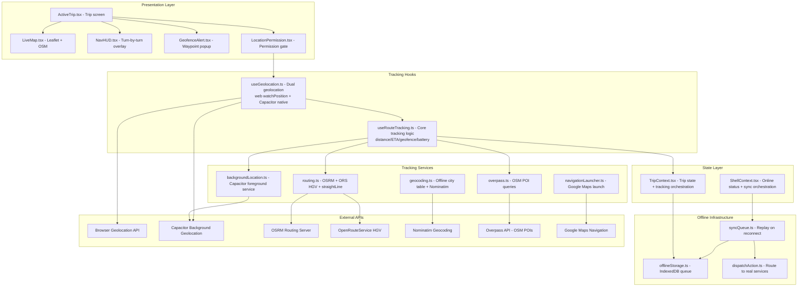
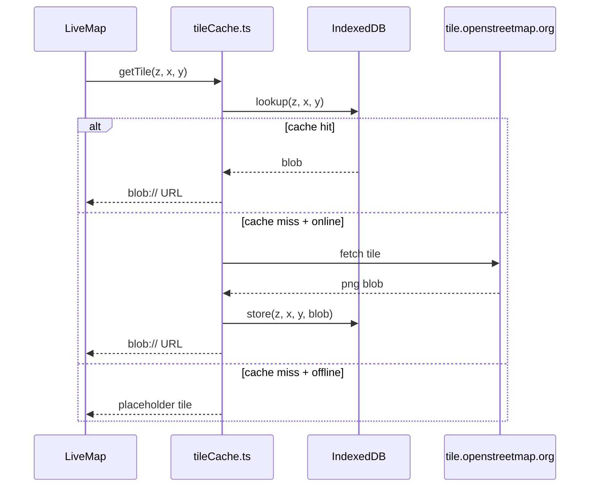
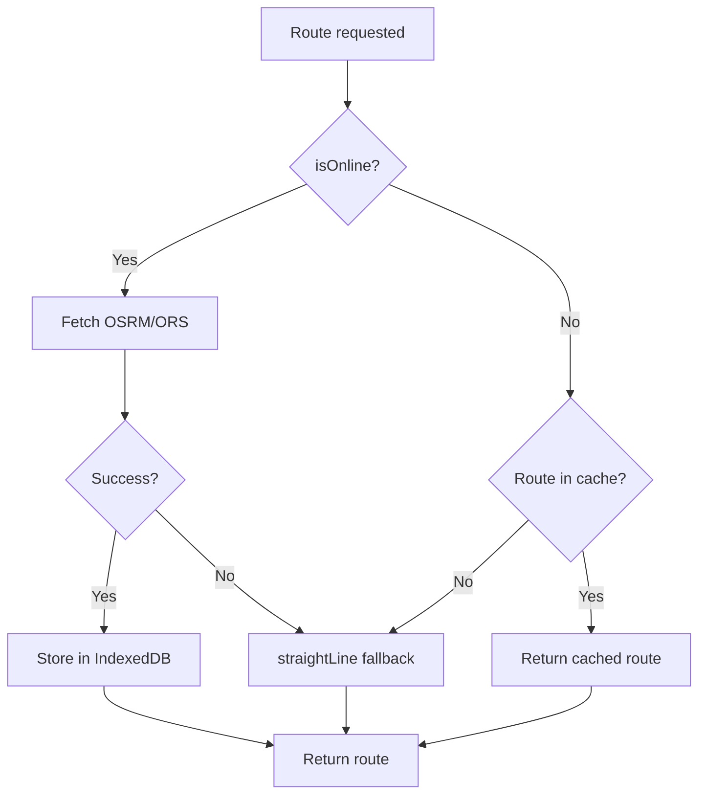
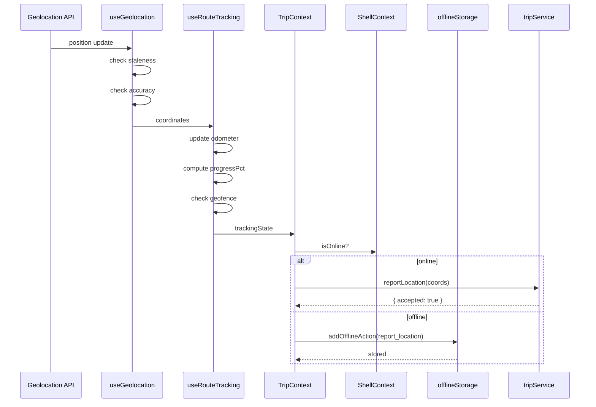
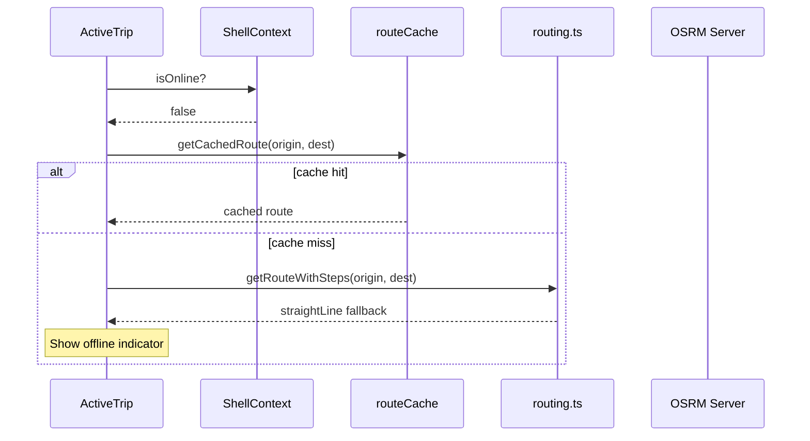
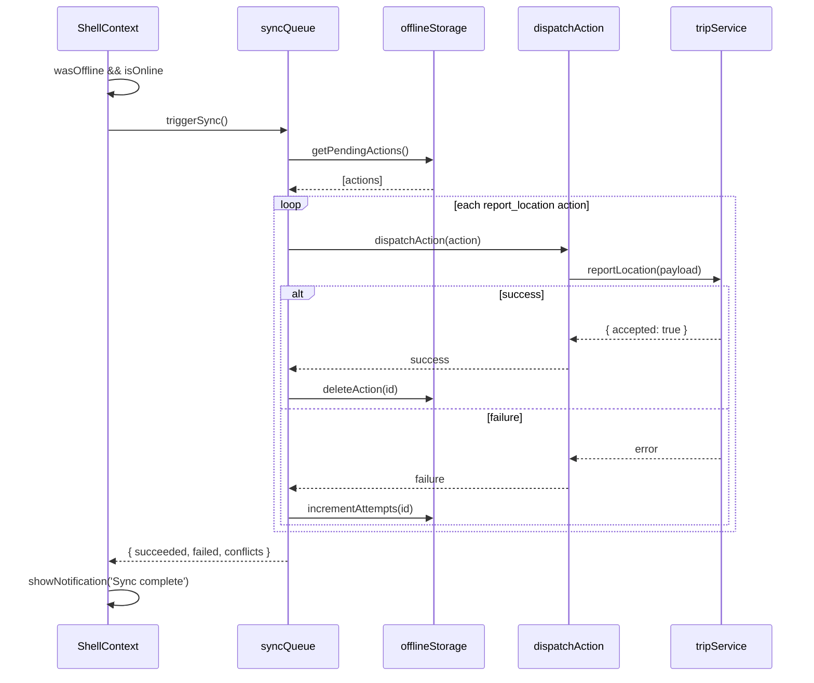

# GPS Tracking Enhancement Design

## 1. Architecture Overview



## 2. Current State Assessment

### 2.1 What Is Already Implemented (Real/Functional)

| Component | File | Status | Detail |
|-----------|------|--------|--------|
| Dual-path geolocation | [`useGeolocation.ts`](src/features/tracking/hooks/useGeolocation.ts) | ✅ Real | Web `watchPosition` + Capacitor native, permission mgmt, cleanup |
| Live Leaflet map | [`LiveMap.tsx`](src/features/tracking/components/LiveMap.tsx) | ✅ Real | OpenStreetMap tiles, truck SVG icon with rotation, waypoint/POI markers, auto-center, fit-bounds, POI filter checkboxes |
| Geofence detection | [`useRouteTracking.ts`](src/features/tracking/hooks/useRouteTracking.ts:166-204) | ✅ Real | `computeGeofenceStatus` with enter/exit state machine |
| Geofence alert UI | [`GeofenceAlert.tsx`](src/features/tracking/components/GeofenceAlert.tsx) | ✅ Real | Slide-down alert, auto-dismiss 5s, shows label/distance/type |
| Route tracking math | [`useRouteTracking.ts`](src/features/tracking/hooks/useRouteTracking.ts:7-21) | ✅ Real | Haversine distance, ETA with speed or 50 km/h default |
| Battery optimization | [`useRouteTracking.ts`](src/features/tracking/hooks/useRouteTracking.ts:69-84) | ✅ Real | Drops to 30s interval when battery <20% and not charging |
| Background location | [`backgroundLocation.ts`](src/features/tracking/services/backgroundLocation.ts) | ✅ Real | Capacitor foreground service, configurable distanceFilter |
| Road routing | [`routing.ts`](src/features/tracking/services/routing.ts) | ✅ Real | OSRM (free) + ORS HGV (optional), turn-by-turn steps, graceful fallback |
| POI queries | [`overpass.ts`](src/features/tracking/services/overpass.ts) | ✅ Real | OSM Overpass API for fuel/dhaba/toll, 15km proximity filter |
| Navigation launch | [`navigationLauncher.ts`](src/features/tracking/services/navigationLauncher.ts) | ✅ Real | Capacitor AppLauncher → Google Maps, web fallback |
| Offline geocoding | [`geocoding.ts`](src/features/tracking/services/geocoding.ts) | ✅ Real | ~100 Indian city lookup table, Nominatim fallback |
| Location permission UI | [`LocationPermission.tsx`](src/features/tracking/components/LocationPermission.tsx) | ✅ Real | Multi-stage flow: prompt → request → background disclosure → granted |
| Nav HUD | [`NavHUD.tsx`](src/features/tracking/components/NavHUD.tsx) | ✅ Real | Speed, distance, ETA, maneuver instruction, POI distances |
| Offline location reporting | [`TripContext.tsx`](src/state/TripContext.tsx:71-97) | ✅ Real | Buffers GPS fixes into offline queue via `addOfflineAction` |
| Re-route on deviation | [`ActiveTrip.tsx`](src/screens/ActiveTrip.tsx:85-110) | ✅ Real | Re-fetches route when driver >600m off-route |

### 2.2 Gaps Identified

| Gap | Severity | Detail |
|-----|----------|--------|
| No unit tests for tracking hooks/services | **High** | Only `navigationLauncher.test.ts` exists; 0 tests for geolocation, route tracking, routing, geofence, overpass, geocoding, backgroundLocation |
| `ITripService` lacks tracking API methods | **Medium** | No `reportLocation`, `getRoute`, or tracking-specific methods in service interface |
| No `isServiceReal('tracking')` service key | **Medium** | Service switching keys are `auth|loads|trip|earnings|profile|chat` — no `tracking` key |
| Routing/POI fail silently when offline | **Medium** | `getRoadRoute` and `fetchPoisAlongRoute` make network calls without offline fallback beyond `straightLine` for routing |
| No E2E tests for tracking flows | **Medium** | No Playwright test covers map rendering, geofence alerts, or navigation launch |
| Geofence status not persisted across reload | **Low** | `computeGeofenceStatus` is in-memory only; restart loses geofence state |
| No speed threshold alerts | **Low** | No overspeeding or stopped-vehicle detection |
| Route caching not implemented | **Low** | Routes refetched every time; no cache for known corridors |

### 2.3 Test Coverage Gap Analysis

| File | Has Test | Priority | Test Complexity |
|------|:---:|:---:|:---:|
| [`useGeolocation.ts`](src/features/tracking/hooks/useGeolocation.ts) | ❌ | P0 | Medium — mock `navigator.geolocation` + Capacitor plugin |
| [`useRouteTracking.ts`](src/features/tracking/hooks/useRouteTracking.ts) | ❌ | P0 | Medium — mock geolocation hook, verify distance/ETA/geofence |
| [`routing.ts`](src/features/tracking/services/routing.ts) | ❌ | P0 | Medium — mock `fetch`, verify OSRM/ORS/fallback paths |
| [`overpass.ts`](src/features/tracking/services/overpass.ts) | ❌ | P1 | Low — mock `fetch`, verify POI parsing and filtering |
| [`geocoding.ts`](src/features/tracking/services/geocoding.ts) | ❌ | P1 | Low — test offline table + Nominatim fallback |
| [`backgroundLocation.ts`](src/features/tracking/services/backgroundLocation.ts) | ❌ | P1 | Medium — mock Capacitor plugin |
| [`LiveMap.tsx`](src/features/tracking/components/LiveMap.tsx) | ❌ | P1 | High — mock react-leaflet, verify markers/controls |
| [`GeofenceAlert.tsx`](src/features/tracking/components/GeofenceAlert.tsx) | ❌ | P1 | Low — render test with props, verify auto-dismiss |
| [`LocationPermission.tsx`](src/features/tracking/components/LocationPermission.tsx) | ❌ | P1 | Low — mock geolocation hook states |
| [`NavHUD.tsx`](src/features/tracking/components/NavHUD.tsx) | ❌ | P2 | Low — render test with props |
| [`navigationLauncher.ts`](src/features/tracking/services/navigationLauncher.ts) | ✅ | — | Already tested |
| [`ActiveTrip.tsx`](src/screens/ActiveTrip.tsx) (tracking parts) | ❌ | P1 | High — integration test with mocked services |
| E2E tracking flows | ❌ | P2 | Medium — Playwright with mocked geolocation |

---

## 3. Enhanced Geolocation Hook

### 3.1 Current Implementation

| Aspect | Current State |
|--------|---------------|
| Web path | `navigator.geolocation.watchPosition` with `enableHighAccuracy` |
| Native path | Capacitor `BackgroundGeolocation.addWatcher` |
| Permission | `navigator.permissions.query` (web) + Capacitor native dialog |
| Error handling | PERMISSION_DENIED, POSITION_UNAVAILABLE, TIMEOUT |
| Cleanup | Stops both watchers on unmount |

### 3.2 Planned Enhancements

| Enhancement | Type | Rationale |
|-------------|------|-----------|
| Configurable accuracy modes | Modify `useGeolocation.ts` | Allow switching between HIGH (GPS) and BALANCED (network) to save battery on long hauls |
| Position staleness detection | Modify `useGeolocation.ts` | Warn if last fix is >60s old (GPS lost in tunnel/underground) |
| Accuracy degradation recovery | Modify `useGeolocation.ts` | Auto-retry high-accuracy when accuracy drops >100m |
| Mock geolocation for tests | Modify test setup | Inject mock positions via `@testing-library` for hook tests |

### 3.3 Configuration Changes

```typescript
// Modified TrackingConfig in types.ts
export interface TrackingConfig {
    highAccuracy: boolean;
    intervalMs: number;
    batteryOptimized: boolean;
    // NEW fields
    stalenessThresholdMs?: number;   // Default 60_000 (60s)
    minAccuracyMeters?: number;      // Default 100 (warn if worse)
    accuracyMode?: 'high' | 'balanced' | 'low';
}
```

---

## 4. Live Map Enhancements

### 4.1 Current Implementation

| Aspect | Current State |
|--------|---------------|
| Tile provider | OpenStreetMap (free, no API key) |
| Markers | Custom SVG truck icon with rotation, waypoint circles, POI emojis |
| Controls | Locate-me, fit-route, fullscreen toggle, POI filter checkboxes |
| Dynamic import | `leaflet/dist/leaflet.css` loaded dynamically |

### 4.2 Planned Enhancements

| Enhancement | Type | Rationale |
|-------------|------|-----------|
| Dark mode tile layer | Modify `LiveMap.tsx` | Use CartoDB dark tiles when theme is dark |
| Offline tile caching | New service | Cache OSM tiles in IndexedDB for offline map viewing |
| Speed-based marker smoothing | Modify `LiveMap.tsx` | Animate marker position between GPS fixes for smoother movement |
| Route polyline color by segment | Modify `LiveMap.tsx` | Color upcoming segments differently from traversed ones |
| Clustered POI markers | New component | Prevent POI overlap at high zoom levels |
| Map error boundary | New component | Graceful fallback when tiles fail to load |
| Tile loading indicator | Modify `LiveMap.tsx` | Show spinner while tiles load on slow networks |

### 4.3 Offline Tile Cache Design



---

## 5. Geofence Alert Enhancements

### 5.1 Current Implementation

| Aspect | Current State |
|--------|---------------|
| Detection | `computeGeofenceStatus` in `useRouteTracking.ts` — finds closest waypoint, detects enter/exit transitions |
| Alert UI | `GeofenceAlert.tsx` — slide-down, auto-dismiss 5s, shows label/distance/type |
| Radius | Per-waypoint `geofenceRadius` (from `RouteWaypoint`) |

### 5.2 Planned Enhancements

| Enhancement | Type | Rationale |
|-------------|------|-----------|
| Persist geofence state to localStorage | Modify `useRouteTracking.ts` | Survive app restart; prevent duplicate alerts on reload |
| Custom alert action per waypoint type | Modify `GeofenceAlert.tsx` | Pickup → "Call shipper" action; Drop → "Capture POD" action |
| Sound/vibration on alert | Modify `GeofenceAlert.tsx` | Critical for pickup/drop notifications when phone is pocketed |
| Graduated alerts | Modify `useRouteTracking.ts` | Warn at 2x radius ("approaching"), alert at 1x radius ("arrived") |
| Geofence log for audit trail | New `useGeofenceLog` hook | Record enter/exit timestamps for compliance reporting |
| Exit debounce | Modify `useRouteTracking.ts` | Prevent rapid enter→exit→enter when GPS jitters at boundary |

### 5.3 Geofence Log Schema

```typescript
interface GeofenceLogEntry {
    id: string;
    waypointId: string;
    waypointLabel: string;
    waypointType: RouteWaypoint['type'];
    event: 'entered' | 'exited';
    timestamp: number;
    coordinates: Coordinates;
    tripId: string;
    synced: boolean;
}
```

---

## 6. Route Tracking Enhancements

### 6.1 Current Implementation

| Aspect | Current State |
|--------|---------------|
| Distance | Haversine to last waypoint (straight-line) |
| ETA | `remainingDistance / speed` (default 13.9 m/s ≈ 50 km/h) |
| Battery | Drops to 30s interval when <20% and not charging |
| Re-route | Fetches new route when >600m off-route (in ActiveTrip.tsx) |

### 6.2 Planned Enhancements

| Enhancement | Type | Rationale |
|-------------|------|-----------|
| Road-distance ETA | Modify `useRouteTracking.ts` | Track progress index along route polyline, not straight-line distance |
| Route progress percentage | Modify `useRouteTracking.ts` | Expose `progressPct` (0-100) for dashboard and settlement |
| Speed monitoring alerts | New hook `useSpeedMonitor` | Alert on overspeeding (>80 km/h for trucks) or prolonged idling |
| Trip odometer | Modify `useRouteTracking.ts` | Accumulate total distance traveled during trip |
| Rest-break detection | New hook `useRestBreak` | Detect stops >15 min, prompt break log |
| Route deviation heuristics | Modify `ActiveTrip.tsx` | Smarter threshold: >300m for highways, >100m for city, debounced |

### 6.3 Route Progress Calculation

```typescript
// Replace straight-line ETA with polyline-indexed calculation
function computeRouteProgress(
    position: Coordinates,
    routePath: Coordinates[]   // Full route polyline
): { progressPct: number; distanceRemaining: number; nearestIndex: number } {
    // Find closest point on the polyline
    let minDist = Infinity;
    let closestIdx = 0;
    for (let i = 0; i < routePath.length; i++) {
        const d = haversineDistance(position, routePath[i]);
        if (d < minDist) { minDist = d; closestIdx = i; }
    }
    
    // Calculate remaining distance from closestIdx to end
    let remaining = 0;
    for (let i = closestIdx; i < routePath.length - 1; i++) {
        remaining += haversineDistance(routePath[i], routePath[i + 1]);
    }
    
    // Total route distance
    let total = 0;
    for (let i = 0; i < routePath.length - 1; i++) {
        total += haversineDistance(routePath[i], routePath[i + 1]);
    }
    
    return {
        progressPct: total > 0 ? ((total - remaining) / total) * 100 : 0,
        distanceRemaining: remaining,
        nearestIndex: closestIdx,
    };
}
```

---

## 7. Background Location Enhancements

### 7.1 Current Implementation

| Aspect | Current State |
|--------|---------------|
| Android | Capacitor `BackgroundGeolocation.addWatcher` with foreground service notification |
| Config | `distanceFilter` (default 20m), notification title/body |
| Stop | `removeWatcher(id)` |

### 7.2 Planned Enhancements

| Enhancement | Type | Rationale |
|-------------|------|-----------|
| iOS background support | Modify `backgroundLocation.ts` | Add iOS path using `CLLocationManager` via Capacitor plugin |
| Adaptive distance filter | Modify `backgroundLocation.ts` | Increase filter on highways (100m), decrease in cities (10m) |
| Battery-aware interval | Modify `backgroundLocation.ts` | Synergize with `useRouteTracking.ts` battery state |
| Background kill recovery | Modify `backgroundLocation.ts` | Auto-restart watcher if OS kills the service |
| Notification channel | Modify `backgroundLocation.ts` | Use Android notification channel for user control |

---

## 8. Service Integration

### 8.1 Current State

The service layer currently has no dedicated tracking service. Location data flows:
```
useGeolocation → useRouteTracking → TripContext → addOfflineAction(IndexedDB)
                                                      ↓
                                               POST /driver/trips/{loadId}/location
```

### 8.2 Design Decisions

**Decision: Do NOT create a separate `trackingService`**

Rationale:
- Location reporting is already handled via the offline queue infrastructure
- Creating a `trackingService` would add indirection without clear benefit
- The offline queue already handles retry, batching, and persistence
- Routing/POI/geocoding are client-side operations; they don't need a service abstraction

**Decision: Add tracking-specific methods to `ITripService`**

Rationale:
- Location reports are trip-scoped; they logically belong to `ITripService`
- Enables mock service to simulate location reporting for testing
- Consistent with existing pattern where trip operations live on `ITripService`

### 8.3 Interface Changes

```typescript
// Modified ITripService in src/services/types.ts
export interface ReportLocationRequest {
    loadId: string;
    lat: number;
    lng: number;
    accuracy: number | null;
    heading: number | null;
    speed: number | null;
    recordedAt: number;
}

export interface ReportLocationResponse {
    accepted: boolean;
}

export interface ITripService {
    getActiveTrip(): Promise<GetActiveTripResponse>;
    advanceStep(request: AdvanceStepRequest): Promise<AdvanceStepResponse>;
    completeTrip(request: CompleteTripRequest): Promise<CompleteTripResponse>;
    // NEW
    reportLocation(request: ReportLocationRequest): Promise<ReportLocationResponse>;
}
```

### 8.4 Service Implementations

**Real service** ([`src/services/real/tripService.ts`](src/services/real/tripService.ts)):
```typescript
async reportLocation(req: ReportLocationRequest): Promise<ReportLocationResponse> {
    // Write to Firestore: /trips/{loadId}/locations/{timestamp}
    const doc = {
        loadId: req.loadId,
        lat: req.lat,
        lng: req.lng,
        accuracy: req.accuracy,
        heading: req.heading,
        speed: req.speed,
        recordedAt: req.recordedAt,
    };
    await setDoc(doc(db, 'trips', req.loadId, 'locations', String(req.recordedAt)), doc);
    return { accepted: true };
}
```

**Mock service** ([`src/services/mock/tripService.ts`](src/services/mock/tripService.ts)):
```typescript
async reportLocation(_req: ReportLocationRequest): Promise<ReportLocationResponse> {
    await delay(100);
    return { accepted: true };
}
```

### 8.5 Service Switching

The `isServiceReal('trip')` check already exists and will cover the new `reportLocation` method. No new service key (`tracking`) is needed.

---

## 9. Offline Handling

### 9.1 Current Implementation

| Capability | Status |
|------------|--------|
| Location reporting offline | ✅ Implemented — `TripContext.tsx:71-97` queues via `addOfflineAction` |
| Route fetching offline | ❌ Fails silently — returns `straightLine` fallback |
| POI fetching offline | ❌ Fails silently — returns empty array |
| Geocoding offline | ✅ Works — offline city table |
| Tile rendering offline | ❌ Fails — no tile cache |

### 9.2 Planned Enhancements

| Enhancement | Type | Rationale |
|-------------|------|-----------|
| Route cache in IndexedDB | New service `routeCache.ts` | Cache OSRM responses for known corridors; reuse when offline |
| POI offline fallback | Modify `overpass.ts` | Return empty POI list gracefully with UI indicator |
| Tile cache in IndexedDB | New service `tileCache.ts` | Cache recent tiles (LRU, max 500 tiles) for offline map |
| Offline-aware route fetch | Modify `ActiveTrip.tsx` | Check `isOnline` before attempting OSRM; use cache or straightLine |
| Sync queue integration | Modify `TripContext.tsx` | Ensure `reportLocation` actions flush through `dispatchAction` in `actionDispatcher.ts` |

### 9.3 Route Cache Design

```typescript
// New file: src/features/tracking/services/routeCache.ts
interface CachedRoute {
    key: string;            // "origin_lat,origin_lng→dest_lat,dest_lng" (rounded to 2dp)
    route: RouteWithSteps;
    cachedAt: number;
    ttl: number;            // 24 hours
}

// IndexedDB store: 'route_cache'
// Keyed by origin→dest snapshot
// Purge entries older than TTL on each write
```

### 9.4 Tile Cache Design

```typescript
// New file: src/features/tracking/services/tileCache.ts
interface CachedTile {
    key: string;            // "{z}/{x}/{y}"
    blob: Blob;
    cachedAt: number;
}

// IndexedDB store: 'tile_cache'
// LRU eviction when >500 tiles
// Pre-cache tiles for known routes (fetch tiles along route polyline)
```

### 9.5 Offline-Aware Flow



---

## 10. Unit Test Plan

### 10.1 New Test Files

| Test File | Tests | Mock Strategy |
|-----------|-------|---------------|
| `src/features/tracking/hooks/useGeolocation.test.ts` | Permission states, web watchPosition, permission denied, timeout, cleanup | Mock `navigator.geolocation`, mock Capacitor plugin |
| `src/features/tracking/hooks/useRouteTracking.test.ts` | Distance calc, ETA calc, geofence enter/exit, battery optimization, progress tracking | Mock `useGeolocation` return value |
| `src/features/tracking/services/routing.test.ts` | OSRM path, OSRM with steps, ORS HGV, straightLine fallback, network error | Mock `fetch` with OSRM/ORS response fixtures |
| `src/features/tracking/services/overpass.test.ts` | POI parsing, bbox calculation, proximity filtering, empty results | Mock `fetch` with Overpass response fixtures |
| `src/features/tracking/services/geocoding.test.ts` | Offline table lookup, city normalization, Nominatim response, India center fallback | Mock `fetch` for Nominatim |
| `src/features/tracking/services/backgroundLocation.test.ts` | Start watcher, stop watcher, coordinate conversion | Mock Capacitor plugin |
| `src/features/tracking/components/GeofenceAlert.test.tsx` | Render with waypoint, auto-dismiss timer, dismiss button, format distance | Pure render test, no mocks needed |
| `src/features/tracking/components/LocationPermission.test.tsx` | Prompt state, requesting state, granted state, denied state | Mock `useGeolocation` |
| `src/features/tracking/components/NavHUD.test.tsx` | Speed display, ETA display, maneuver icons, POI distances | Pure render test |
| `src/features/tracking/services/routeCache.test.ts` | Store, retrieve, TTL expiry, LRU eviction | Mock IndexedDB via idb |
| `src/features/tracking/services/tileCache.test.ts` | Store tile, retrieve tile, LRU eviction, cache miss | Mock IndexedDB via idb |

### 10.2 Existing Test to Extend

| Test File | Additions |
|-----------|-----------|
| [`navigationLauncher.test.ts`](src/features/tracking/services/navigationLauncher.test.ts) | Add Google Maps web fallback test, invalid coordinates test |
| [`src/services/mock/authService.test.ts`](src/services/mock/authService.test.ts) | Add `reportLocation` mock test |

### 10.3 E2E Tests

| Spec | Test Case | Approach |
|------|-----------|----------|
| `e2e/tracking.spec.ts` (new) | Map renders with truck marker | Navigate to ActiveTrip, check map container exists |
| `e2e/tracking.spec.ts` | Geofence alert appears near waypoint | Mock geolocation to waypoint coordinates |
| `e2e/tracking.spec.ts` | Navigation launcher opens Google Maps | Click navigation button, verify URL opened |
| `e2e/tracking.spec.ts` | Location permission flow | Step through permission prompt → grant |
| `e2e/tracking.spec.ts` | Offline → online location sync | Go offline, verify queue, go online, verify sync |
| `e2e/tracking.spec.ts` | Route changes on deviation | Mock position off-route, verify new route fetched |

### 10.4 Test Fixtures

```typescript
// New file: src/features/tracking/__tests__/fixtures.ts
export const DELHI_COORDS: Coordinates = { lat: 28.6139, lng: 77.2090, ... };
export const MUMBAI_COORDS: Coordinates = { lat: 19.0760, lng: 72.8777, ... };
export const WAYPOINTS: RouteWaypoint[] = [...];
export const OSRM_RESPONSE = { ... };  // Real OSRM JSON response
export const OVERPASS_RESPONSE = { ... };  // Real Overpass XML response
export const MOCK_GPS_SEQUENCE: Coordinates[] = [...];  // Simulated drive
```

---

## 11. Implementation Checklist

### Phase 1: Types & Interfaces (Foundation)

- [ ] **1.1** Add `stalenessThresholdMs`, `minAccuracyMeters`, `accuracyMode` to `TrackingConfig` in [`types.ts`](src/features/tracking/types.ts:42-48)
- [ ] **1.2** Add `progressPct` and `odometerMeters` to `TrackingState` in [`types.ts`](src/features/tracking/types.ts:31-40)
- [ ] **1.3** Add `GeofenceLogEntry` type to [`types.ts`](src/features/tracking/types.ts)
- [ ] **1.4** Add `ReportLocationRequest` and `ReportLocationResponse` to [`src/services/types.ts`](src/services/types.ts:115-119)
- [ ] **1.5** Add `reportLocation()` method to `ITripService` interface in [`src/services/types.ts`](src/services/types.ts:115-119)

### Phase 2: Core Hook Enhancements

- [ ] **2.1** Add position staleness detection to [`useGeolocation.ts`](src/features/tracking/hooks/useGeolocation.ts)
  - Track `lastFixTimestamp` in state
  - Set `isStale: true` when `Date.now() - lastFixTimestamp > stalenessThresholdMs`
  - Add `stalePosition` to return type
- [ ] **2.2** Add accuracy mode switching to [`useGeolocation.ts`](src/features/tracking/hooks/useGeolocation.ts)
  - Map `accuracyMode` to `enableHighAccuracy` flag
  - Map `accuracyMode` to `distanceFilter` in native mode
- [ ] **2.3** Add route progress calculation to [`useRouteTracking.ts`](src/features/tracking/hooks/useRouteTracking.ts)
  - Implement `computeRouteProgress` using polyline indexing
  - Expose `progressPct` in `TrackingState`
- [ ] **2.4** Add trip odometer to [`useRouteTracking.ts`](src/features/tracking/hooks/useRouteTracking.ts)
  - Accumulate distance between consecutive position updates
  - Expose `odometerMeters` in `TrackingState`
- [ ] **2.5** Add graduated geofence alerts to [`useRouteTracking.ts`](src/features/tracking/hooks/useRouteTracking.ts:166-204)
  - `approaching` status at 2× radius
  - `entered` status at 1× radius (existing behavior)
- [ ] **2.6** Add exit debounce to `computeGeofenceStatus`
  - Require >3 consecutive positions outside geofence before triggering exit
- [ ] **2.7** Persist geofence state to localStorage
  - On mount, restore last geofence status
  - Prevent duplicate alerts on page reload

### Phase 3: Service Layer

- [ ] **3.1** Implement `reportLocation` in real trip service [`src/services/real/tripService.ts`](src/services/real/tripService.ts)
  - Write to Firestore `trips/{loadId}/locations/{timestamp}`
- [ ] **3.2** Implement `reportLocation` in mock trip service [`src/services/mock/tripService.ts`](src/services/mock/tripService.ts)
  - Simulate with delay, return `{ accepted: true }`
- [ ] **3.3** Add `report_location` handling to [`dispatchAction.ts`](src/features/offline/services/dispatchAction.ts)
  - Route `report_location` actions to `tripService.reportLocation()`
- [ ] **3.4** Update `TripContext` to use `tripService.reportLocation` for online reports
  - Replace direct `addOfflineAction` with online-first approach

### Phase 4: Offline Resilience

- [ ] **4.1** Create route cache service [`src/features/tracking/services/routeCache.ts`](src/features/tracking/services/routeCache.ts)
  - Store OSRM/ORS responses keyed by origin→dest
  - 24h TTL, LRU eviction of 50 entries
- [ ] **4.2** Create tile cache service [`src/features/tracking/services/tileCache.ts`](src/features/tracking/services/tileCache.ts)
  - Intercept tile requests via custom Leaflet TileLayer
  - Store in IndexedDB, LRU eviction of 500 tiles
- [ ] **4.3** Add offline-aware route fetch to [`ActiveTrip.tsx`](src/screens/ActiveTrip.tsx)
  - Check `isOnline` before OSRM fetch
  - Fall back to route cache → straightLine
- [ ] **4.4** Add offline-aware POI fetch to [`overpass.ts`](src/features/tracking/services/overpass.ts)
  - Return empty `RoutePoI[]` when offline (no crash)
  - Add `offlineFallback` flag to response

### Phase 5: UI Enhancements

- [ ] **5.1** Add dark mode tile layer to [`LiveMap.tsx`](src/features/tracking/components/LiveMap.tsx)
  - Use CartoDB `dark_all` tiles when `isDark` theme active
- [ ] **5.2** Add marker position smoothing to [`LiveMap.tsx`](src/features/tracking/components/LiveMap.tsx)
  - Interpolate truck position between GPS updates using `requestAnimationFrame`
- [ ] **5.3** Add traversed vs upcoming route coloring to [`LiveMap.tsx`](src/features/tracking/components/LiveMap.tsx)
  - Green polyline for traversed segment, blue for upcoming
  - Use `progressPct` from `TrackingState`
- [ ] **5.4** Add tile loading indicator to [`LiveMap.tsx`](src/features/tracking/components/LiveMap.tsx)
  - `tileload` / `tileloadstart` / `tileerror` Leaflet events
- [ ] **5.5** Add map error boundary component
  - New file: [`src/features/tracking/components/MapErrorBoundary.tsx`](src/features/tracking/components/MapErrorBoundary.tsx)
  - Fallback UI when tiles fail to load
- [ ] **5.6** Add action buttons to [`GeofenceAlert.tsx`](src/features/tracking/components/GeofenceAlert.tsx)
  - Pickup waypoint → "Call Shipper" button
  - Drop waypoint → "Capture POD" button
- [ ] **5.7** Add progress bar to [`ActiveTrip.tsx`](src/screens/ActiveTrip.tsx)
  - Show `progressPct` from `TrackingState`

### Phase 6: Speed & Break Monitoring

- [ ] **6.1** Create `useSpeedMonitor` hook
  - New file: [`src/features/tracking/hooks/useSpeedMonitor.ts`](src/features/tracking/hooks/useSpeedMonitor.ts)
  - Alert when speed >80 km/h maintained for >10s
  - Alert when stopped >15 min (rest break prompt)
- [ ] **6.2** Create `useRestBreak` hook
  - New file: [`src/features/tracking/hooks/useRestBreak.ts`](src/features/tracking/hooks/useRestBreak.ts)
  - Track stop duration via geolocation stillness
  - Prompt break log UI when stop >15 min

### Phase 7: Unit Tests

- [ ] **7.1** Create test fixtures [`src/features/tracking/__tests__/fixtures.ts`](src/features/tracking/__tests__/fixtures.ts)
  - Coord constants, waypoints, OSRM/Overpass response samples
- [ ] **7.2** Write [`useGeolocation.test.ts`](src/features/tracking/hooks/useGeolocation.test.ts)
  - Permission prompt → granted flow
  - Permission denied → error state
  - `watchPosition` callback → position update
  - Position timeout → error state
  - Cleanup on unmount → clearWatch called
  - Staleness detection → `isStale` flag
- [ ] **7.3** Write [`useRouteTracking.test.ts`](src/features/tracking/hooks/useRouteTracking.test.ts)
  - Distance calculation accuracy
  - ETA calculation with known speed
  - ETA default fallback (50 km/h)
  - Geofence enter detection
  - Geofence exit detection
  - Battery optimization trigger (<20%)
  - Route progress percentage
  - Odometer accumulation
  - Graduated alert (approaching → entered)
- [ ] **7.4** Write [`routing.test.ts`](src/features/tracking/services/routing.test.ts)
  - OSRM route returns valid path
  - OSRM with steps returns maneuvers
  - ORS HGV route (with mock KEY)
  - ORS failure → OSRM fallback
  - OSRM failure → straightLine fallback
  - Network error → straightLine fallback
  - Maneuver type mapping
- [ ] **7.5** Write [`overpass.test.ts`](src/features/tracking/services/overpass.test.ts)
  - POI parsing from Overpass JSON
  - Bbox calculation from path
  - Proximity filtering (within 15km)
  - `distanceToNextPoi` returns nearest
  - Empty results → empty array
  - Network error → empty array
- [ ] **7.6** Write [`geocoding.test.ts`](src/features/tracking/services/geocoding.test.ts)
  - Offline table lookup (known cities)
  - Unknown city → null from `lookupCity`
  - Nominatim response → parsed coordinates
  - Nominatim failure → India center
  - City normalization (case, whitespace)
- [ ] **7.7** Write [`backgroundLocation.test.ts`](src/features/tracking/services/backgroundLocation.test.ts)
  - `startBackgroundWatch` calls `addWatcher`
  - Coordinate conversion `toCoordinates`
  - `stopBackgroundWatch` calls `removeWatcher`
  - Notification config passed to plugin
- [ ] **7.8** Write [`GeofenceAlert.test.tsx`](src/features/tracking/components/GeofenceAlert.test.tsx)
  - Renders waypoint label and distance
  - Formats distance m/km correctly
  - Auto-dismiss after 5s triggers `onDismiss`
  - Dismiss button triggers `onDismiss`
  - Action button renders for pickup waypoint
- [ ] **7.9** Write [`LocationPermission.test.tsx`](src/features/tracking/components/LocationPermission.test.tsx)
  - Shows prompt UI when permission is `prompt`
  - Shows requesting UI when permission is `prompt` and request in flight
  - Renders children when permission is `granted`
  - Shows denied UI when permission is `denied`
  - Opens settings when denied and button clicked
- [ ] **7.10** Write [`NavHUD.test.tsx`](src/features/tracking/components/NavHUD.test.tsx)
  - Speed display in km/h
  - Distance remaining display
  - ETA display
  - Maneuver icons for each maneuver type
  - POI distances within threshold
- [ ] **7.11** Write [`routeCache.test.ts`](src/features/tracking/services/routeCache.test.ts)
  - Store and retrieve cached route
  - TTL expiry returns null
  - LRU eviction when over limit
  - Cache key normalization
- [ ] **7.12** Write [`tileCache.test.ts`](src/features/tracking/services/tileCache.test.ts)
  - Store and retrieve cached tile blob
  - Cache miss returns null
  - LRU eviction when >500 tiles
  - Tile key format `{z}/{x}/{y}`

### Phase 8: E2E Tests

- [ ] **8.1** Create `e2e/tracking.spec.ts`
  - Map container renders with Leaflet elements
  - Truck marker appears at driver position
  - Geofence alert slides in near waypoint (mocked position)
  - Navigation button opens Google Maps URL
  - Location permission flow: prompt → grant → map shown
  - Offline → online location sync flow
  - Route re-fetch on deviation >600m
- [ ] **8.2** Add geolocation mocking to Playwright config
  - Use `context.grantPermissions(['geolocation'])`
  - Set `geolocation` in browser context

### Phase 9: Integration & Polish

- [ ] **9.1** Add i18n strings for all new tracking UI text
  - File: [`src/i18n/en.json`](src/i18n/en.json) (and other locales)
  - Keys: `tracking.stale`, `tracking.offlineMap`, `tracking.breakPrompt`, etc.
- [ ] **9.2** Run `npm run typecheck` and fix all type errors
- [ ] **9.3** Run `npm run test:run` and verify all tests pass
- [ ] **9.4** Run `npm run test:coverage` and verify tracking coverage >80%
- [ ] **9.5** Manual QA on Android device:
  - Background location continues when app minimized
  - Foreground service notification visible
  - Geofence alerts trigger at actual waypoints
  - Google Maps navigation launches correctly
  - Offline queue flushes location reports on reconnect

---

## Appendix A: File Manifest

| File | Action | Purpose |
|------|--------|---------|
| [`src/features/tracking/types.ts`](src/features/tracking/types.ts) | Modify | Add staleness, accuracy mode, progress, odometer, geofence log types |
| [`src/features/tracking/hooks/useGeolocation.ts`](src/features/tracking/hooks/useGeolocation.ts) | Modify | Add staleness detection, accuracy mode switching |
| [`src/features/tracking/hooks/useRouteTracking.ts`](src/features/tracking/hooks/useRouteTracking.ts) | Modify | Add route progress, odometer, graduated alerts, exit debounce, localStorage persistence |
| [`src/features/tracking/hooks/useSpeedMonitor.ts`](src/features/tracking/hooks/useSpeedMonitor.ts) | **Create** | Overspeeding and idle detection |
| [`src/features/tracking/hooks/useRestBreak.ts`](src/features/tracking/hooks/useRestBreak.ts) | **Create** | Rest break detection and logging |
| [`src/features/tracking/services/routeCache.ts`](src/features/tracking/services/routeCache.ts) | **Create** | IndexedDB route cache for offline routing |
| [`src/features/tracking/services/tileCache.ts`](src/features/tracking/services/tileCache.ts) | **Create** | IndexedDB tile cache for offline maps |
| [`src/features/tracking/components/LiveMap.tsx`](src/features/tracking/components/LiveMap.tsx) | Modify | Dark mode tiles, marker smoothing, route coloring, tile indicator |
| [`src/features/tracking/components/MapErrorBoundary.tsx`](src/features/tracking/components/MapErrorBoundary.tsx) | **Create** | Graceful fallback for map errors |
| [`src/features/tracking/components/GeofenceAlert.tsx`](src/features/tracking/components/GeofenceAlert.tsx) | Modify | Action buttons per waypoint type |
| [`src/features/tracking/services/overpass.ts`](src/features/tracking/services/overpass.ts) | Modify | Offline-aware fetch, empty fallback |
| [`src/features/tracking/services/routing.ts`](src/features/tracking/services/routing.ts) | Modify | Route cache integration |
| [`src/services/types.ts`](src/services/types.ts) | Modify | Add `reportLocation` to `ITripService` |
| [`src/services/real/tripService.ts`](src/services/real/tripService.ts) | Modify | Implement `reportLocation` for Firestore |
| [`src/services/mock/tripService.ts`](src/services/mock/tripService.ts) | Modify | Implement mock `reportLocation` |
| [`src/features/offline/services/dispatchAction.ts`](src/features/offline/services/dispatchAction.ts) | Modify | Add `report_location` dispatch case |
| [`src/state/TripContext.tsx`](src/state/TripContext.tsx) | Modify | Use `tripService.reportLocation` when online |
| [`src/screens/ActiveTrip.tsx`](src/screens/ActiveTrip.tsx) | Modify | Offline-aware routing, progress bar |
| [`src/features/tracking/__tests__/fixtures.ts`](src/features/tracking/__tests__/fixtures.ts) | **Create** | Shared test data |
| [`src/features/tracking/hooks/useGeolocation.test.ts`](src/features/tracking/hooks/useGeolocation.test.ts) | **Create** | Geolocation hook tests |
| [`src/features/tracking/hooks/useRouteTracking.test.ts`](src/features/tracking/hooks/useRouteTracking.test.ts) | **Create** | Route tracking hook tests |
| [`src/features/tracking/services/routing.test.ts`](src/features/tracking/services/routing.test.ts) | **Create** | Routing service tests |
| [`src/features/tracking/services/overpass.test.ts`](src/features/tracking/services/overpass.test.ts) | **Create** | POI service tests |
| [`src/features/tracking/services/geocoding.test.ts`](src/features/tracking/services/geocoding.test.ts) | **Create** | Geocoding service tests |
| [`src/features/tracking/services/backgroundLocation.test.ts`](src/features/tracking/services/backgroundLocation.test.ts) | **Create** | Background location tests |
| [`src/features/tracking/services/routeCache.test.ts`](src/features/tracking/services/routeCache.test.ts) | **Create** | Route cache tests |
| [`src/features/tracking/services/tileCache.test.ts`](src/features/tracking/services/tileCache.test.ts) | **Create** | Tile cache tests |
| [`src/features/tracking/components/GeofenceAlert.test.tsx`](src/features/tracking/components/GeofenceAlert.test.tsx) | **Create** | Geofence alert tests |
| [`src/features/tracking/components/LocationPermission.test.tsx`](src/features/tracking/components/LocationPermission.test.tsx) | **Create** | Permission flow tests |
| [`src/features/tracking/components/NavHUD.test.tsx`](src/features/tracking/components/NavHUD.test.tsx) | **Create** | HUD component tests |
| [`e2e/tracking.spec.ts`](e2e/tracking.spec.ts) | **Create** | E2E tracking flow tests |
| [`src/i18n/en.json`](src/i18n/en.json) | Modify | Add tracking i18n keys |
| [`src/i18n/hi.json`](src/i18n/hi.json) | Modify | Add tracking i18n keys |

---

## Appendix B: Sequence Diagrams

### B.1 Location Reporting Flow (Enhanced)



### B.2 Offline Route Fetch



### B.3 Sync Replay for Location Reports



---

## Appendix C: Risk Assessment

| Risk | Impact | Mitigation |
|------|--------|------------|
| Battery drain from high-frequency GPS | High | Adaptive interval + accuracy modes + battery-aware scaling (existing) |
| Offline tile cache growing unbounded | Medium | LRU eviction at 500 tiles (~5MB) |
| Stale route cache leading drivers astray | Medium | 24h TTL + on-route validation before serving cache |
| Capacitor plugin API changes | Low | Pin version, wrap in adapter |
| OSRM service downtime | Low | Already has ORS fallback + straightLine ultimate fallback |
| GPS jitter causing false geofence exits | Low | Exit debounce (3+ consecutive outside positions) |
| IndexedDB corruption | Low | Queue replay is idempotent; clear queue and re-report |

---

## Appendix D: Key Design Decisions

| # | Decision | Rationale |
|---|----------|-----------|
| 1 | No separate `trackingService` | Location reports flow through offline queue + `ITripService.reportLocation`; creates no benefit |
| 2 | No new `tracking` service key | `reportLocation` is a trip operation, covered by `isServiceReal('trip')` |
| 3 | Tile cache in IndexedDB, not Service Worker | Simpler implementation; Service Worker Cache API has opaque response issues with cross-origin tiles |
| 4 | Route cache keyed by rounded coordinates | 2dp rounding captures ~1km precision — same corridor reuse, different exact coordinates |
| 5 | StraightLine fallback preserved as ultimate safety net | When everything fails, driver still gets a line on the map |
| 6 | Geofence exit debounce at 3 consecutive positions | At 10s intervals, that's 30s of GPS jitter immunity |
| 7 | Speed monitoring at 80 km/h threshold | Indian truck speed governor limit; aligns with regulatory compliance |