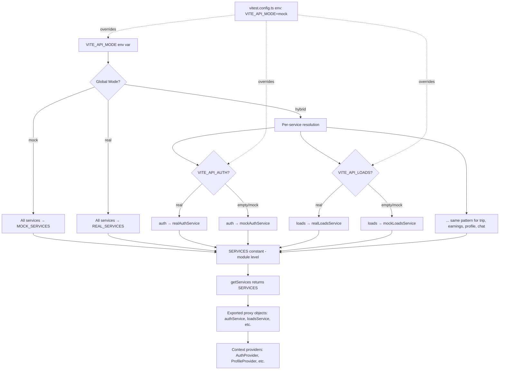

# Service Switching Architecture Design

## 1. Overview

HindTrucks currently uses `VITE_API_MODE` to toggle between `mock` and `real` services at the [`getServices()`](src/services/index.ts:34) level. This design extends that mechanism to support **hybrid mode** — per-service switching — while preserving backward compatibility, type safety, test isolation, and production safety.

---

## 2. Environment Variable Scheme

### 2.1 `VITE_API_MODE` — Global Mode

| Value | Behavior |
|-------|----------|
| `mock` | All services use mock implementations (default, safe for production if misconfigured) |
| `real` | All services use real implementations |
| `hybrid` | Each service individually controlled by `VITE_API_<SERVICE>` env var; falls back to mock if per-service var is unset |

### 2.2 Per-Service Variables (hybrid mode only)

| Env Var | Controls | Service Key |
|---------|----------|-------------|
| `VITE_API_AUTH` | [`IAuthService`](src/services/types.ts:46) | `auth` |
| `VITE_API_LOADS` | [`ILoadsService`](src/services/types.ts:83) | `loads` |
| `VITE_API_TRIP` | [`ITripService`](src/services/types.ts:115) | `trip` |
| `VITE_API_EARNINGS` | [`IEarningsService`](src/services/types.ts:146) | `earnings` |
| `VITE_API_PROFILE` | [`IProfileService`](src/services/types.ts:180) | `profile` |
| `VITE_API_CHAT` | [`IChatService`](src/services/types.ts:210) | `chat` |

Each per-service var accepts `mock` or `real`. In `hybrid` mode, if a per-service var is unset or empty, the service defaults to **mock** (safe fallback).

### 2.3 Resolution Logic

```
if VITE_API_MODE === 'mock'       → all mock
if VITE_API_MODE === 'real'       → all real
if VITE_API_MODE === 'hybrid'     → per-service resolution:
    for each service S:
        if VITE_API_S === 'real'  → real implementation
        else                      → mock implementation (default)
if VITE_API_MODE unset/empty      → all mock (default)
```

---

## 3. Changes to `src/services/index.ts`

### 3.1 Current Code (lines 24-64)

```ts
const MODE: 'mock' | 'real' =
    (import.meta.env.VITE_API_MODE as 'mock' | 'real') || 'mock'

// ... singleton vars ...

function getServices() {
    if (MODE === 'mock') {
        return { auth: mockAuthService, loads: mockLoadsService, ... }
    }
    // Real mode — singleton initialization
    if (!_auth) {
        _auth = realAuthService; _loads = realLoadsService; ...
    }
    return { auth: _auth, loads: _loads, ... }
}
```

### 3.2 Proposed Replacement

Replace lines 24-64 with:

```ts
// ── Service Mode Resolution ──

type ServiceMode = 'mock' | 'real'
type ApiMode = 'mock' | 'real' | 'hybrid'

const API_MODE: ApiMode =
    (import.meta.env.VITE_API_MODE as ApiMode) || 'mock'

/** Resolve a single service's mode. In hybrid mode, read per-service env var;
 *  in mock/real mode, all services follow the global setting. */
function resolveServiceMode(serviceKey: string): ServiceMode {
    if (API_MODE === 'mock') return 'mock'
    if (API_MODE === 'real') return 'real'
    // hybrid: per-service env var, default mock
    const perService = import.meta.env[`VITE_API_${serviceKey.toUpperCase()}`] as ServiceMode | undefined
    return perService === 'real' ? 'real' : 'mock'
}

// ── Service Implementations Map ──

const MOCK_SERVICES = {
    auth: mockAuthService,
    loads: mockLoadsService,
    trip: mockTripService,
    earnings: mockEarningsService,
    profile: mockProfileService,
    chat: mockChatService,
}

const REAL_SERVICES = {
    auth: realAuthService,
    loads: realLoadsService,
    trip: realTripService,
    earnings: realEarningsService,
    profile: realProfileService,
    chat: realChatService,
}

// ── Resolved Service Instances (computed once at module load) ──

const SERVICES = {
    auth:   resolveServiceMode('auth')   === 'real' ? REAL_SERVICES.auth   : MOCK_SERVICES.auth,
    loads:  resolveServiceMode('loads')  === 'real' ? REAL_SERVICES.loads  : MOCK_SERVICES.loads,
    trip:   resolveServiceMode('trip')   === 'real' ? REAL_SERVICES.trip   : MOCK_SERVICES.trip,
    earnings: resolveServiceMode('earnings') === 'real' ? REAL_SERVICES.earnings : MOCK_SERVICES.earnings,
    profile:  resolveServiceMode('profile')  === 'real' ? REAL_SERVICES.profile  : MOCK_SERVICES.profile,
    chat:     resolveServiceMode('chat')     === 'real' ? REAL_SERVICES.chat     : MOCK_SERVICES.chat,
}

function getServices() {
    return SERVICES
}
```

**Key design decisions:**
- Resolution happens **once at module load time** (not per-call) — consistent with Vite's static `define` replacement approach
- No singleton caching needed — `SERVICES` is a module-level constant
- The proxy pattern on exported service objects (lines 68-103) remains unchanged — they still delegate to `getServices()`
- `import.meta.env[`VITE_API_${key}`]` works because Vite `define` replaces these statically at build time

### 3.3 Export a Helper for Consumer Checks

Several files outside `src/services/` check `VITE_API_MODE === 'real'` directly. Add a helper to support hybrid-aware checks:

```ts
/** Whether a specific service is using its real implementation.
 *  Use this instead of raw VITE_API_MODE checks in consumers. */
export function isServiceReal(serviceKey: keyof typeof SERVICES): boolean {
    return resolveServiceMode(serviceKey) === 'real'
}
```

This lets consumers like [`ProfileContext.tsx`](src/state/ProfileContext.tsx:200) write `isServiceReal('profile')` instead of `import.meta.env.VITE_API_MODE === 'real'`, which correctly handles hybrid mode.

---

## 4. Changes to `vite.config.ts`

### 4.1 Current `define` Block (lines 36-43)

```ts
define: {
    'import.meta.env.VITE_API_MODE': JSON.stringify(process.env.VITE_API_MODE || 'mock'),
    'import.meta.env.VITE_API_BASE_URL': JSON.stringify(process.env.VITE_API_BASE_URL || '/api'),
    'import.meta.env.VITE_USE_EMULATOR': JSON.stringify(process.env.VITE_USE_EMULATOR || 'false'),
    'import.meta.env.VITE_ORS_API_KEY': JSON.stringify(process.env.VITE_ORS_API_KEY || ''),
    __BUNDLED_DEV__: 'false',
    __SERVER_FORWARD_CONSOLE__: 'false',
},
```

### 4.2 Proposed `define` Block

Add per-service env var definitions. Each defaults to empty string (which `resolveServiceMode` treats as `mock` in hybrid mode):

```ts
define: {
    'import.meta.env.VITE_API_MODE': JSON.stringify(process.env.VITE_API_MODE || 'mock'),
    'import.meta.env.VITE_API_AUTH': JSON.stringify(process.env.VITE_API_AUTH || ''),
    'import.meta.env.VITE_API_LOADS': JSON.stringify(process.env.VITE_API_LOADS || ''),
    'import.meta.env.VITE_API_TRIP': JSON.stringify(process.env.VITE_API_TRIP || ''),
    'import.meta.env.VITE_API_EARNINGS': JSON.stringify(process.env.VITE_API_EARNINGS || ''),
    'import.meta.env.VITE_API_PROFILE': JSON.stringify(process.env.VITE_API_PROFILE || ''),
    'import.meta.env.VITE_API_CHAT': JSON.stringify(process.env.VITE_API_CHAT || ''),
    'import.meta.env.VITE_API_BASE_URL': JSON.stringify(process.env.VITE_API_BASE_URL || '/api'),
    'import.meta.env.VITE_USE_EMULATOR': JSON.stringify(process.env.VITE_USE_EMULATOR || 'false'),
    'import.meta.env.VITE_ORS_API_KEY': JSON.stringify(process.env.VITE_ORS_API_KEY || ''),
    __BUNDLED_DEV__: 'false',
    __SERVER_FORWARD_CONSOLE__: 'false',
},
```

---

## 5. New File: `.env.example`

Create `.env.example` at project root (no such file currently exists):

```env
# ── API Service Mode ──
# Global mode: mock | real | hybrid
# Default: mock (safe — no real API calls)
VITE_API_MODE=mock

# Per-service overrides (only effective when VITE_API_MODE=hybrid)
# Values: mock | real  (unset = mock)
VITE_API_AUTH=
VITE_API_LOADS=
VITE_API_TRIP=
VITE_API_EARNINGS=
VITE_API_PROFILE=
VITE_API_CHAT=

# ── API Infrastructure ──
VITE_API_BASE_URL=/api
VITE_USE_EMULATOR=false

# ── Third-party Keys ──
VITE_ORS_API_KEY=
VITE_VAPID_PUBLIC_KEY=
```

---

## 6. Test Compatibility

### 6.1 Current State

[`vitest.config.ts`](vitest.config.ts:17) already sets:

```ts
env: {
    VITE_API_MODE: 'mock',
},
```

This ensures all tests use mock services regardless of shell env vars.

### 6.2 Required Changes

Add per-service env vars to `vitest.config.ts` test environment, all set to `mock`:

```ts
env: {
    VITE_API_MODE: 'mock',
    VITE_API_AUTH: 'mock',
    VITE_API_LOADS: 'mock',
    VITE_API_TRIP: 'mock',
    VITE_API_EARNINGS: 'mock',
    VITE_API_PROFILE: 'mock',
    VITE_API_CHAT: 'mock',
},
```

This guarantees tests always resolve to mock implementations, even if someone sets `VITE_API_MODE=hybrid` in their shell.

### 6.3 No Changes to `src/__tests__/setup.ts`

The existing Firebase mock at [line 88](src/__tests__/setup.ts:88) already prevents real Firebase SDK initialization. No additional mocking needed — the service resolution logic itself ensures mock services are selected.

---

## 7. Consumer Refactoring — Scattered `VITE_API_MODE` Checks

Several files outside `src/services/` directly check `VITE_API_MODE === 'real'`. These need updating for hybrid mode correctness.

### 7.1 Affected Files

| File | Line(s) | Current Check | Proposed Replacement |
|------|---------|---------------|---------------------|
| [`ProfileContext.tsx`](src/state/ProfileContext.tsx:200) | 200-202, 286, 460-461, 484-485 | `VITE_API_MODE === 'real'` | `isServiceReal('profile')` |
| [`App.tsx`](src/App.tsx:61) | 61 | `VITE_API_MODE === 'real'` | `isServiceReal('auth')` or `isServiceReal('profile')` depending on intent |
| [`chatService.ts`](src/features/chatbot/services/chatService.ts:130) | 129-131 | `mode === 'mock'` | `!isServiceReal('chat')` |

### 7.2 Import Pattern

Each consumer adds:

```ts
import { isServiceReal } from '../services/index'
// or appropriate relative path
```

### 7.3 Note on `chatService.ts`

[`shouldUseStaticFallback()`](src/features/chatbot/services/chatService.ts:129) currently returns `true` when `VITE_API_MODE === 'mock'` or offline. With hybrid mode, it should return `true` when the chat service specifically is mock. The offline check remains unchanged.

---

## 8. Vite Build Mode Considerations

### 8.1 No New Vite Modes Needed

The current `npm run dev -- --mode http` pattern works because `vite.config.ts` uses `define` with `process.env.VITE_API_MODE`, which reads from the shell environment at build/dev-server start time. The Vite `--mode` flag controls `.env.<mode>` file loading, but the `define` block overrides those.

**No changes to Vite mode handling are required.** The `define` block already takes precedence.

### 8.2 Usage Examples

```bash
# All mock (default)
npm run dev

# All real
VITE_API_MODE=real npm run dev

# Hybrid: real auth + real profile, rest mock
VITE_API_MODE=hybrid VITE_API_AUTH=real VITE_API_PROFILE=real npm run dev

# Production build with real services
VITE_API_MODE=real npm run build
```

On Windows (cmd.exe), use `set` prefix or `cross-env`:

```cmd
set VITE_API_MODE=hybrid && set VITE_API_AUTH=real && npm run dev
```

Or add `cross-env` as a devDependency for cross-platform support (optional, not required for this design).

---

## 9. TypeScript Type Safety

### 9.1 Vite Env Type Declarations

Update `src/vite-env.d.ts` (or create if missing) to add type declarations for the new env vars:

```ts
/// <reference types="vite/client" />

interface ImportMetaEnv {
    readonly VITE_API_MODE: 'mock' | 'real' | 'hybrid'
    readonly VITE_API_AUTH: 'mock' | 'real' | ''
    readonly VITE_API_LOADS: 'mock' | 'real' | ''
    readonly VITE_API_TRIP: 'mock' | 'real' | ''
    readonly VITE_API_EARNINGS: 'mock' | 'real' | ''
    readonly VITE_API_PROFILE: 'mock' | 'real' | ''
    readonly VITE_API_CHAT: 'mock' | 'real' | ''
    readonly VITE_API_BASE_URL: string
    readonly VITE_USE_EMULATOR: string
    readonly VITE_ORS_API_KEY: string
    readonly VITE_VAPID_PUBLIC_KEY: string
}

interface ImportMeta {
    readonly env: ImportMetaEnv
}
```

This ensures TypeScript catches invalid values at compile time.

---

## 10. Production Safety Guarantees

1. **Default is mock**: `VITE_API_MODE` defaults to `mock` in both [`vite.config.ts`](vite.config.ts:37) and [`vitest.config.ts`](vitest.config.ts:18)
2. **Hybrid defaults to mock**: Per-service vars default to empty string, which `resolveServiceMode` interprets as `mock`
3. **Explicit opt-in required**: Real services only activate when `VITE_API_MODE=real` or `VITE_API_MODE=hybrid` + `VITE_API_<SERVICE>=real`
4. **Build-time resolution**: Vite's `define` replaces env vars at build time — no runtime switching possible, no accidental real-service activation from runtime env changes
5. **Test isolation**: `vitest.config.ts` env block forces `mock` regardless of shell environment

---

## 11. Implementation Checklist

| # | Task | File |
|---|------|------|
| 1 | Replace `MODE` + `getServices()` with `resolveServiceMode` + `SERVICES` constant | [`src/services/index.ts`](src/services/index.ts) |
| 2 | Add `isServiceReal()` export to `src/services/index.ts` | [`src/services/index.ts`](src/services/index.ts) |
| 3 | Add per-service `define` entries to `vite.config.ts` | [`vite.config.ts`](vite.config.ts) |
| 4 | Add per-service env vars to `vitest.config.ts` env block | [`vitest.config.ts`](vitest.config.ts) |
| 5 | Create `.env.example` with all vars documented | `.env.example` (new) |
| 6 | Update `src/vite-env.d.ts` with typed env declarations | [`src/vite-env.d.ts`](src/vite-env.d.ts) |
| 7 | Refactor `ProfileContext.tsx` — replace 4 raw checks with `isServiceReal('profile')` | [`src/state/ProfileContext.tsx`](src/state/ProfileContext.tsx) |
| 8 | Refactor `App.tsx` — replace raw check with `isServiceReal()` | [`src/App.tsx`](src/App.tsx) |
| 9 | Refactor `chatService.ts` — replace `shouldUseStaticFallback` check with `!isServiceReal('chat')` | [`src/features/chatbot/services/chatService.ts`](src/features/chatbot/services/chatService.ts) |
| 10 | Run `npm run typecheck` to verify no type errors | CLI |
| 11 | Run `npm run test:run` to verify tests still pass with mock services | CLI |

---

## 12. Architecture Diagram



---

## 13. Edge Cases and Considerations

### 13.1 Dynamic `import.meta.env` Access

The `resolveServiceMode` function uses `import.meta.env[`VITE_API_${key.toUpperCase()}`]` — dynamic key access. Vite's `define` plugin performs static string replacement, so **each `VITE_API_*` var must be explicitly listed in the `define` block** for this to work. The proposed `vite.config.ts` changes (section 4.2) include all six per-service vars.

### 13.2 Real Auth Service Requires Firebase

[`realAuthService`](src/services/real/authService.ts:22) uses Firebase Auth with `RecaptchaVerifier`. When `VITE_API_AUTH=real`, the app must have Firebase configured. If Firebase is not initialized (e.g., missing config), the real auth service will throw at runtime. This is expected — the developer explicitly opted into real auth.

### 13.3 Real Loads/Trip/Earnings/Profile Services Require Firestore

[`realLoadsService`](src/services/real/loadsService.ts:45) and other real services import `db` from [`firebase.ts`](src/lib/firebase.ts). Same consideration as auth — Firebase must be configured when these are set to `real`.

### 13.4 `apiClient.ts` Usage

[`apiClient.ts`](src/services/apiClient.ts) exists but is not directly imported by the current real services (they use Firebase SDK directly). The `apiClient` is available for future HTTP-based real service implementations. No changes needed to `apiClient.ts` for this design.

### 13.5 No Runtime Switching

Because Vite `define` replaces env vars at build time, switching modes requires restarting the dev server or rebuilding. This is intentional — runtime switching would introduce complexity and risk of inconsistent state across services.